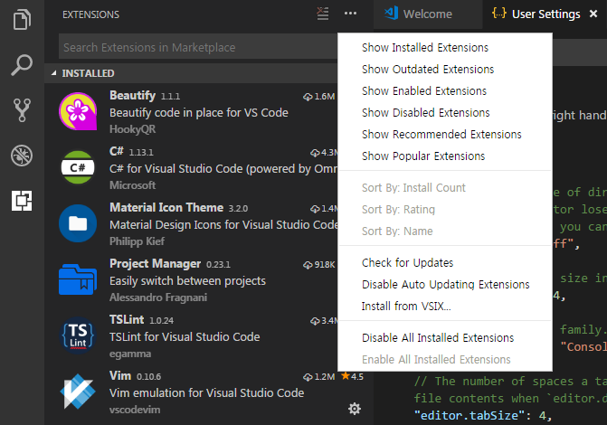

# Installing Visual Studio Code Extension For Tizen

Visual Studio Code Extension for Tizen (VS Code Extension for Tizen) is a Visual Studio Code extension that enables you to develop Tizen applications easily using Visual Studio Code. This topic covers 2 different ways to perform the installation: installing from the Marketplace or installing from a VSIX file.

Before installing VS Code Extension for Tizen, check [Prerequisites of Visual Studio Code Extension for Tizen](../index.md).

## Install from Marketplace

To install VS Code Extension for Tizen from the Visual Studio Code Marketplace:

1. In Visual Studio Code, at the bottom of the **Activity Bar**, click the **Extensions** icon.

   

2. In the **Extensions** view's **Search Extensions in Marketplace** field, enter **Tizen**.
3. Locate **Tizen Extension** in the search results and click **Install**.

   

The video below shows how to install Visual Studio Code Extension for Tizen from the marketplace:

<video controls height="400">
  <source src="../media/vscode-installation.mp4" type=video/mp4>
</video>

## Install using VSIX file

To install VS Code Extension for Tizen from a VSIX file:

1. In Visual Studio Code, at the bottom of the **Activity Bar**, click the **Extensions** icon.
2. In the top right corner of the **Extensions** view, click the **More** button () and select **Install from VSIX**.

   

3. Select the VSIX file in the file browser and click **Install**.
4. Once the installation is complete, a **VS Code Notification** will appear at the bottom-right corner of the window, confirming that the extension has been successfully installed.

   

   This notification indicates that the initial setup process has finished.  
   After it appears, you can start using the Tizen Extension right away by opening the **Tizen** view from the Activity Bar.
