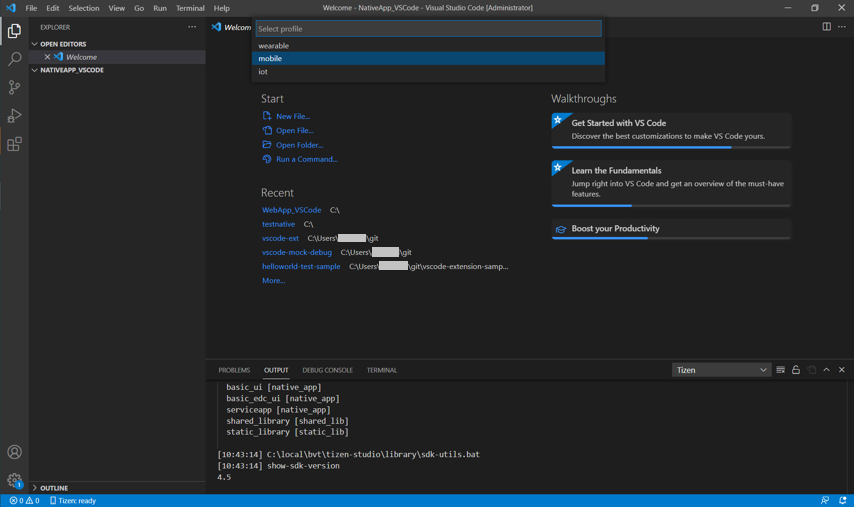
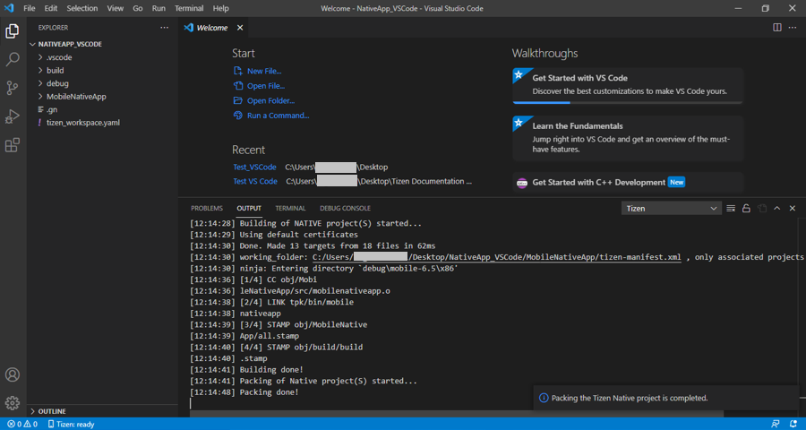
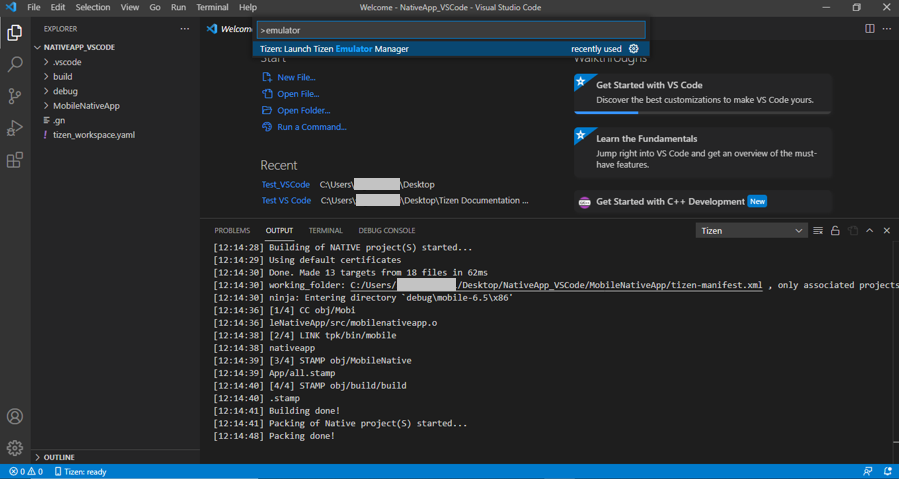
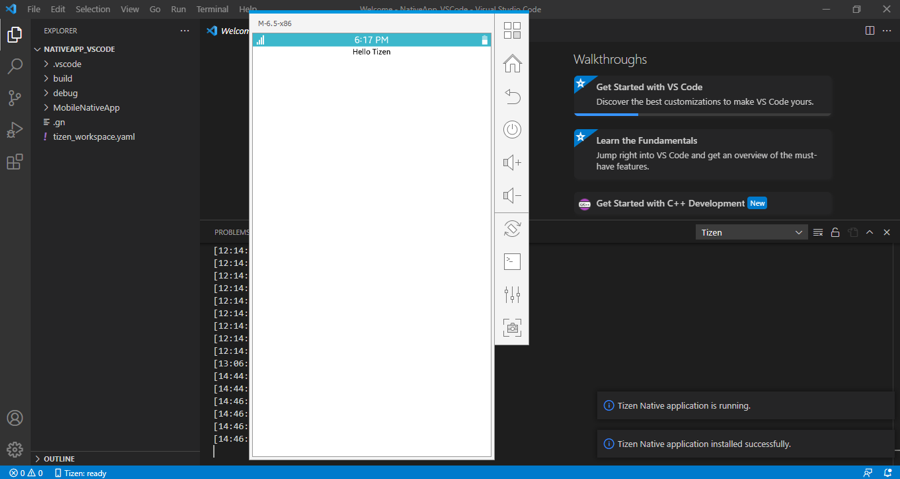
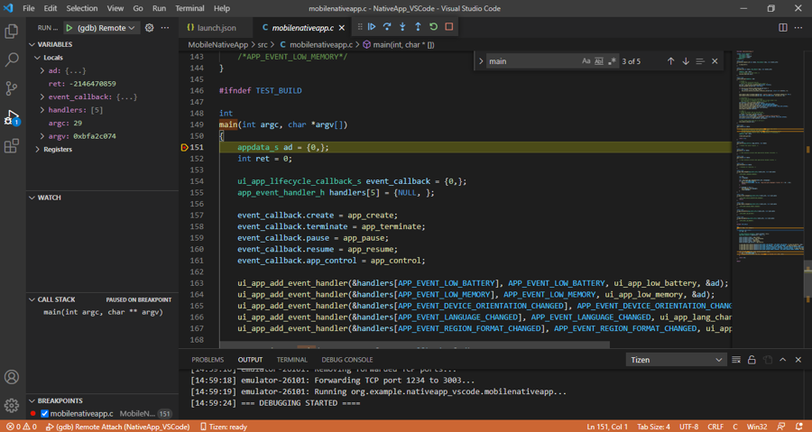

# Visual Studio Code Extension for Tizen Native

The VS code extension installation can be done in two different ways. Refer to [VS code extension installation](dotnet.md) section for details. 

## Develop application

The following sections explain how to use Visual Studio Code Extension for Tizen to develop your applications.

### Create Tizen Native project

To create a Tizen Native project:

1. Create a new directory as the root directory for your project.

2. In Visual Studio Code, open the project directory you created.

   

3. In the pop up window, select **Trust folder and enable all features** button.

   

4. Open the **Command Palette** and select **Tizen: Create Tizen project**.

   

5.	Select the project type as **Native**.

   

6.	Select the required profile for your application development.

   

7. Select the profile version for your application.

   

8.	Select the required project template for your application from template list.

   

9.	Enter the project name.

   

### Building your project

1.	Open the **Command Palette** and enter build. Select **Tizen: Build Tizen project**.

   

2.	Review the build results in the output window, and check the location of the package file (.tpk).

   

### Deploy and run your application in emulator

1.	To launch the Tizen Emulator Manager, open the **Command Palette** and enter emulator. Select **Tizen: Launch Tizen Emulator Manager**.

   

2.	Create and launch an emulator instance in the Emulator Manager.

3.	To deploy your application to the target, enter install Tizen in the **Command Palette** and select **Tizen: Install Tizen application**.

   

4.	To run the application on the emulator, enter run in the **Command Palette** and select **Tizen: Run Tizen application**.

   

   

### Debug your application in emulator

1.	Deploy and run your application in the emulator.

2.	In the Visual Studio Code Activity Bar, select the **Debug** icon.

3.	In the Debug view, open the Configuration drop-down menu and select **Add Configuration** or click **Run and Debug** button.

4.	Select **Tizen Native Debugger** in the list of configurations.
   
   

5.	Add a break point in your source code.
   
   

6.	Start the debugging session by pressing **F5**.
   
   
