# Rpk(Resource Package) application development

The VS code extension installation can be done in two different ways. Refer to [VS code extension installation](dotnet.md) section for details. 

## Develop application

The following sections explain how to use Visual Studio Code Extension for Tizen to develop your applications.

### Create Tizen Rpk project

To create a Tizen Rpk project:

1. Create a new directory as the root directory for your project.

2. In Visual Studio Code, open the project directory you created.

   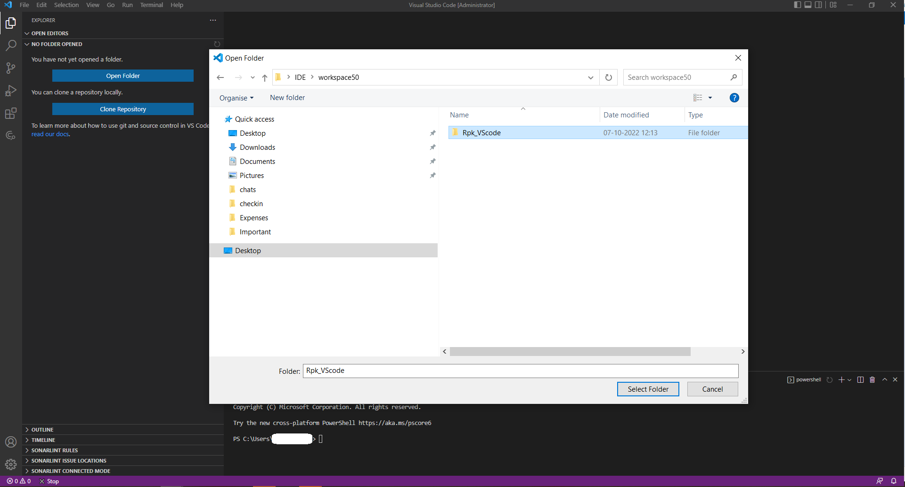

3. In the pop up window, select **Trust folder and enable all features** button.

   

4. Open the **Command Palette** and select **Tizen: Create Tizen project**.

   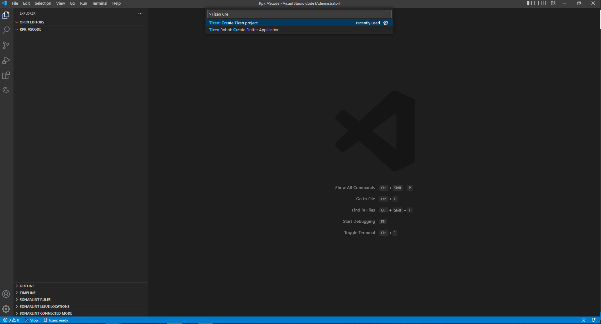

5. Select the project type as **Rpk**.

   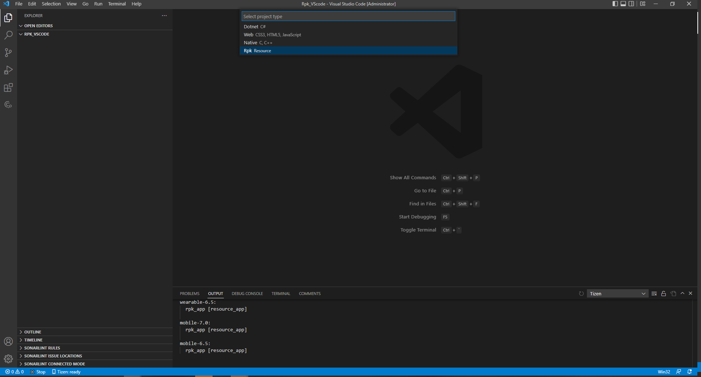

6. Select the required profile for your application development.

   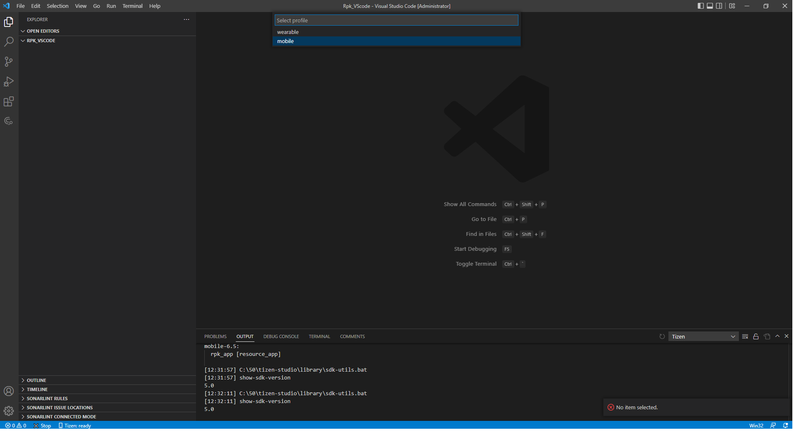

7. Select the profile version(mobile-7.0 / mobile-6.5) for your application.

   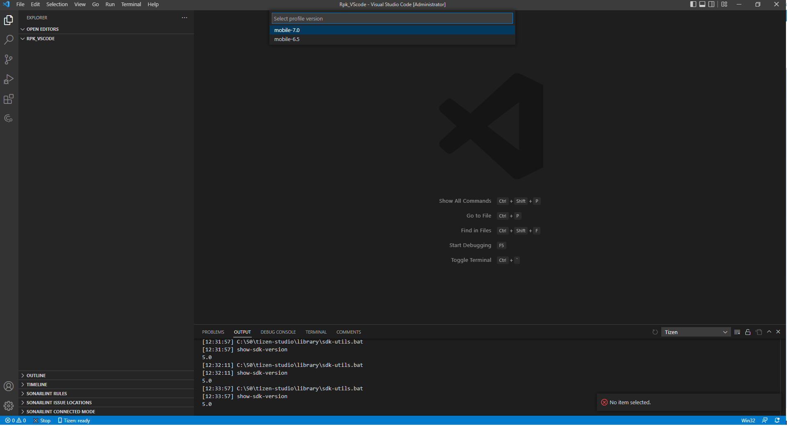

8. Select the required project template for your application from template list.

   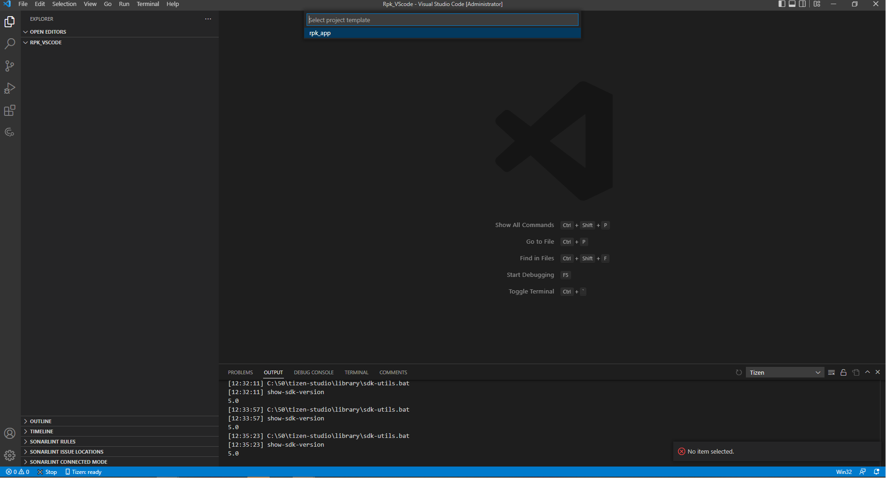

9. Enter the project name.

   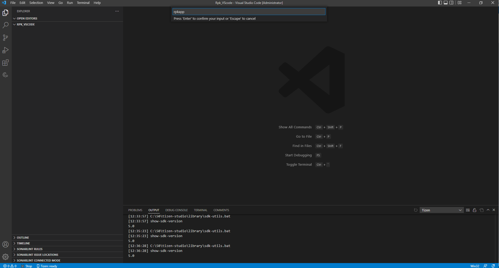

### Build your project

1. Open the **Command Palette** and enter Tizen build. Select **Tizen: Build Tizen project**.

   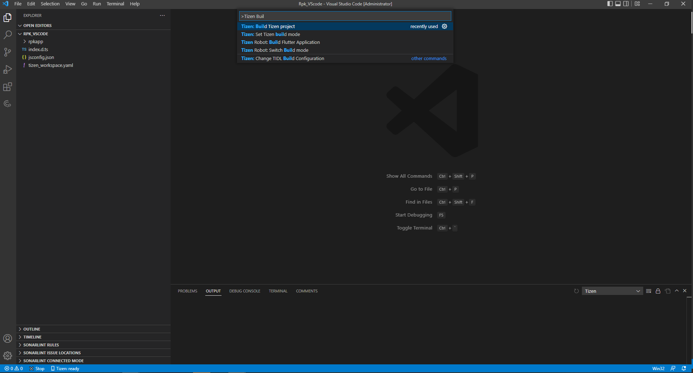

2. Review the build results in the output window, and check the location of the package file (.rpk).

   

### Deploy and run your application in emulator

1. To launch the Tizen Emulator Manager, open the **Command Palette** and enter Tizen Emulator. Select **Tizen: Launch Tizen Emulator Manager**.

   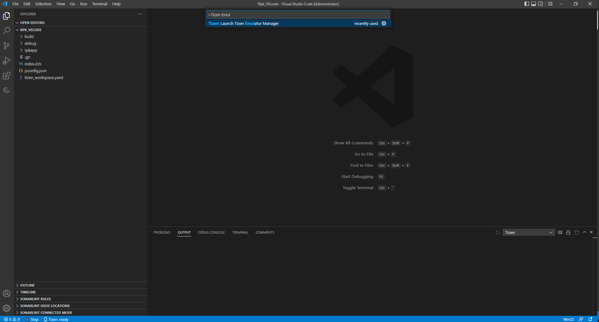

2. Create and launch an emulator instance in the Emulator Manager.

3. To deploy your application to the target, enter Tizen Install in the **Command Palette** and select **Tizen: Install Tizen application**.

   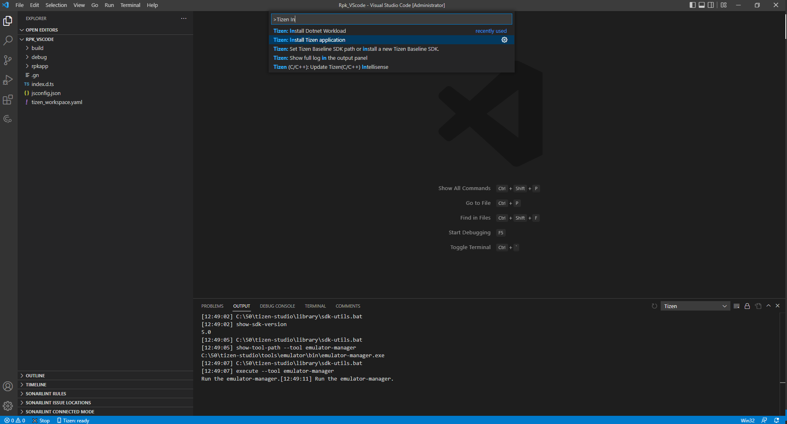

   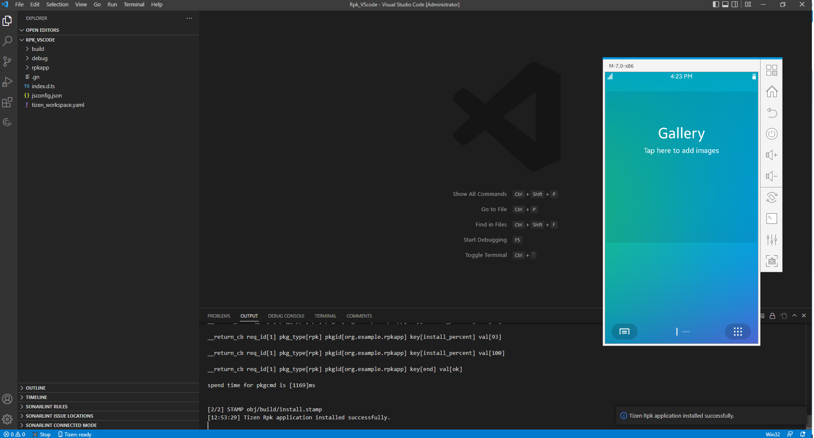

4. To run the application on the emulator, enter run in the **Command Palette** and select **Tizen: Run Tizen application**.

   

   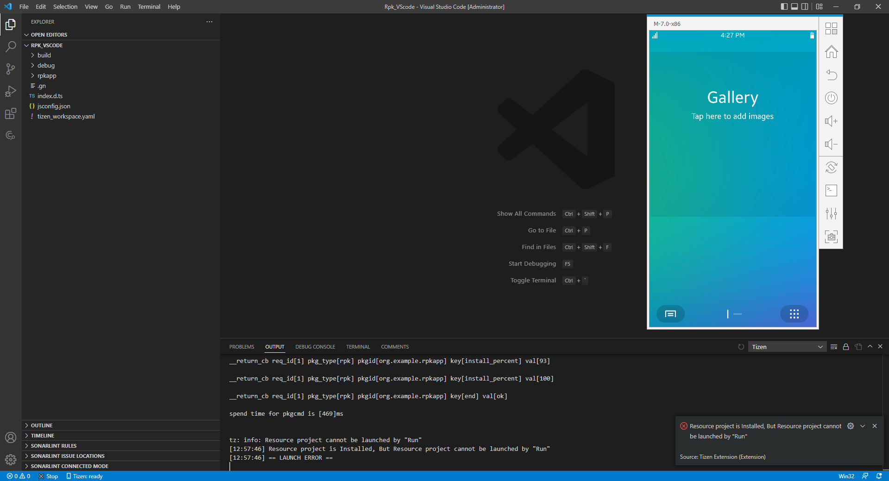

   > [!NOTE] 
   > Resource project is Installed, But Resource project cannot be launched by Run info popup will be displayed.

# Tizen workspace yaml Validation

1. Create Tizen project using command **Tizen: Create Tizen project**..

2. Open tizen_workspace.yaml file, Append character d to type:hybrid, Red line displays under hybridd and when mouse hover on it, Error message to be displayed.
  
   

   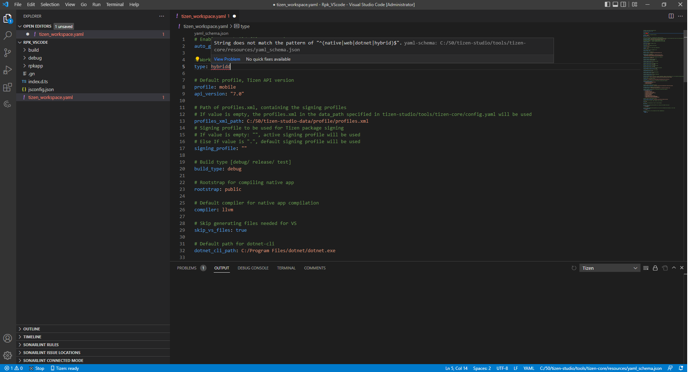

# Dotnet Workload Installation

1. Dotnet Workload Installation will be installed on vscode activation OR by using command **Tizen: Install Dotnet Workload**..

2. For Windows OS, Run vscode as Administrator.

3. For Ubuntu/Mac OS, Enter system password as it installation required sudo permission OR Press Esc to skip installation.
  
   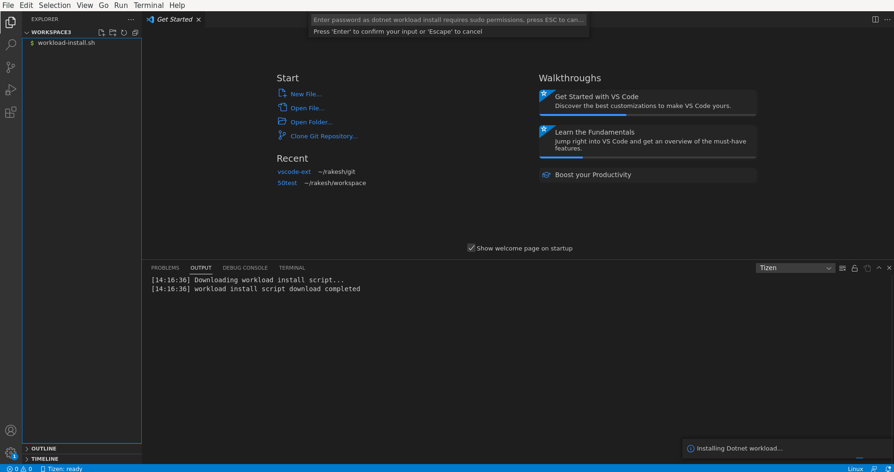

   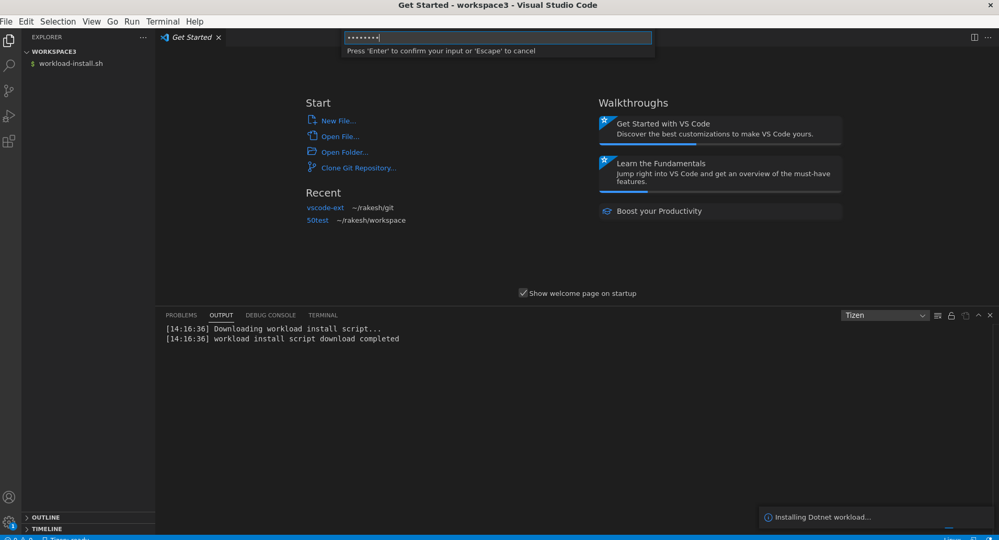
   
   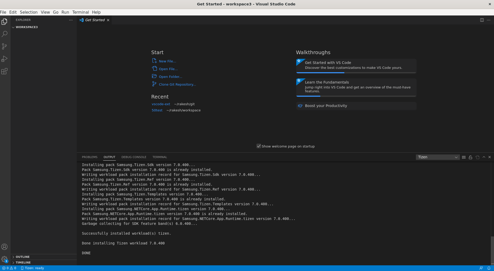
   
   > [!NOTE] 
   > dotnet workload installion requires .NET Core SDK (.NET6 or higher).
   > Download and Install Latest .NET Core SDK from <https://www.microsoft.com/net/download/>
