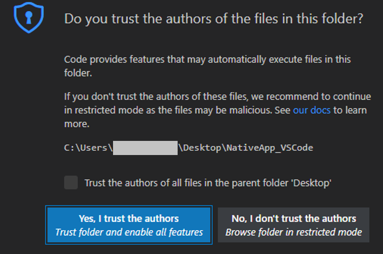

# RPK (Resource Package) Application Development

The VS Code extension installation can be done in two different ways. Refer to [VS Code extension installation](dotnet.md) for details. 

## Develop application

The following sections explain how to use Visual Studio Code Extension for Tizen to develop RPK applications.

### Create Tizen RPK project

To create a Tizen RPK project, follow these steps:

1. Create a new directory as the root directory for your project.

2. In Visual Studio Code, open the project directory you created.

   

3. In the pop up window, select the **Trust folder and enable all features** button.

   

4. Open the **Command Palette** and select **Tizen: Create Tizen project**.

   

5. Select the project type as **Rpk**.

   

6. Select the required profile for your application development.

   

7. Select the profile version(mobile-7.0/mobile-6.5) for your application.

   

8. Select the required project template for your application from the template list.

   

9. Enter the project name.

   

### Build your project

1. Open the **Command Palette** and enter Tizen build. Select **Tizen: Build Tizen project**.

   

2. Review the build results in the output window, and check the location of the package file (.rpk).

   

### Deploy and run your application in emulator

1. To launch the Tizen Emulator Manager, open the **Command Palette** and enter Tizen Emulator. Select **Tizen: Launch Tizen Emulator Manager**.

   

2. Create and launch an emulator instance in the Emulator Manager.

3. To deploy your application to the target, enter Tizen Install in the **Command Palette** and select **Tizen: Install Tizen application**.

   

   

4. To run the application on the emulator, enter run in the **Command Palette** and select **Tizen: Run Tizen application**.

   

   

   > [!NOTE] 
   > An info popup will be displayed, showing the message "Resource project is Installed, but resource project cannot be launched by Run".

<!--
## Tizen workspace YAML validation

1. Create Tizen project using command **Tizen: Create Tizen project**.

2. Open the tizen_workspace.yaml file and append the character 'd' to type:hybrid. After that, a red line displays under the word 'hybridd' when the mouse is hovered on it. An error message will also be displayed.
  
   

   

## Dotnet workload installation

1. Dotnet workload installation will be installed on VS Code activation OR by using the command **Tizen: Install Dotnet Workload**.

2. For Windows OS, Run VS Code as Administrator.

3. For Ubuntu/macOS, enter system password as the installation requires sudo permission. Or you can press Esc to skip installation.
  
   

   
   
   
   
   > [!NOTE] 
   > Dotnet workload installation requires .NET Core SDK (.NET6 or higher).
   > Download and install the latest version of .NET Core SDK from <https://www.microsoft.com/net/download/>

-->