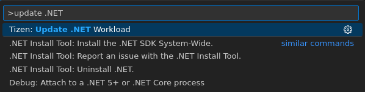
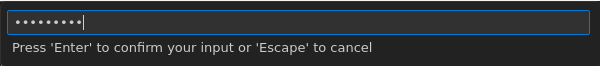
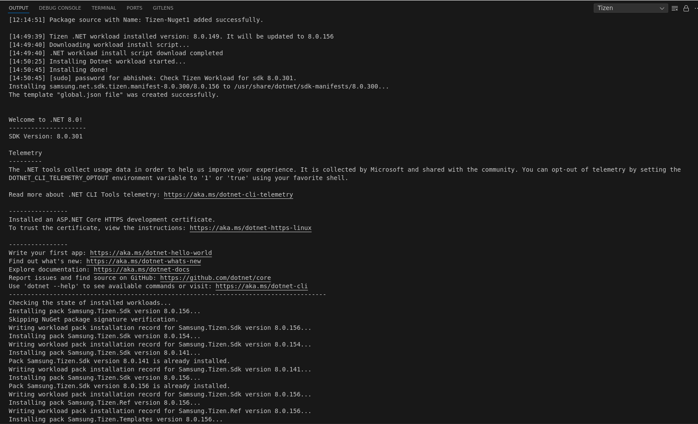
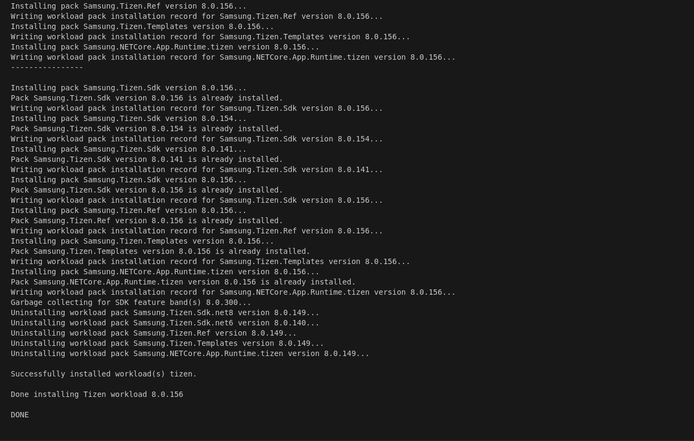
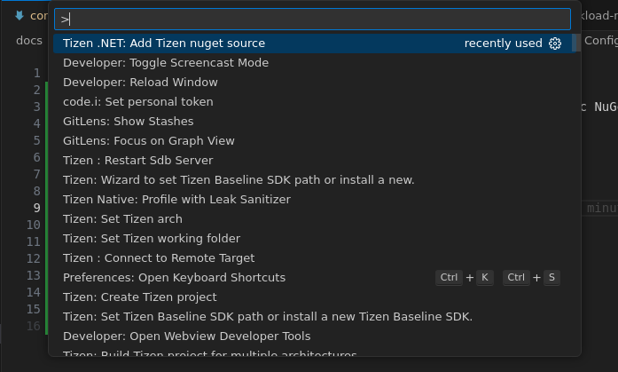
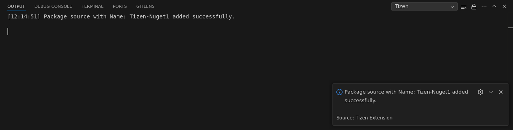

# Configuring .NET Workload & Add NuGet Source

This guide will help you configure .NET workload for Tizen .NET development using Visual Studio Code and add a NuGet source to your project. By following these steps, you'll be able to set up your environment and access the necessary packages for building Tizen applications.

## Prerequisites

Before you begin, ensure you have the following:
- .NET Sdk installed on your machine. You can download it from [here](https://dotnet.microsoft.com/download/dotnet).
- Visual Studio Code installed on your machine. You can download it from [here](https://code.visualstudio.com/).

## Configuring .NET Workload

By default, the VS Code extension for Tizen installs the Tizen .NET workload when you install the extension and launch VS Code. If you need to update it, you can manually do so by running a specific command in the command palette.

1. Select "Update .NET Workload" from command palette.

    

2. Enter password and press enter.

    

3. Workload is updated successfully. You can see the message in output window.

    
    

## Add Tizen NuGet Source

To add a Tizen NuGet source, follow these steps:

1. Select "Tizen .NET: Add Tizen nuget source" from command palette.

    

2. Enter package source path or URL and click enter.
    e.g. - `https://example.com/nugetfeed`

3. Enter name of the source and click enter.
    e.g. - `Tizen-Nuget1`

4. NuGet source is added successfully. You can see the message in output window.

    