# Configuring App

This section provides instructions on how to configure the application for different build environments and target devices. The following contents are included:

- [Configuring App](#configuring-app)
  - [Set Working Folder](#set-working-folder)
  - [Set Arch](#set-arch)
  - [Set Build Type](#set-build-type)
  - [Set Device](#set-device)
  - [Set Certificate Profile](#set-certificate-profile)

## Set Working Folder

Set the working folder where the application will be built and managed.

1. Open the Command Palette (Ctrl+Shift+P) and type "Set Tizen working folder".

   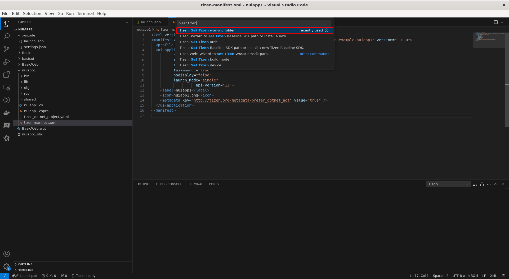
2. Select the option from the list.
3. Select the project folder in the file explorer that you want to set as the working folder.

   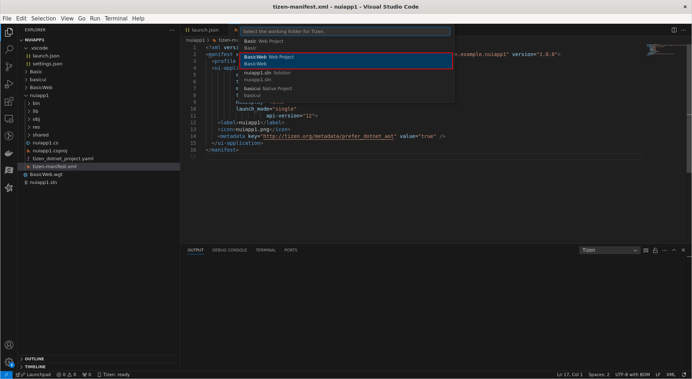
4. The working folder is now set. You can see the notification at the bottom right of the window.

   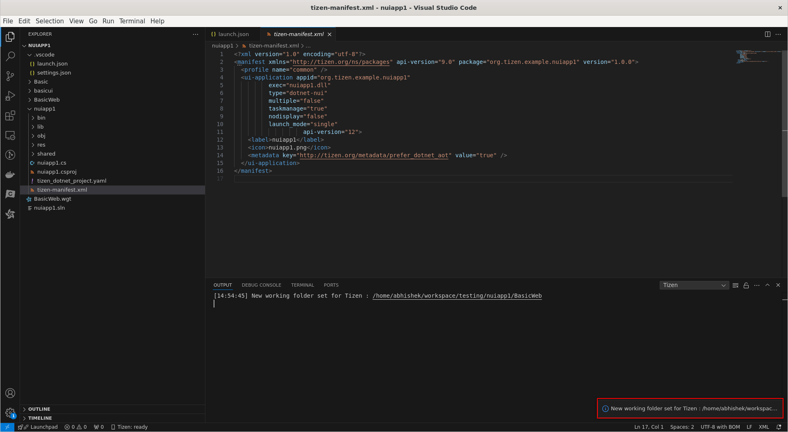

## Set Arch

Set the target architecture for the application. This could be x86, x64, ARM, etc., depending on the target device's architecture.

1. Open the Command Palette (Ctrl+Shift+P) and type "Set Tizen arch".

   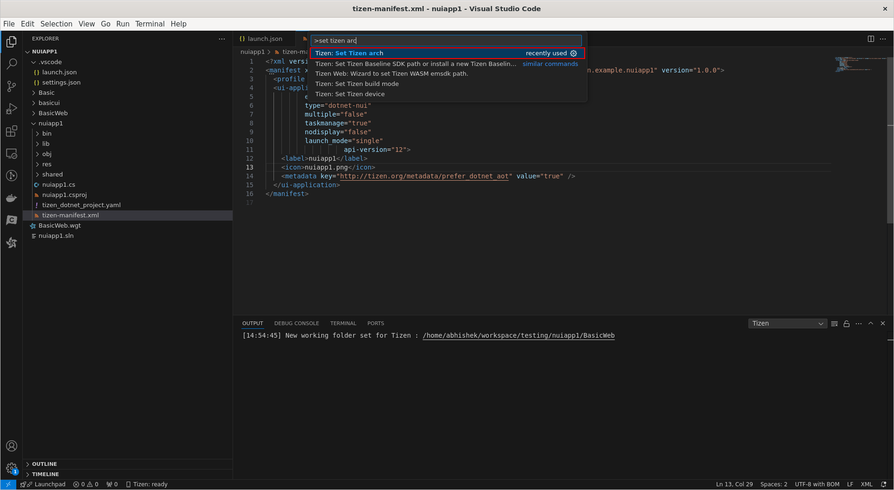
2. Select the option from the list.
3. Select the architecture from the list.

   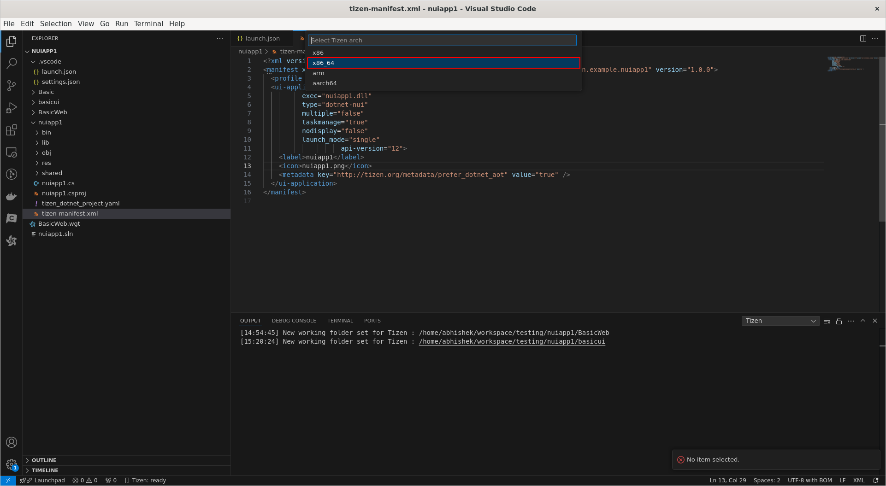
4. The architecture is now set. You can see the message in output window.

   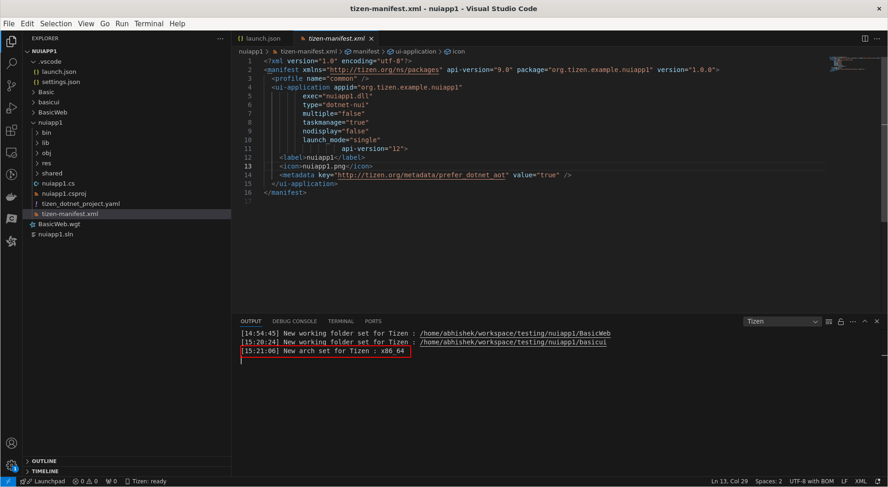

## Set Build Type

Set the build type for the application. This could be Debug, Release, or any other custom build configuration.

1. Open the Command Palette (Ctrl+Shift+P) and type "Set Tizen build type".

   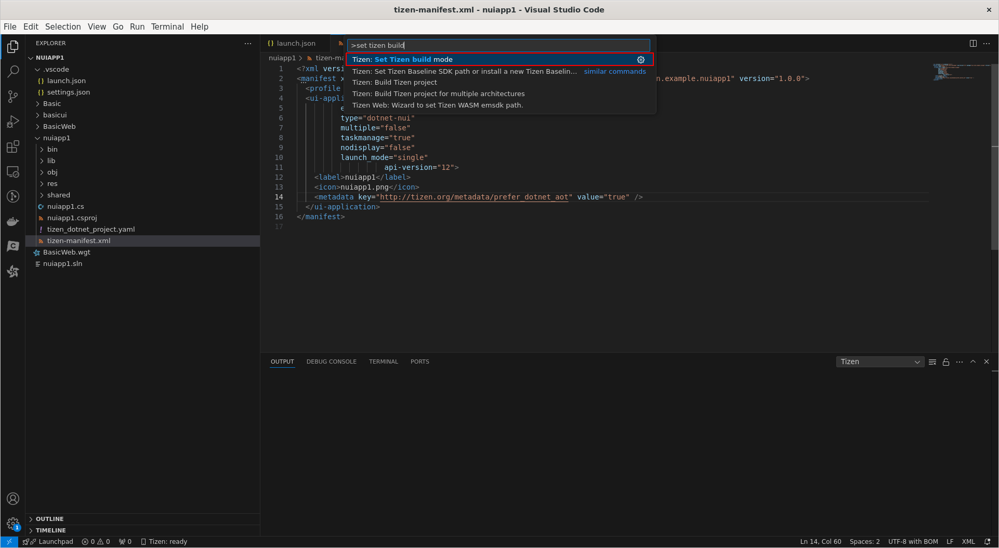
2. Select the option from the list.
3. Select the build type from the list.

   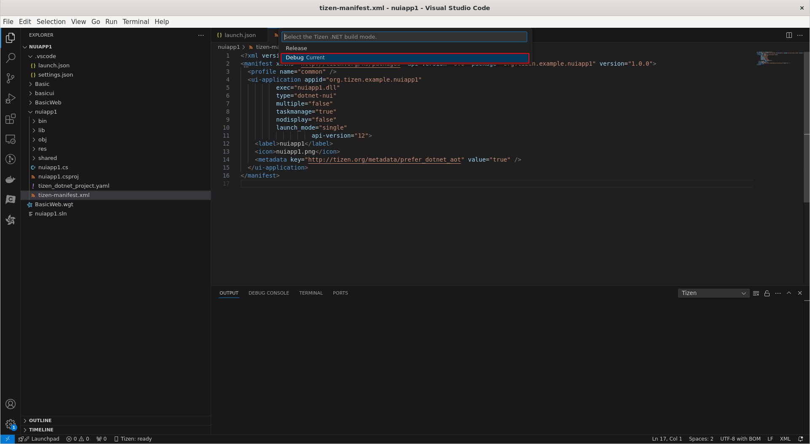
4. The build type is now set. You can see the notification at the bottom right of the window.

   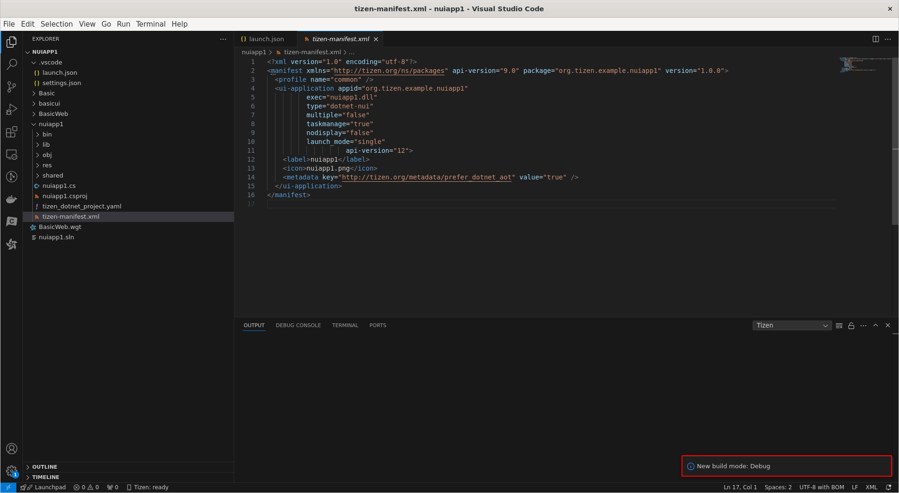

## Set Device

Configure the target device where the application will be deployed.

1. Open the Command Palette (Ctrl+Shift+P) and type "Set Tizen device".

   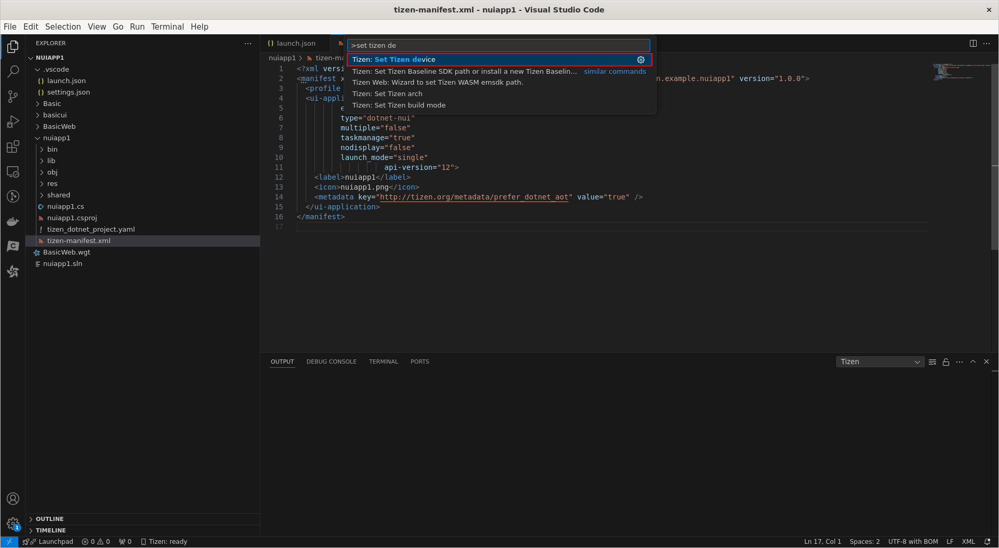
2. Select the option from the list.
3. Select the target device from the list.

   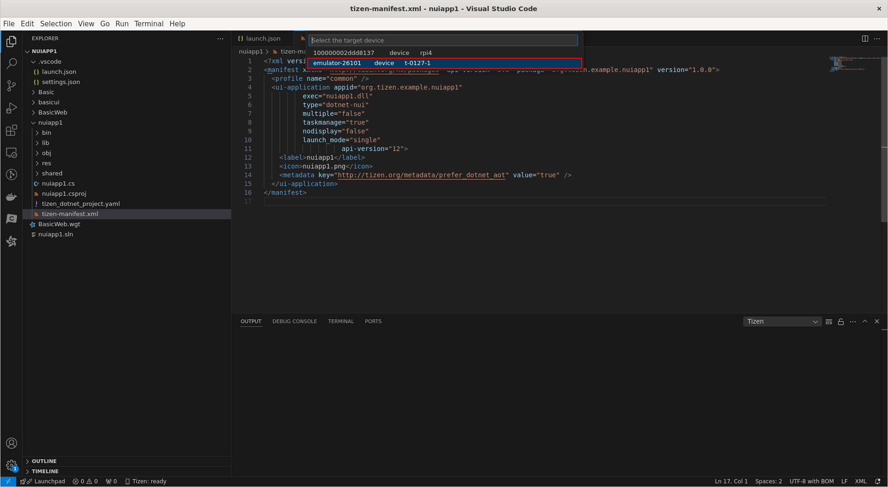
4. The device is now set. You can see the notification at the bottom right of the window.

   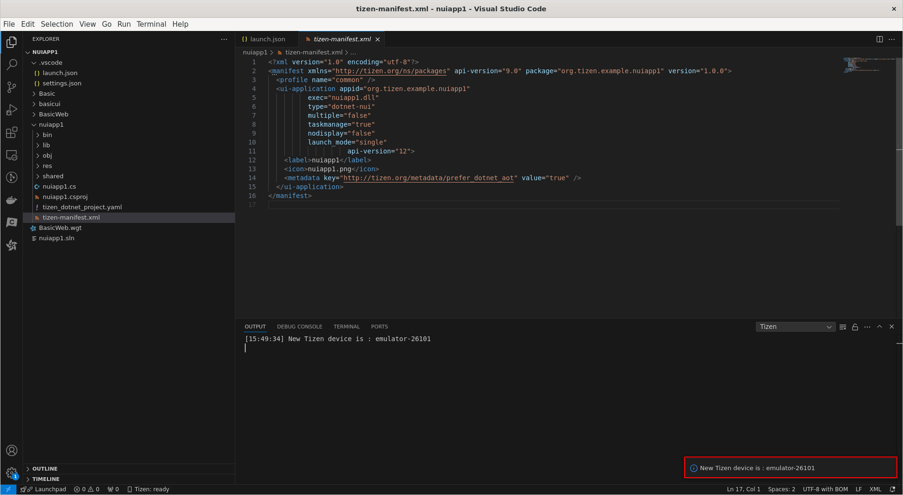

## Set Certificate Profile

Configure the certificate profile for signing the application. If you don't have a certificate, you can create one by following this `<a href="https://docs.tizen.org/application/dotnet/get-started/certificates/creating-certificates/">`guide`</a>`.

1. Open the project YAML:

   * Locate and open the project YAML file in the root directory of your project.
2. Set the Custom Profile:

   * If you want to set a custom profile, assign the `signing_profile` property to the name of your certificate profile. Ensure that the name is enclosed in double quotes.
3. Use Active Signing Profile:

   * If the `signing_profile` value is set to `""` (an empty string), the `active` signing profile will be used by default.
4. Apply Default Signing Profile:

   * If the `signing_profile` value is set to `"."`, the `default` signing profile will be applied.

> [!NOTE]
> You can create author and distributor certificates and register them to your own profiles using [certificate manager](../tools/certificate-manager.md) tool.
