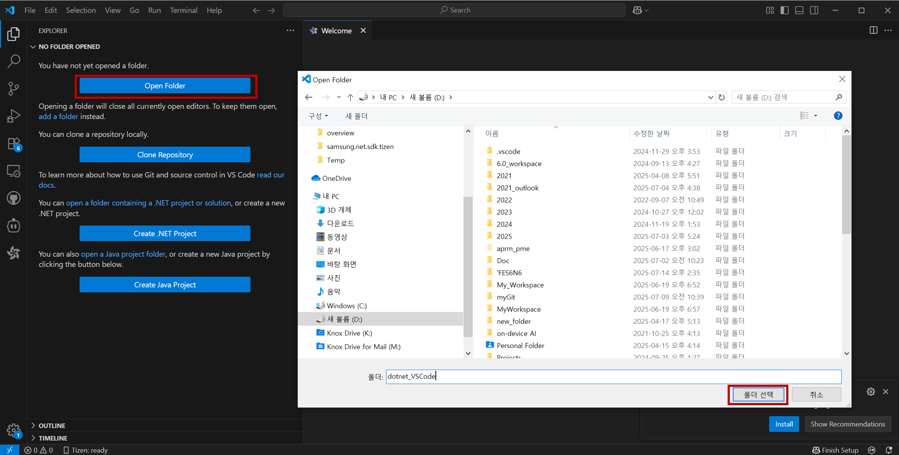
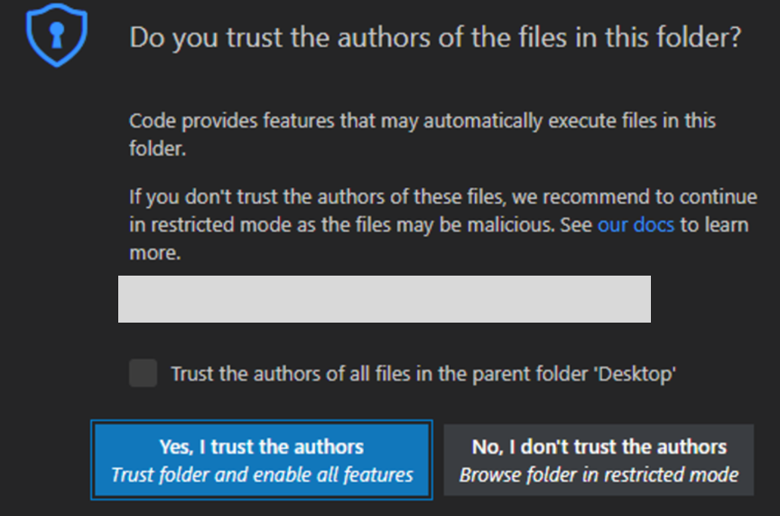
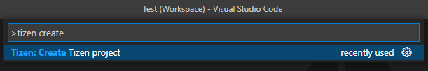
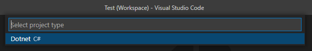
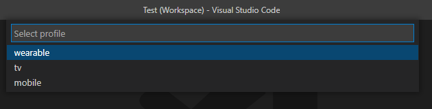
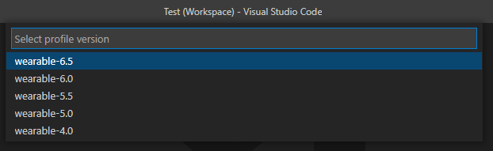
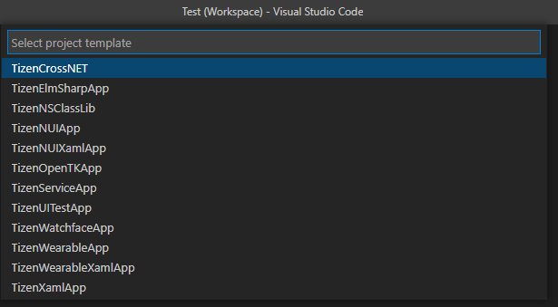
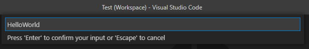

# Create application

The following sections explain how to use Visual Studio Code Extension for Tizen to create your .NET applications.

## Create Tizen .NET project

To create a Tizen .NET project, follow the steps below:

1. Create a new directory as the root directory for your project.

2. In Visual Studio Code, open the project directory you created.

   

3. In the pop up window, select **Trust folder and enable all features** button.

   

4. Open the **Command Palette** and select **Tizen: Create Tizen project**.

   

5. Select the project type as **Dotnet**.

   

6. Select the required profile for your application development.

   

7. Select the profile version for your application.

   

8. Select the required project template for your application from template list.

   

9. Enter the project name.

   