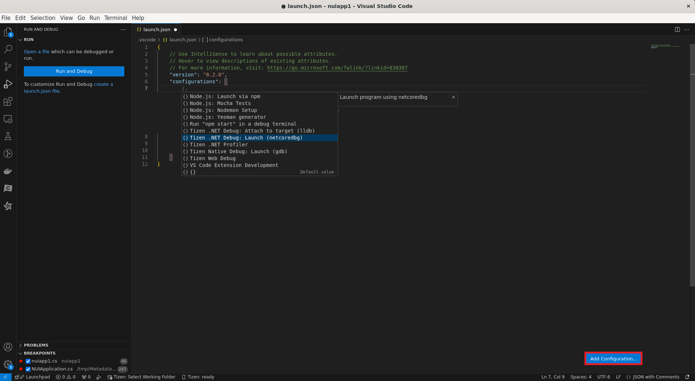
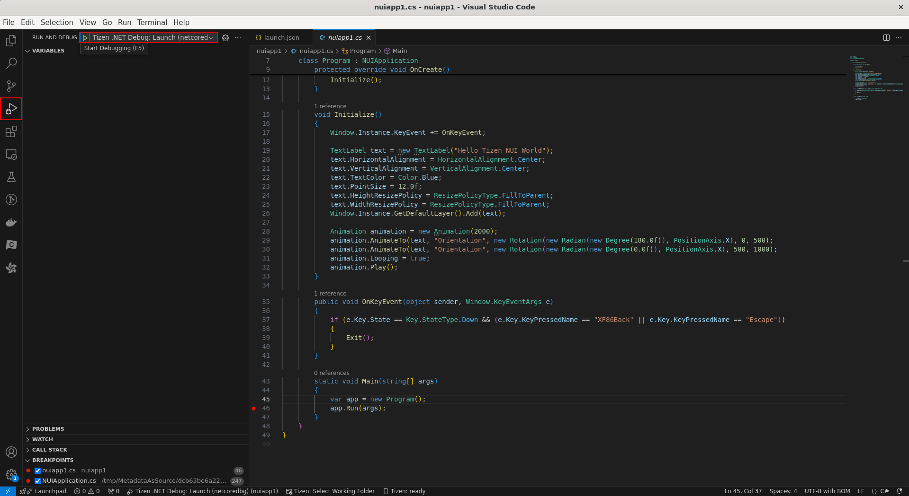
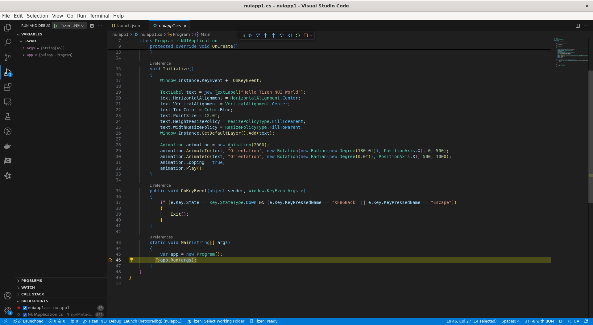

# Debugger Setting (.Net)

This guide provides a step-by-step process for setting up the debugger for .NET applications. 
Follow the instructions specific to your application to set up debugging.

## Debugger Setup for .NET Applications

### Steps

1. **Open Your Project**
   - Open Visual Studio or Visual Studio Code.
   - Load your .NET project by selecting `File` -> `Open Project/Solution`.

2. **Configure Launch.json file**
   - In Visual Studio Code, open the `.vscode` folder in your project directory.
   - Create a `launch.json` file if it doesn't exist.
   - Click "Add Configuration" and select "Tizen .NET Debug:Launch (netcoredbg)".

   
   
3. **Set Breakpoints**
   - Open your source code files.
   - Set breakpoints by clicking on the gutter next to the line numbers where you want to pause execution.

4. **Start Debugging**
   - Make sure to set the debug configuration to "Tizen .NET Debug:Launch (netcoredbg)" in the dropdown menu.
   - Click the play button with a bug icon in the top toolbar or press `F5`.
   - The debugger will start and your application will run until it hits a breakpoint.
   - You can now inspect variables, step through code, and analyze the state of your application.

   

   