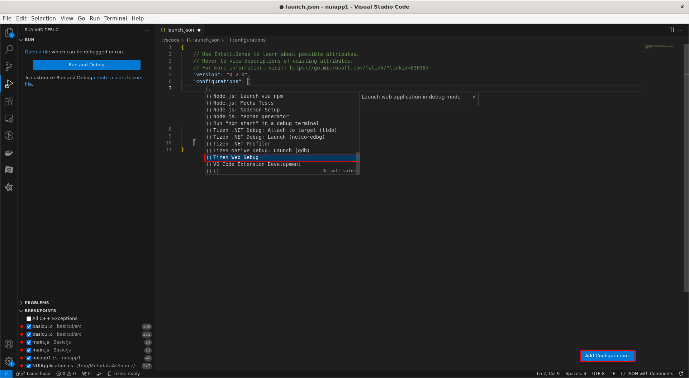
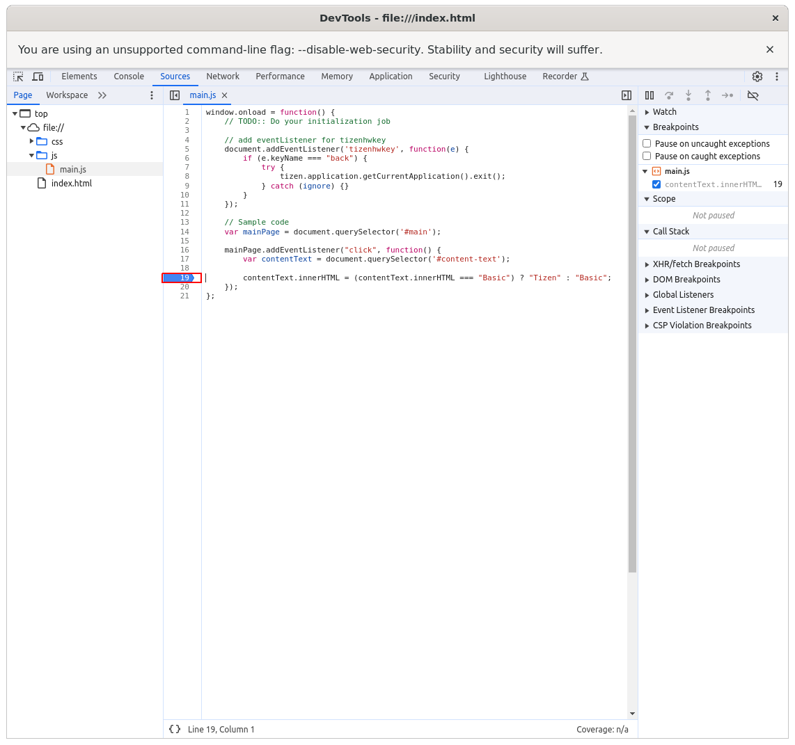
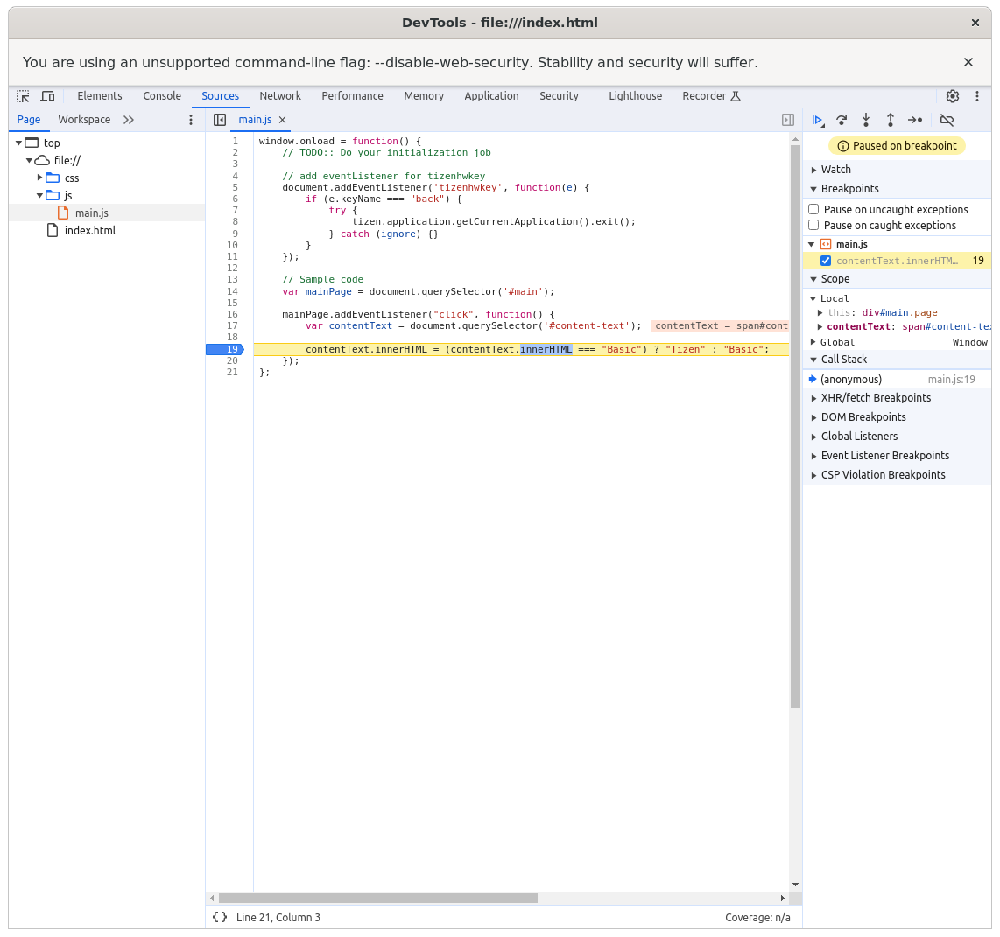

# Debugger Setting (Web)

This guide provides a step-by-step process for setting up the debugger for Web applications. 
Follow the instructions specific to your applicationto set up debugging.

## Debugger Setup for Web Applications

### Steps

1. **Open Your Project**
   - Open Visual Studio Code.
   - Load your web project by selecting `File` -> `Open Folder`.

2. **Configure Launch.json file**
   - In Visual Studio Code, open the `.vscode` folder in your project directory.
   - Create a `launch.json` file if it doesn't exist.
   - Click "Add Configuration" and select "Tizen Web Debug".

   

3. **Start Debugging**
   - Make sure to set the debug configuration to "Tizen Web Debug" in the dropdown menu.
   - Click the play button with a bug icon in the top toolbar or press `F5`.
   - The debugger will start and your application will run in the Tizen emulator or device.
   - Add breakpoints in your source code as needed. The breakpoints will be synchronized with the running application. When the application hits a breakpoint, it will pause execution, allowing you to inspect variables and step through code.

   

   
