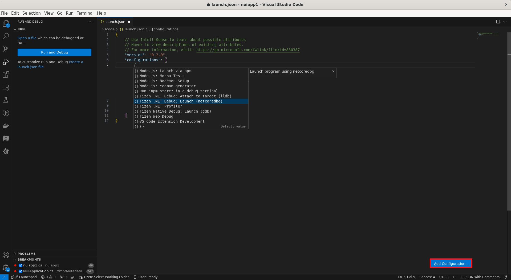
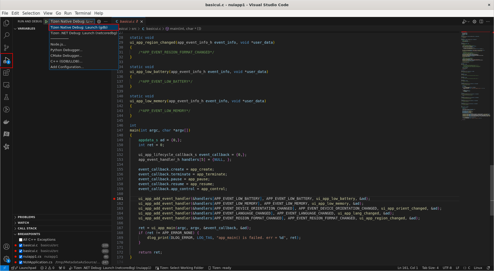
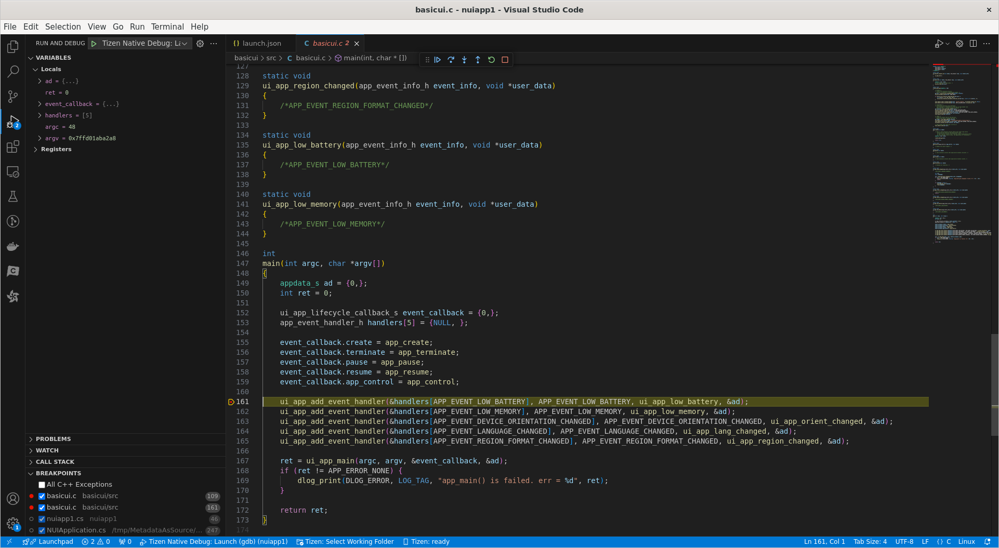
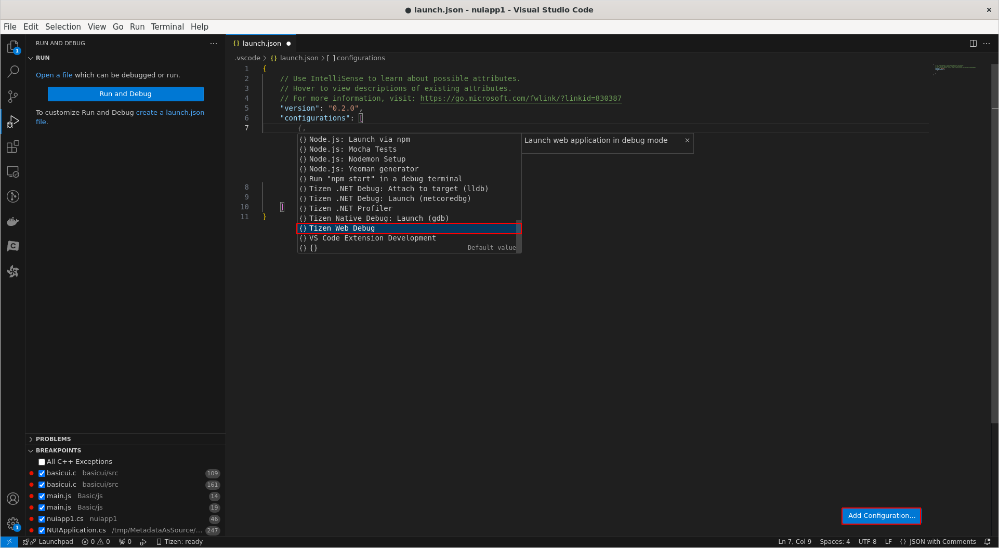

# Debugger Setting (.Net/Web/Native)

This guide provides a step-by-step process for setting up the debugger for .NET, Web, and Native applications. Follow the instructions specific to your application type to set up debugging.

## Table of Contents

- [Debugger Setting (.Net/Web/Native)](#debugger-setting-netwebnative)
  - [Table of Contents](#table-of-contents)
  - [Debugger Setup for .NET Applications](#debugger-setup-for-net-applications)
    - [Steps](#steps)
  - [Debugger Setup for Native Applications](#debugger-setup-for-native-applications)
    - [Steps](#steps-1)
  - [Debugger Setup for Web Applications](#debugger-setup-for-web-applications)
    - [Steps](#steps-2)

## Debugger Setup for .NET Applications

### Steps

1. **Open Your Project**
   - Open Visual Studio or Visual Studio Code.
   - Load your .NET project by selecting `File` -> `Open Project/Solution`.

2. **Configure Launch.json file**
   - In Visual Studio Code, open the `.vscode` folder in your project directory.
   - Create a `launch.json` file if it doesn't exist.
   - Click "Add Configuration" and select "Tizen .NET Debug:Launch (netcoredbg)".

   
   
3. **Set Breakpoints**
   - Open your source code files.
   - Set breakpoints by clicking on the gutter next to the line numbers where you want to pause execution.

4. **Start Debugging**
   - Make sure to set the debug configuration to "Tizen .NET Debug:Launch (netcoredbg)" in the dropdown menu.
   - Click the play button with a bug icon in the top toolbar or press `F5`.
   - The debugger will start and your application will run until it hits a breakpoint.
   - You can now inspect variables, step through code, and analyze the state of your application.

   

   

## Debugger Setup for Native Applications

### Steps

1. **Open Your Project**
   - Open Visual Studio Code.
   - Load your native project by selecting `File` -> `Open Folder`.

2. **Configure Launch.json file**
   - In Visual Studio Code, open the `.vscode` folder in your project directory.
   - Create a `launch.json` file if it doesn't exist.
   - Click "Add Configuration" and select "Tizen Native Debug:Launch (gdb)".

   

3. **Set Breakpoints**
   - Open your source code files.
   - Set breakpoints by clicking on the gutter next to the line numbers where you want to pause execution.

4. **Start Debugging**
   - Make sure to set the debug configuration to "Tizen Native Debug:Launch (gdb)" in the dropdown menu.
   - Click the play button with a bug icon in the top toolbar or press `F5`.

   

   - The debugger will start and your application will run until it hits a breakpoint.
   - You can now inspect variables, step through code, and analyze the state of your application.

   

## Debugger Setup for Web Applications

### Steps

1. **Open Your Project**
   - Open Visual Studio Code.
   - Load your web project by selecting `File` -> `Open Folder`.

2. **Configure Launch.json file**
   - In Visual Studio Code, open the `.vscode` folder in your project directory.
   - Create a `launch.json` file if it doesn't exist.
   - Click "Add Configuration" and select "Tizen Web Debug".

   

3. **Start Debugging**
   - Make sure to set the debug configuration to "Tizen Web Debug" in the dropdown menu.
   - Click the play button with a bug icon in the top toolbar or press `F5`.
   - The debugger will start and your application will run in the Tizen emulator or device.
   - Add breakpoints in your source code as needed. The breakpoints will be synchronized with the running application. When the application hits a breakpoint, it will pause execution, allowing you to inspect variables and step through code.

   

   
