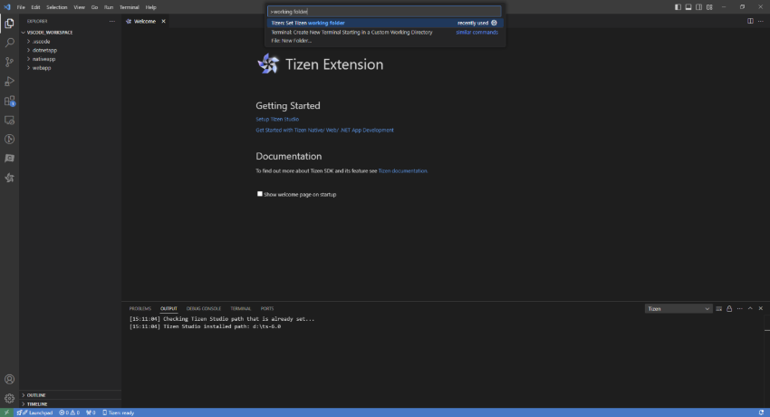
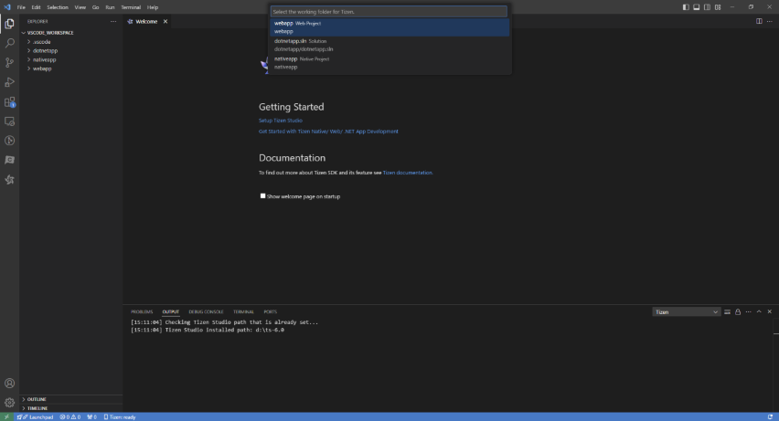
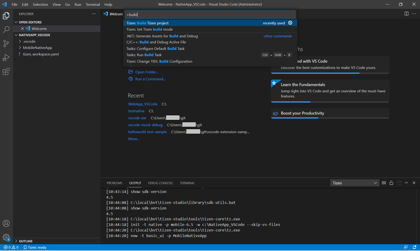
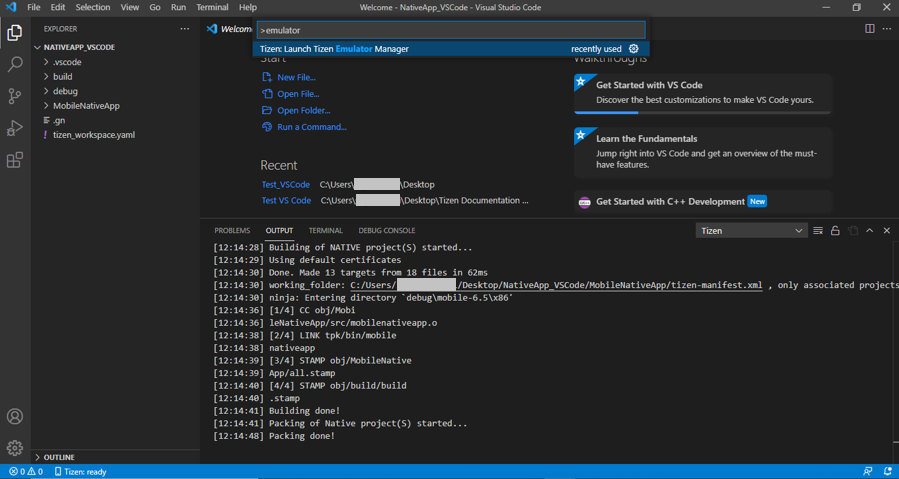
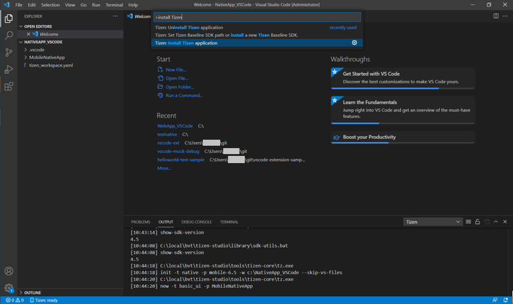
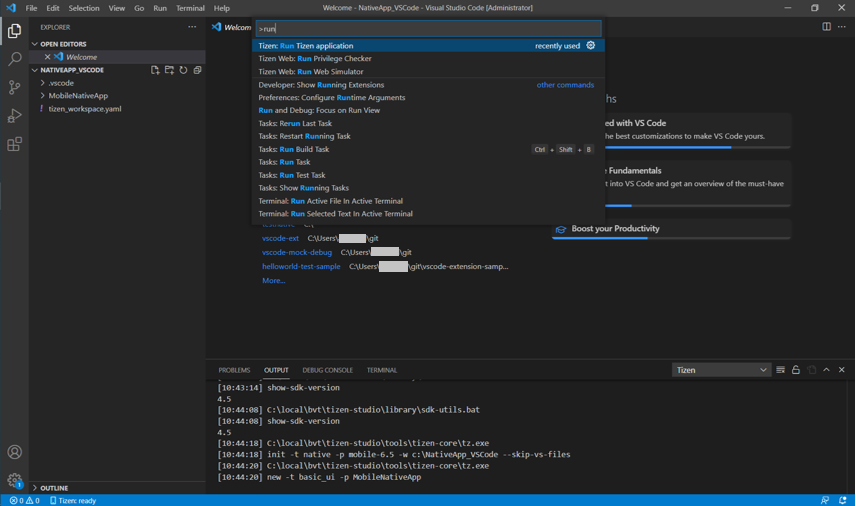

# Edit Code(Build, Install & Normal Run)

The following sections explain how to use Visual Studio Code Extension for Tizen to build, deploy and run your applications.

## Set your project as working folder

1. Open the **Command Palette** and enter working folder. Select **Tizen: Set Tizen working folder**.

   

2. Set the project which you want to build, deploy and run on emulator.

   

## Build your project

1. Open the **Command Palette** and enter build. Select **Tizen: Build Tizen project**.

   

2. Review the build results in the output window, and check the location of the package file (.tpk/.wgt).

   

### Deploy and run your application in emulator

1. To launch the Tizen Emulator Manager, open the **Command Palette** and enter emulator. Select **Tizen: Launch Tizen Emulator Manager**.

   

2. Create and launch an emulator instance in the Emulator Manager.

3. To deploy your application to the target, enter install Tizen in the **Command Palette** and select **Tizen: Install Tizen application**.

   

4. To run the application on the emulator, enter run in the **Command Palette** and select **Tizen: Run Tizen application**.

   

   