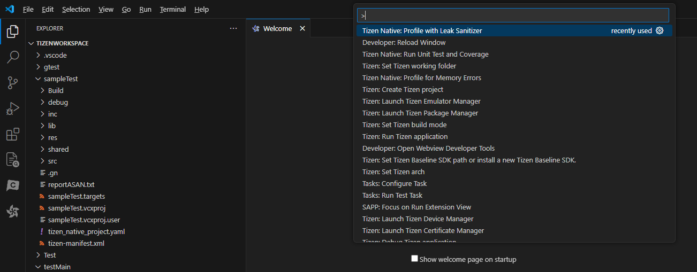
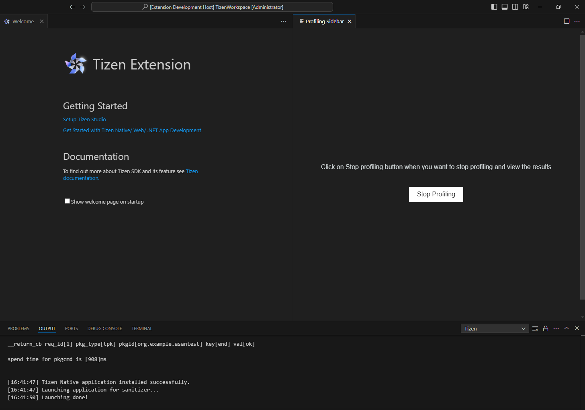
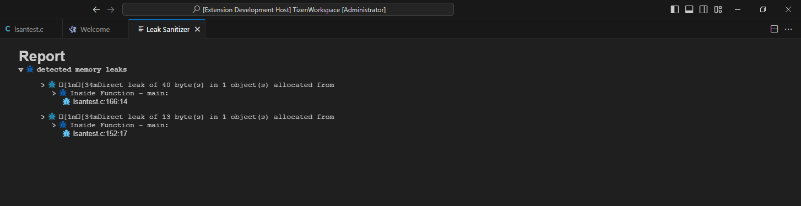
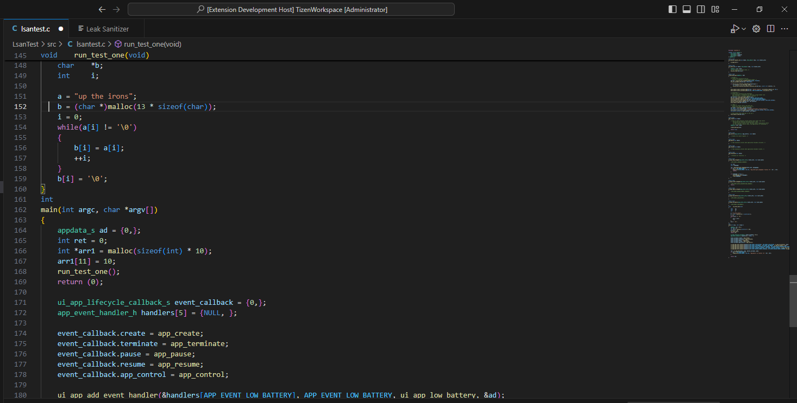

# Leak Sanitizer
The Leak Sanitizer is a profiling tool designed to identify runtime memory leaks in Tizen Native applications. It helps developers pinpoint sections of code that may lead to memory leaks during execution. By instrumenting the code during application compilation, the tool can detect memory leaks at runtime. If the program runs without crashing under Leak Sanitizer, it indicates that the code is free from potential memory leaks. This ensures safer and more efficient memory management in Tizen applications.

## To Detect Runtime Memory Errors with Leak Sanitizer
- In the **File Explorer view**, click on view and select **Command Palette > Tizen: Profile with Leak Sanitizer**.
  
  The profiling instruments the code and compiles the project for the Leak Sanitizer. Finally, it launches the application on the connected target or Emulator, as illustrated in the following figure:
  
  
   

- After the application is launched, run the application scenario you want to test.
- Visual Studio Code shows the profiling result after clicking on the **Stop Profiling** button:

  
    
    
- Once clicked on the **Stop Profiling** button, application will crash if there are any errors. Hence, the report will be generated. If there are no memory errors, it will give the message that no error was found, as illustrated in the following figure:

  

## Source File Navigation on Failure
  - When a failure occurs, you can click on the **line number associated with the failure which is generated in UI Report**. This action will open the corresponding source file in your editor and **navigate to the exact location where the failure has occurred**, as illustrated in the following figure:

    