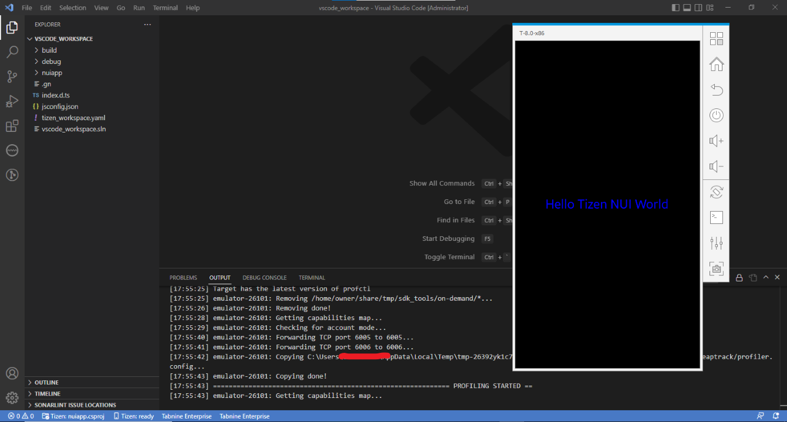
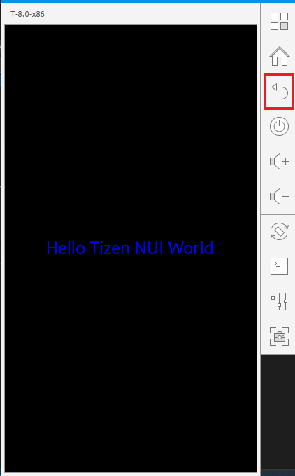

# Get Started with Performance Profiling

## Running Core Profiler
   - If no Tizen device is connected and no Tizen emulators are running then launch Emulator Manager and launch the type of emulator you want to use for running and profiling your application.

     

   - Open the **Command Palette** and select **Tizen.NET: Run Tizen core profiler**.

     

   - If everything is ok then the application starts as if you are running it normally.

     

   - Profiling progress window will be displayed with a "Stop" button in a new tab showing the application's live performance profiling.

     

   - Profiling can be stopped by clicking the "Stop" button.

     

## Running Memory Profiler
   - If no Tizen device is connected and no Tizen emulators are running then launch Emulator Manager and launch the type of emulator you want to use for running and profiling your application.

     

   - Open the **Command Palette** and select **Tizen.NET: Run Tizen memory profiler**.

     

   - If everything is ok then the application starts as if you are running it normally.

     

   - The memory profiling data will be displayed with the Memory Profiler GUI after closing the application. The application can be closed by pressing the "Back" button.

     

## Analyze the results
   - The GUI application provides several views of the memory profiling data. The views include the following:

       - Summary page with information on which process was profiled, its total runtime, some memory related statistics, and so on.
       - Bottom-up table tree view of the code locations that allocated memory with their aggregated cost and stack traces.
       - Caller/Callee table.
       - Top-down table tree view of the code locations.
       - Managed heap table tree view.
       - Flame graph visualization (explanation: [http://www.brendangregg.com/FlameGraphs/memoryflamegraphs.html](http://www.brendangregg.com/FlameGraphs/memoryflamegraphs.html){:target="_blank"}).
       - Consumed memory size over time graph.
       - Number of instances over time graph.
       - Number of memory allocations over time graph.
       - Size of memory allocated over time graph.
       - Allocation histogram displaying the number of allocations (the total number and the several topmost code locations) belonging to one of the groups divided by allocation size (0 - 8 bytes, 9 - 16 bytes, ... , 512 bytes - 1 KB, more than 1 KB).

### Flame graph view sample

   

### Memory allocations graph view sample

   

### Allocation histogram view sample

   