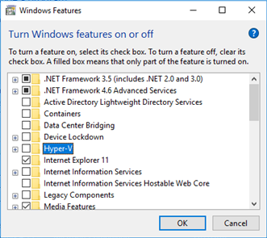
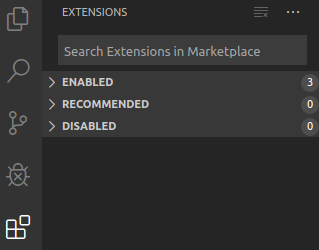

# Visual Studio Code Extension for Tizen

Visual Studio Code Extension for Tizen (VS Code Extension for Tizen) is a Visual Studio Code extension that enables you to develop Tizen .NET applications easily using Visual Studio Code. This topic covers 2 different ways to perform the installation: installing from the Marketplace or installing from a VSIX file.


## Prerequisites

To work with Visual Studio Code Extension for Tizen, your computer must have:

- Supported host platform

  VS Code Extension for Tizen supports the following operating systems:

  - Windows&reg; 7/10 (64 bit)
  - Ubuntu 14.04/16.04 (64 bit)
  - macOS 10.12 (Sierra) or later
- Required tools

  To use VS Code Extension for Tizen, you must install the following tools:

  - NET Core SDK 2.0 or later

    Download from <https://www.microsoft.com/net/download/>.

  - Node.js

    Download from <https://nodejs.org>.

  - Oracle Java 8 or higher

    Ubuntu 16.04 also supports OpenJDK.

  - Tizen Baseline SDK or Tizen Studio

    If neither of these is found, VS Code Extension for Tizen automatically installs the baseline SDK.

  - Microsoft C\# extension for Visual Studio Code

    Install from the Visual Studio Code Marketplace.

### Emulator Requirements

The Tizen emulator for VS Code Extension for Tizen has the same requirements as the emulator in the Tizen Studio. To check the detailed hardware and software requirements for the Tizen emulator, see [Emulator Requirements](../tizen-studio/setup/prerequisites.md#emulator).

- Intel&reg; Hardware Acceleration Execution Manager (Intel&reg; HAXM) speeds up the Tizen emulation on Intel-VT-enabled systems. For more information, see [Hardware Accelerated Execution Manager](../tizen-studio/setup/hardware-accelerated-execution-manager.md).
- Make sure **Hyper-V** is disabled (in Windows&reg; 10 or higher):
  1. In the **Start** menu, select **Programs and Features**.

     

  2. Select **Turn Windows features on or off**.
  3. Disable **Hyper-V** and click **OK**.

     

  4. Reboot the computer.


## Installing from the Marketplace 

To install VS Code Extension for Tizen from the Visual Studio Code Marketplace:

1. In Visual Studio Code, at the bottom of the **Activity Bar**, click the **Extensions** icon.

   

2. In the **Extensions** view's **Search Extensions in Marketplace** field, enter **Tizen**.
3. Locate **Visual Studio Code Extension for Tizen** in the search results and click **Install**.
4. After the installation is complete, activate the extension by clicking **Reload**.
5. Once the extension has been activated, it asks whether you want to use an existing Tizen baseline SDK installation or install a new one:

   

   - To perform a fresh installation, click **NO**.

     The extension suggests the path where to install the Tizen baseline SDK. Click **YES** to proceed.

     > **Note**  
     > If you click **NO**, you must finish the Tizen baseline SDK installation before you can use the extension.


   - To use a previously-installed instance of the Tizen baseline SDK or Tizen Studio with the VS Code Extension for Tizen, click **YES** and see [Setting Tizen Baseline SDK Configuration](#setting-baseline-config).


## Installing from a VSIX File

To install VS Code Extension for Tizen from a VSIX file:

1. In Visual Studio Code, at the bottom of the **Activity Bar**, click the **Extensions** icon.
2. In the top right corner of the **Extensions** view, click the **More** button () and select **Install from VSIX**.

   

3. Select the VSIX file in the file browser and click **Install**.
4. After the installation is complete, activate the extension by clicking **Reload**.
5. Once the extension has been activated, it asks whether you want to use an existing Tizen baseline SDK installation or install a new one:

   

   - To perform a fresh installation, click **NO**.

     The extension suggests the path where to install the Tizen baseline SDK. Click **YES** to proceed.

     > **Note**  
     > If you click **NO**, you must finish the Tizen baseline SDK installation before you can use the extension.

   - To use a previously-installed instance of the Tizen baseline SDK or Tizen Studio with the VS Code Extension for Tizen, click **YES** and see [Setting Tizen Baseline SDK Configuration](#setting-baseline-config).


<a name="setting-baseline-config"></a>
## Setting Tizen Baseline SDK Configuration
If you have a previously-installed Tizen baseline SDK or Tizen Studio instance, you can reuse it for VS Code Extension for Tizen:

1. Once the extension has been activated, it asks if you want to use an existing Tizen baseline SDK installation or install a new one. If you want to use the existing SDK, click **YES** (if you click **NO**, a new instance of the Tizen baseline SDK is installed automatically).

   

2. Enter the existing Tizen baseline SDK path.

   

3. Confirm the path by clicking **YES**.

   

4. Wait as the Package Manager built into the VS Code Extension for Tizen installs or updates the required files. During this process, the extension remains deactivated.


## Installing Emulator Images

If you do not have a real device, you can run applications in the Tizen emulator.

To download emulator media, you can use the Tizen Package Manager or the Tizen Emulator Manager.

- To use the Tizen Package Manager:
  1. Open the **Command Palette** and enter **tizen package**.
  2. Select **Tizen .NET: Launch Tizen Package Manager**.
  3. Select the profiles and versions that you want to install and click **Install**.

     

- To use the Tizen Emulator Manager:

  > **Note**  
  > The Tizen Emulator Manager shows the emulator media installation window only when no media are installed on your computer.

  1. Open the **Command Palette** and enter **tizen emulator**.
  2. Select **Tizen .NET: Launch Tizen Emulator Manager**.
  3. Select the profiles and versions that you want to install and click **Ok**.

     


## Developing Applications

The following sections explain how to use Visual Studio Code Extension for Tizen to develop your applications.

### Creating a Tizen .NET Project

To create a Tizen .NET project:

1. Create a new directory as the root directory for your project.
2. In Visual Studio Code, open the project directory you created.
3. Open the **Command Palette** and enter **tizen create**.
4. Select **Tizen .NET: Create a Tizen .NET project**.
5. Select a Tizen .NET project template from the template list.
6. Enter the project name.
7. For a building target, select a solution file with the `.sln` extension or a project file with the `.csproj` extension.

### Building Your Project

To build your project:

1. Open the **Command Palette** and enter **tizen build**.
2. Select **Tizen .NET: Build a Tizen .NET project**.
3. Review the build results in the **Output** window, and check the location of the package file (`.tpk`).

> **Note**  
> If you have a Tizen device and want to deploy the application to it, you must create a certificate profile using the Tizen Certificate Manager or Tizen CLI before building your project. For more information, see [Certificate Manager](../vstools/tools/certificate-manager.md).

<a name="emulator-run"></a>
### Deploying and Running Your Application in the Emulator

To deploy and run your application:

1. To launch the Tizen Emulator Manager, open the **Command Palette** and enter **tizen run**.

   > **Note**  
   > You cannot launch an emulator directly from Visual Studio Code. Instead, you must launch the Tizen Emulator Manager and use it to launch the emulator you need.

2. Select **Tizen .NET: Launch Tizen Emulator Manager**.
3. Create and launch an emulator instance in the Emulator Manager.
4. To deploy your application to the target, enter **tizen install** in the **Command Palette** and select **Tizen .NET: Install a Tizen .NET application on the Tizen device**.
5. To run the application on the emulator, enter **tizen run** in the **Command Palette** and select **Tizen .NET: Run a Tizen .NET application on the Tizen device**.

### Debugging Your Application in the Emulator

To debug your application:

1. [Deploy and run your application in the emulator](#emulator-run).
2. In the Visual Studio Code **Activity Bar**, click the **Debug** icon ().
3. In the **Debug** view, open the **Configuration** drop-down menu and select **Add Configuration**.
4. Select **Tizen LLDB** in the list of configurations.
5. Start the debugging session by pressing **F5**.

> **Note**  
> The LLDB RPM packages are automatically installed on the device as a part of the debugging process. If you want to install them at a custom location, see [Manual LLDB Package Installation](#manual-lldb).


## Troubleshooting

This section contains instructions for common problems with the VS Code Extension for Tizen.

### Failed Baseline SDK Installation

If the Tizen baseline SDK installation fails:

1. In the **Command Palette**, enter **tizen set**.
2. Select **Tizen .NET: Set the Tizen baseline SDK path or install a new Tizen baseline SDK**.
3. The extension asks if you want to use an existing baseline SDK installation or install a new one. Proceed as described in [Setting Tizen Baseline SDK Configuration](#setting-baseline-config).

<a name="manual-lldb"></a>
### Manual LLDB Package Installation

Normally, the following LLDB packages are installed automatically when debugging:

- For a physical target device: `lldb-x.x.x-armv7l.rpm`
- For an x86 emulator: `lldb-x.x.x-i686.rpm`
- For an x86 64-bit emulator: `lldb-x.x.x-x86_64.rpm`

If necessary, you can install the LLDB packages manually:

1. Push the RPM package to the device using the `sdb push` command.
2. Install the package with raised privilege for write permission:

   ```bash
   $ sdb root on
   $ sdb shell mount -o remount, rw /
   $ sdb shell rpm -Uvh "<RPM package path>" --force
   $ sdb root off
   ```
