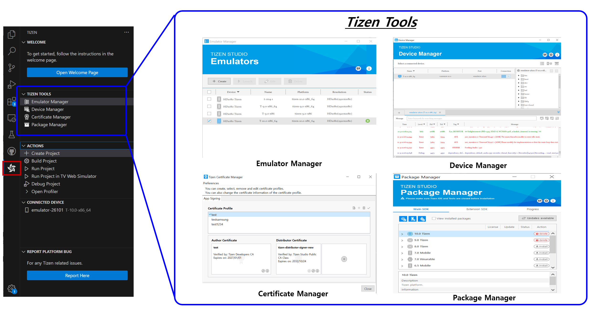

# Overview Visual Studio Code Extension for Tizen

Visual Studio Code extension for Tizen (""VS Code extension for Tizen"") is a Visual Studio Code extension that enables you to develop Tizen .NET, Web and Native applications easily using Visual Studio Code. You can access most of its features by simply typing ' **tizen** ' in the command palette.

Using VS Code extension for Tizen, you can:

* Create a project from templates.
* Edit code with IntelliSense.
* Build your project and get a Tizen application.
* Deploy your application to the device or emulator and run it.
* Debug your application.
* Remove your application from the device.
* Launch Tizen Studio tools.

**Figure : Visual Studio Code Views**

  

### Views of "VSCode Extension for Tizen"

- `Project Explorer` : When you open a workspace with open folder, vscode makes the project structure and you can navigate the file with this view.
- `Run and Debugger` : Tizen Native and .NET Debugger Configuration and provide debugging view

  ※ Web app debugger is provided with individual view (Web-inspector) and triggered by "debug project" on tizen sidebar menu.
- `Tizen sidebar Menu` : Provides various shortcut menus for tizen tools and actions when Tizen Activity bar menu is selected.

  - Welcome : Open Tizen Extenion walkthrough page
  - Tizen Tools
    - Emulator Manager : Run emulator manager 
    - Device Manager : Run device Manager
    - Certificate Manager : Run Certificate Manager
    - Package Manager : Run Package Manager
  - Actions
    - Create Project : Provide project creation menu with app templeates (Web, Native, .NET App for given platform version)
    - Run Project : Run current active app project (Build, Package, Sign, Install, and Launch App)
    - Run Project in TV Web Simulator
    - Debug Project : Run active app project with debugging session
    - .NET Profiler
      - Core Profiler : System Usage Information and Top path
      - MemoryProfiler : Memory Allocation status
      - Dotnet Diagnostics : Provides 3 kinds of .NET Diagnostics profiling tools (dotnet dump, gc-dump, dotent-trace)
    - Connected Device : Show connected device list from host
    - Report Platform Bug : Open Tizen Github issue page and provide issue reporting templates.

**Figure : Menus of Visual Studio Code Extension for Tizen**

  

**Figure : Tizen Common Tools**

  