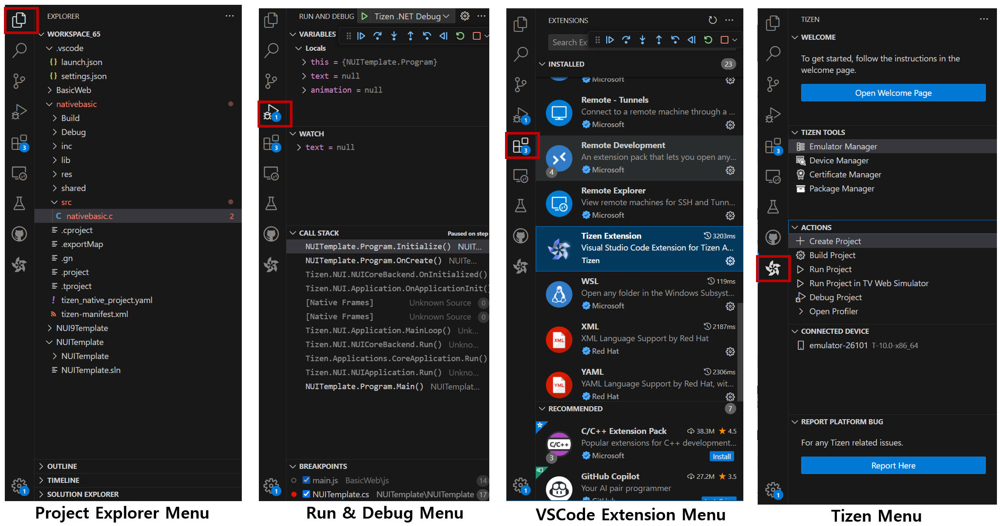

# Overview Visual Studio Code Extension for Tizen

The **Visual Studio Code extension for Tizen** is a tool designed to streamline the development of Tizen applications, including **.NET, Web, and Native** projects, directly within **Visual Studio Code**.

### Key Features
- Project Creation: Generate projects from templates.
- Code Editing: Utilize IntelliSense for efficient coding.
- Build & Package: Compile projects into Tizen applications.
- Deployment: Install and run applications on devices or emulators.
- Debugging: Debug applications for better performance.
- Application Management: Remove installed applications from devices.
- Tool Integration: Launch Tizen tools as needed.

**Figure : Visual Studio Code Views**

### Views of "VSCode Extension for Tizen"

- `Project Explorer` : Displays the **project structure** when opening a workspace for easy navigation through files and folders.
- `Run and Debugger` : Supports **Tizen Native** and **.NET** Debugger Configuration and provide debugging views for trouble shooting.
  ※ Web app debugger is provided with a seperate view (Web-inspector) and triggered by "debug project" on tizen sidebar menu.

- `Tizen sidebar Menu` : Provides entry points for managing your development environment and launching key actions.
  - Welcome : Opens the Tizen Extension walkthrough page and explores key features.
  - Active Targets
    - Project : Shows the currently active project. Click to view or switch projects.
    - Device : Displays the connected device or emulator. Click to open the Device Manager or change the target.
    - Certificate : Indicates the active signing certificate. Click to open the Certificate Manager or switch profiles.
      > 💡 _Active Targets replaces the old “Tizen Tools” section. Instead of launching tools directly, you can now manage and switch your working targets from one integrated view._
  - Actions
    - Create Project : Create a new app project from templeates. (Web, Native, or .NET for the selected platform version)
    - Build Project : Build and sign the active project to generate an installable package.
    - Run Project : Build(if needed), install, and launch the active project on a target device or emulator.
    - Debug Project : Launch the active project in debugging mode with runtime inspection.
  - Report Issue : Opens Tizen Github issue page and provides issue reporting templates.

**Figure : Menus of Visual Studio Code Extension for Tizen**

