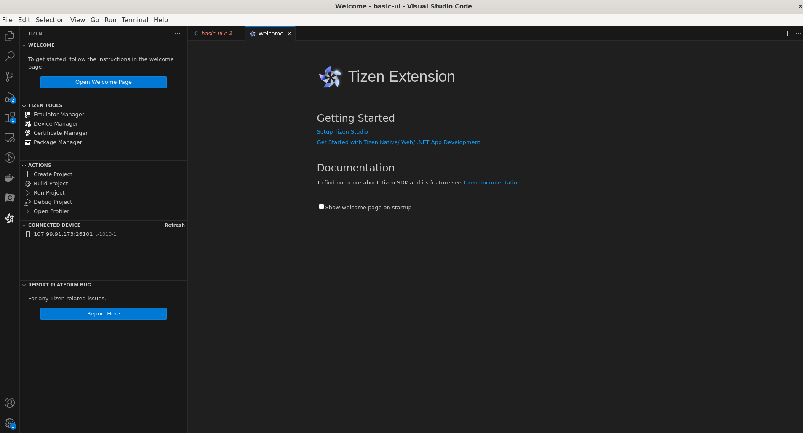

# Tizen Activity Bar and Sidebar Feature

The new Tizen Activity Bar and Sidebar features offer a suite of powerful tools and functionalities designed to streamline your workflow, boost productivity, and make coding more intuitive than ever before. 

The sidebar contains following features: [Welcome](#welcome-page), [Tizen Tools](#tizen-tools), [Actions](#actions), [Connected Devices](#connected-devices), [Report Platform Bug](#report-platform-bug)

### Welcome Page
   - Please refer to the [Welcome](welcome-page.md#open-welcome-page) Section for an introduction to the Tizen Extension for VS Code.

### Tizen Tools
   - The Tizen Tools section contains following tools for Tizen development: 

     1. [**Tizen Emulator Manager**](../../tizen-studio/common-tools/emulator.md): The Tizen Emulator Manager allows you to create and manage emulator instances.

     2. [**Device Manager**](../../tizen-studio/common-tools/device-manager.md): The Device Manager allows you to connect your device and manage it.

     3. [**Certificate Manager**](../../tizen-studio/common-tools/certificate-registration.md): The Certificate Manager allows you to create and manage certificates.

     4. [**Package Manager**](../../tizen-studio/setup/advanced-configuration.md): The Package Manager allows you to install, update, and remove Tizen Studio packages.

     To **access these tools**, click on the **respective icons** in the **Tizen Tools section**. Each tool will open separately, providing you with the necessary functionalities for efficient Tizen development.

### Actions
   - The Actions section includes various **commands** to streamline your Tizen project workflow:

     1. **New Project**: Initiates the creation of a new Tizen project.

     2. **Build Project**: Compiles the source code and generates output of your Tizen project.

     3. **Run Project**: Executes the built project on a target device or emulator.

     4. **Debug Project**: Launches the Tizen project in debug mode, allowing you to set breakpoints and analyze the code execution.

     5. **Open Profiler**: Opens the Tizen Profiler, which helps in analyzing performance metrics and optimizing your application.

     **Click** on the desired **action** to perform the corresponding operation on your Tizen project.

### Connected Devices
   - The Connected Devices section displays a list of all connected Tizen devices. This allows you to select a specific device for running or debugging your Tizen project.

   - To **view** the connected devices, **navigate** to the **Connected Devices** section.

### Report Platform Bug
   - If you encounter any **issues or bugs** while using the Tizen Extension for VS Code, you can use the **Report Platform Bug** feature to report them.

   - To report a **bug**, click on the **Report Platform Bug** button and provide the necessary **details** about the issue you encountered.