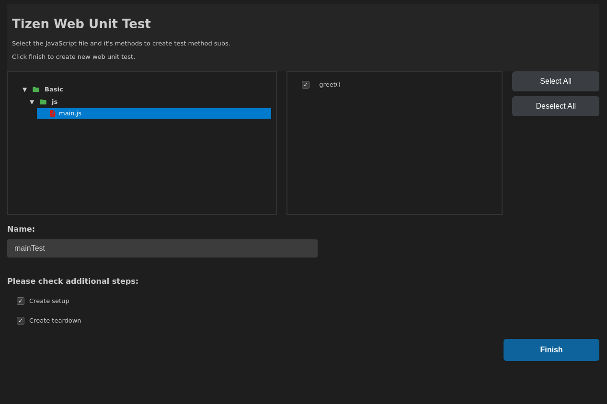

# Tizen: Add Web Unit Test Command Documentation

## Overview

The `Tizen: Add Web Unit Test` command is a powerful Visual Studio Code extension feature designed to streamline the process of adding and configuring unit tests for Tizen web applications. This command automates the setup of a robust testing environment using the QUnit framework, enabling developers to ensure the quality and reliability of their JavaScript code with minimal manual configuration.

This documentation provides a comprehensive guide for developers on how to use the `Tizen: Add Web Unit Test` command, its functionalities, and the structure it creates within your project.

## What is the `Tizen: Add Web Unit Test` Command?

The `Tizen: Add Web Unit Test` command is an integrated utility within the Tizen extension for VS Code. It simplifies the creation of web unit tests by:

1.  **Automating Setup**: It automatically copies necessary testing libraries (QUnit) and sets up the required directory structure within your Tizen web project.
2.  **Generating Test Files**: It generates JavaScript test files based on your existing source files, following a consistent naming convention.
3.  **Configuring the Test Runner**: It updates the main test HTML file to include references to the newly created test files, ensuring they are executed by the test runner.
4.  **Providing a User-Friendly Interface**: It offers a dedicated web panel within VS Code for an intuitive, step-by-step test creation process.

## Prerequisites

Before using the `Tizen: Add Web Unit Test` command, ensure you have the following set up:

*   **Visual Studio Code**: Installed on your development machine.
*   **Tizen Extension for VS Code**: The official Tizen extension must be installed and enabled in your VS Code environment.
*   **Tizen Studio**: While the command automates copying libraries, having Tizen Studio installed ensures that the necessary QUnit library files are available to the extension.
*   **An Existing Tizen Web Project**: You should have a Tizen web project open in your VS Code workspace. The command will operate within the context of this active project.

## How to Execute the Command

Executing the `Tizen: Add Web Unit Test` command is a straightforward process within VS Code:

1.  **Open the Command Palette**:
    *   Go to **View > Command Palette...** or press the shortcut key (`Ctrl+Shift+P` on Windows/Linux, `Cmd+Shift+P` on macOS).

2.  **Search for the Command**:
    *   In the Command Palette, start typing `Tizen: Add Web Unit Test`.
    *   Select the command from the list as it appears.

    


3.  **Interact with the Web Panel**:
    *   Upon executing the command, a new **"Tizen Web Unit Test"** web panel will open within VS Code. This panel provides the user interface for configuring and generating your unit tests.

## The "Tizen Web Unit Test" Web Panel

The web panel is the central interface for the command. It guides you through the test creation process with the following sections and options:

### Panel Layout and Options

The panel is typically divided into a few key areas:

1.  **File Selection (Left Box)**:
    *   This section lists all available JavaScript (`.js`) files within your project's `web` directory (e.g., `Basic/js/`).
    *   **Action**: Click on the JavaScript file for which you want to create unit tests.

2.  **Function Display (Appears after file selection)**:
    *   Once you select a JavaScript file, this area will display a list of all the functions found within that file.
    *   **Action**: You can select one or more functions from this list. The command will generate basic test case stubs for each selected function. If no functions are selected, placeholder test cases will be created.

3.  **Test Configuration Options**:
    *   These are typically input fields or checkboxes that allow you to customize the generated test file:
        *   **Name (Test File Name)**:
            *   A text input field where you can specify a custom name for the test file.
            *   **Behavior**: If you provide a name (e.g., `MyFeature`), the generated test file will be named `MyFeatureTest.js`.
            *   **Default**: If you leave this field blank, the command will use the name of the source JavaScript file you selected and append "Test.js" to it. For example, if you select `main.js`, the test file will be named `mainTest.js`.
        *   **Create Setup**:
            *   A checkbox option.
            *   **Behavior**: If checked, the command will add a `setup` function template to your test module. The `setup` function in QUnit runs before each test in the module, useful for initializing test data.
        *   **Create Teardown**:
            *   A checkbox option.
            *   **Behavior**: If checked, the command will add a `teardown` function template to your test module. The `teardown` function in QUnit runs after each test, useful for cleaning up resources.

4.  **Finish Button**:
    *   A button, usually located at the bottom of the panel.
    *   **Action**: After configuring your options (selecting a file, optional functions, and test settings), click the **"Finish"** button to execute the test generation process.

### Step-by-Step Usage Example

Let's walk through an example:

1.  **Trigger the Command**: Open the Command Palette (`Ctrl+Shift+P`) and run `Tizen: Add Web Unit Test`.
2.  **The Web Panel Opens**: The "Tizen Web Unit Test" panel appears.
3.  **Select a Source File**: In the left-hand file list, click on `js/main.js` (assuming your project has a `main.js` file).
4.  **(Optional) Select Functions**: If `main.js` contains functions like `greet(name)` and `add(a, b)`, they will be displayed. You can click on `greet(name)` to generate a test for it specifically.
5.  **(Optional) Configure Test File**:
    *   In the "Name" field, you could type `AppLogic` to generate `AppLogicTest.js`. Or leave it blank to generate `mainTest.js`.
    *   Check the **"Create Setup"** box if your tests require common initialization.

    


6.  **Generate Tests**: Click the **"Finish"** button.

## What Happens When You Click "Finish"?

When you click the "Finish" button, the command performs several actions in the background:

1.  **Copies Required Libraries**:
    *   It copies the QUnit testing framework files from your Tizen Studio installation into your project. This typically includes:
        *   `qunit.js`: The core QUnit testing library.
        *   `qunit-reporter.js`: A reporter for Tizen-specific test output.
        *   `style.css`: Stylesheets for the QUnit test runner page.
    *   These files are usually placed in a dedicated testing directory.

2.  **Creates/Verifies Test Directory Structure**:
    *   It ensures a `webUnitTest/tests` directory exists in your project. If not, it creates it. This is where your generated test files will reside.
    *   The main test runner HTML file (e.g., `test.html`) is also set up or updated within this structure.

3.  **Generates the Test File**:
    *   A new JavaScript test file is created in the `webUnitTest/tests/` directory.
    *   **Filename**: As per your configuration in the web panel (e.g., `mainTest.js` or `AppLogicTest.js`).
    *   **Content**:
        *   It defines a QUnit module, typically named after your source file or the custom name you provided.
        *   If you checked "Create Setup", a `setup(function() { ... });` block is added.
        *   If you checked "Create Teardown", a `teardown(function() { ... });` block is added.
        *   For each function you selected from the source file, it generates a corresponding `QUnit.test` case. For example, for `greet(name)`, it might create:
            ```javascript
            test("Test for greet", function() {
                // Add your test assertions here
                // Example:
                // var result = greet("World");
                // assert.equal(result, "Hello World!", "Greet function returns correct message.");
            });
            ```
        *   If no specific functions were selected, a placeholder test case is generated to get you started.
    *   **Prevents Overwriting**: The command is designed to prevent accidental overwriting of existing test files. If a test file with the target name already exists, it will typically notify you or modify the name to avoid conflicts.

4.  **Configures the Test Environment (`test.html`)**:
    *   The command automatically updates the `test.html` file (the main runner for your unit tests).
    *   It adds a `<script src="..."></script>` tag within the `<head>` or `<body>` section of `test.html`, pointing to your newly generated test file (e.g., `<script src="../../webUnitTest/tests/mainTest.js"></script>`). This ensures that your new tests are loaded and executed when you open `test.html` in a browser or test runner.

## Generated Test File Structure

The generated test file (e.g., `mainTest.js`) will follow a standard QUnit structure:

```javascript
module("mainTest", {
	setup: function() {
		// TODO Auto-generated method stub
	}, teardown: function() {
		// TODO Auto-generated method stub
	}
});

test("greet test", function() {
	ok(false, "Not implemented");
});
```

## Benefits of Using the Command

*   **Reduced Boilerplate**: Eliminates the need to manually set up QUnit, create directory structures, and write initial test file templates.
*   **Consistency**: Ensures that all test files follow a consistent structure and naming convention across the project.
*   **Speed**: Dramatically speeds up the initial setup phase of writing unit tests.
*   **Integration**: Seamlessly integrates into the VS Code development workflow through the Command Palette and a dedicated web panel.
*   **Focus on Logic**: Allows developers to focus on writing the actual test logic rather than spending time on configuration.


## Conclusion

The `Tizen: Add Web Unit Test` command is an invaluable tool for Tizen web developers, significantly lowering the barrier to entry for implementing unit tests. By automating the setup and configuration process, it allows developers to quickly adopt test-driven development (TDD) practices, leading to more robust, maintainable, and reliable Tizen web applications. This guide should equip you with all the knowledge needed to effectively use this command within your development workflow.
