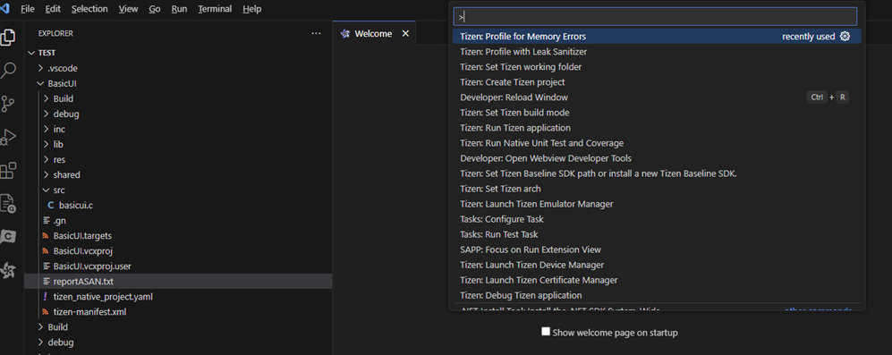
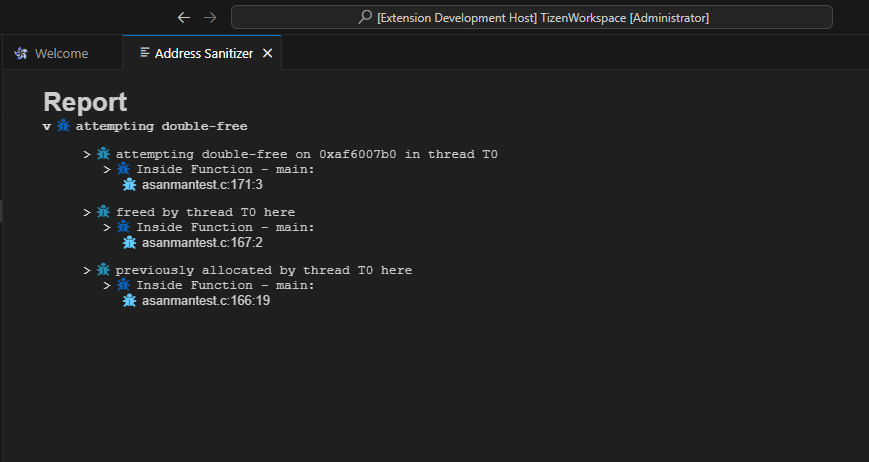
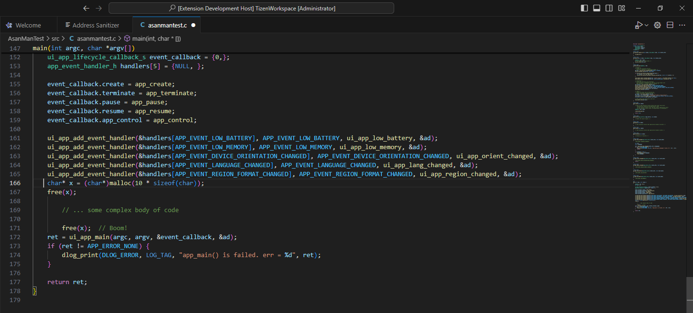

# To Detect Runtime Memory Error with Address Sanitizer
- The Address Sanitizer is a tool that helps find memory errors in Tizen Native apps. It checks if certain parts of the code might cause memory problems while running. This tool can prevent crashes or bugs during app use. It works by adding extra code during app compilation. If the app doesn't crash with the Address Sanitizer, it means the code is safe from memory issues. The tool can find different types of bugs. The Address Sanitizer tool can detect the following types of bugs:

- Out-of-bounds accesses to heap and stack
- Use-after-free
- Use-after-return (to some extent)
- Double free and invalid free

## To use Address Sanitizer
- In the **Menu**, click on view and select **Command Palette > Tizen: Profile with Memory Errors**.
  
  The profiling instruments the code and compiles the project for the Address Sanitizer. Finally, it launches the application on the connected target or Emulator, as illustrated in the following figure:

    
     

- After the application is launched, run the application scenario you want to test.
- Visual Studio Code shows the profiling result after clicking on the **Stop Profiling** button:

    
     
    
- Once clicked on the **Stop Profiling** button, the application will crash if there are any errors hence the report will be generated, and if there are no memory errors it will give the message **no error found**, as illustrated in the following figure:

    
     
  
## Source file navigation on failure
- When a failure occurs, you can click on the **line number associated with the failure which is generated in UI Report**.
- This action will open the corresponding source file in your editor and **navigate to the exact location where the failure has occurred**, as illustrated in the following figure:

                                                         