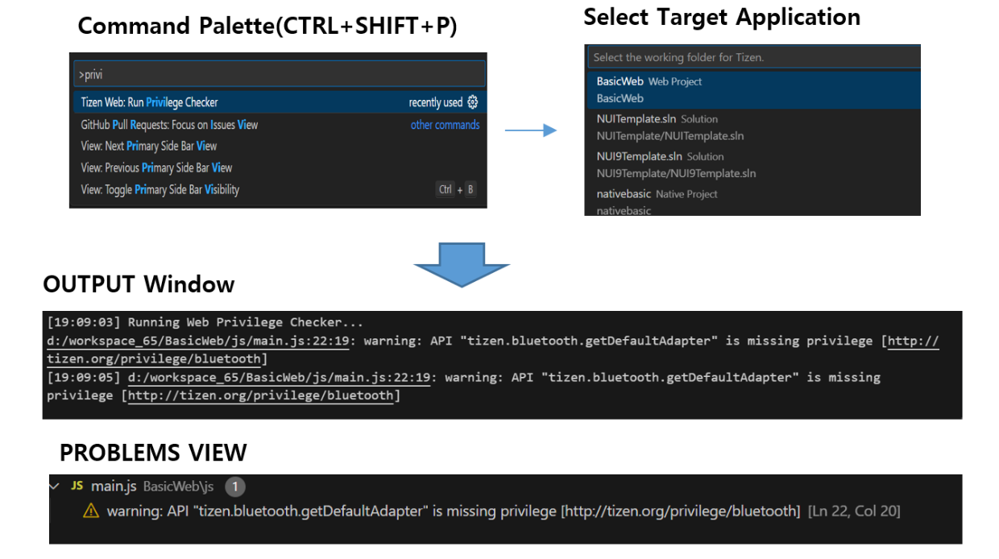

# API and Privilege Checker

You can detect potential issues with privileges and APIs in your Tizen .NET application by using the API Checker tool.

The API Checker currently detects the following issues in Tizen .NET applications:

- **Undefined privileges**

  Flags an error if the application uses a method which requires a privilege, but that privilege has not been defined in the application manifest file.

  For example, the `GetCallHandleList()` method of the [Tizen.Telephony.Call](https://developer.tizen.org/dev-guide/csapi/api/Tizen.Telephony.Call.html) class requires the `http://tizen.org/privilege/telephony` privilege. If an application uses this method without the privilege being defined in the manifest file, the method fails when you try to run the application.

  The API Checker enables you to detect undefined privileges at compile time and fix them using the Quick Actions functionality in Visual Studio.
- **Unused privileges**

  Flags a warning if the application contains privileges that are not used by any APIs in the application.

## Running the API Checker

To run the API Checker on your application:

1. Select **Tizen Web: Run Privilege Checker** in command palette.
2. Select Target Application.
3. Run Privliege Checker and find the missing privilege from tizen-manifest.xml file.
