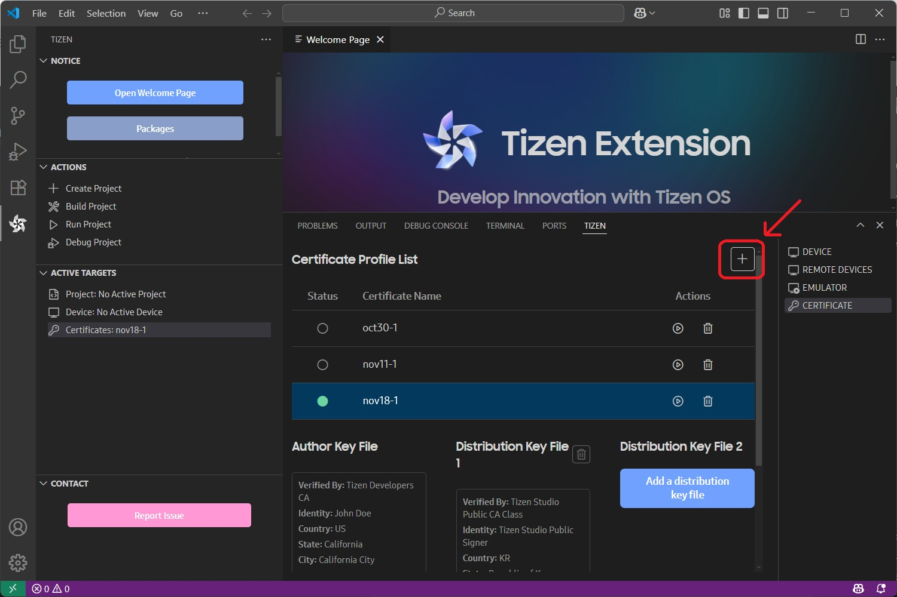
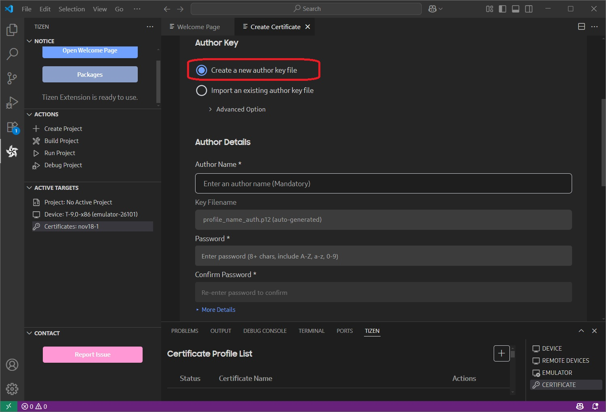
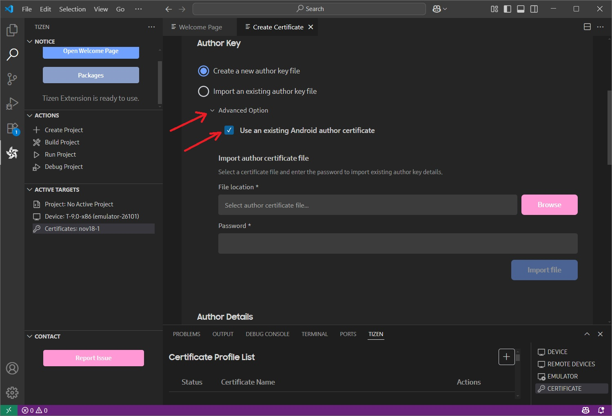
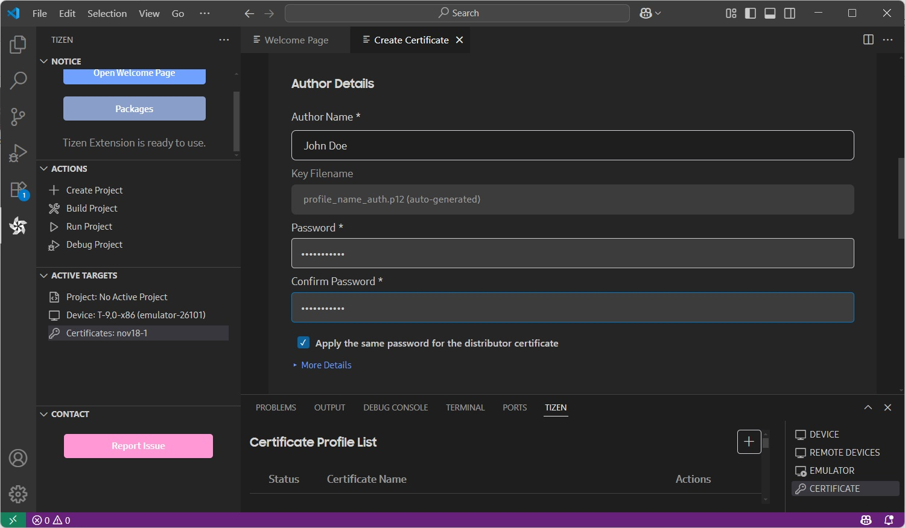
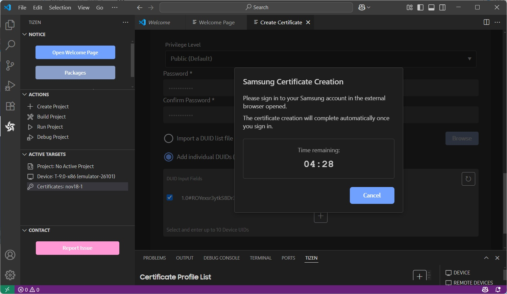
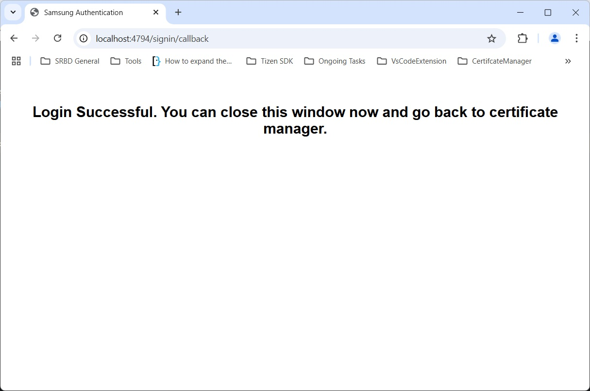
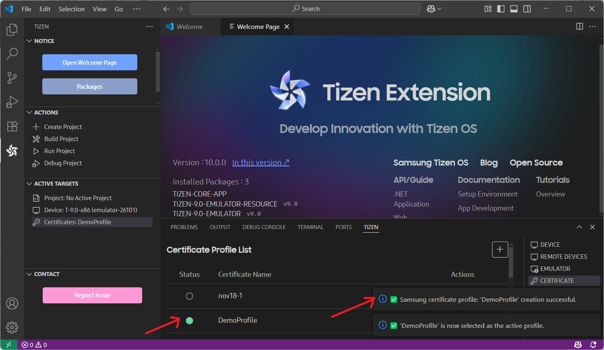

# Creating Certificates

This document explains how to create the necessary certificate profiles through creating or importing existing certificate files to install the Tizen application on a Samsung Tizen wearable device.

## Creating certificate profile

In the VSCode activity bar select:

**(1) Tizen extension** > **(2) ACTIVE TARGETS > (3) Certificates: _Active certificate profile_**.

This will open the **TIZEN** panel with **CERTIFICATE** tab selected.

### Create a new certificate profile

A Certificate profile contains the author certificate and distributor certificate. To create a new certificate profile, follow these steps:

1. New certificate profile

   Click the **+** button to create a new certificate profile.

   

2. Profile name and type of certificate

   Enter a certificate profile name.

   Then select **Create Samsung Certificate** as the certificate profile to generate certificates to develop and install an application to Samsung devices. To upload the application to the store, you must select the certificate profile as Samsung.

   However, if you want to use the emulator and do not want to upload the application to the store, select **Create Tizen Certificate** to create certificate locally.

#### Create a new author certificate

An author certificate includes information about the author of the application.

It is used to create an author signature, which ensures the integrity of the application from the author since the publication of the application.

1. Create new or select existing author certificate

   Select **Create a new author key file** to create a new author certificate.

   If there is an existing author certificate and you select **Import an existing author key file** see [how to manage certificate profile](cert-manage-profile.md#importing-existing-certificates).

   

   With the **Advanced option** menu, you can check **Use an existing author certificate** to select either the Android keystore or an existing Samsung author certificate, and import the certificate key file (.p12, .jks, .keystore, etc.).

   Then you can browse the intended certificate and import it with the correct password.
   

   The same signing key helps in maintaining secure peer authentication between the Tizen Watch app and the Android mobile app.

   For more information, see [Accessory SDK](https://developer.samsung.com/galaxy/accessory). If you select a Samsung author certificate, you can renew the certificate with the same information. This renewed certificate will be the same as your original RSA key, so upgrading your application is guaranteed.

2. Information of the author certificate

   Enter the author name and password. It is recommended to set a strong password. If you want to use the same password for the distributor certificate in the next step, select the check box as shown in the following figure:

   

   **More Details** contains more Certificate Signing Request (CSR) information to add, but is not mandatory.

#### Create a new distributor certificate

1. Create new or select existing distributor certificate

   Select **Create a new distributor key file** to create a new certificate.

   If you select **Import an existing distributor key file**, see [Managing Certificate Profile](cert-manage-profile.md#select-an-existing-distributor-certificate).

2. Information of the distributor certificate

   Select the **Privilege level** for the distributor certificate. The application must have a distributor certificate with appropriate privilege level to ensure that the implemented APIs work in the device.

   

   > [!NOTE] > **Privileges**
   >
   > To protect the device system and user private data, the Tizen security architecture is based on privileges and application signing of the Linux basic security model. Linux basic security model includes process isolation and mandatory access control. The users must have options to grant privileges for security-sensitive operations.
   >
   > - **Public** - No limitation. The privileges can be used by all Tizen application developers.
   > - **Partner** - No limitation to request and get the distributor certificate with this level. But when the application is uploaded to the store, store re-signs the application with official partner level distributor certificate, only for the registered partner developer at Samsung.

   - If you have selected an option to apply same password to the author certificate and to the distributor certificate [while entering author certificate information](#information_of_the_author_certificate), the password is already saved. If you want to change the password, type the new password for the distributor certificate.

   - After the device is connected to the host PC, the DUID is automatically added to the list. If you want to add more devices, connect your device to your host PC via USB or WiFi. The previous DUIDs in the list are not deleted even if you disconnect the device. To delete the DUIDs, click the trash icon. For more information, see [How to connect the device to PC via WiFi](../wearable-connection/index.md).

   - When you need to register devices that are more than 10, upload a txt file using **Import a DUID list file** menu. One DUID on a line and max 50 DUIDs are available.

3. Sign in to Samsung account

   After filling all the author and distributor information, when the user clicks the **Create** button, a pop-up notification appears, indicating a 5-minute timeout for accessing the Samsung account sign-in page.

   

   Samsung account sign-in window appears in the default browser. Click **Sign in** or **Create new account**. (To get a certificate, you must have a Samsung account. If you do not have an account, it is recommended to create a new account.)

   

   Following a successful login, a "Login Successful" window appears in the browser.

   

> [!NOTE]
> The DUID and the authentication is only applicable for **Samsung type** profile creation. **Tizen** type certificate profile does not require any authentication or DUIDs.

### Finish creating new profile

After successful authentication, the certificate profile will be created. You will see a confirmation notification in the bottom right corner.
You will also find the created profile and its information in the list of profiles in the **TIZEN** panel.

