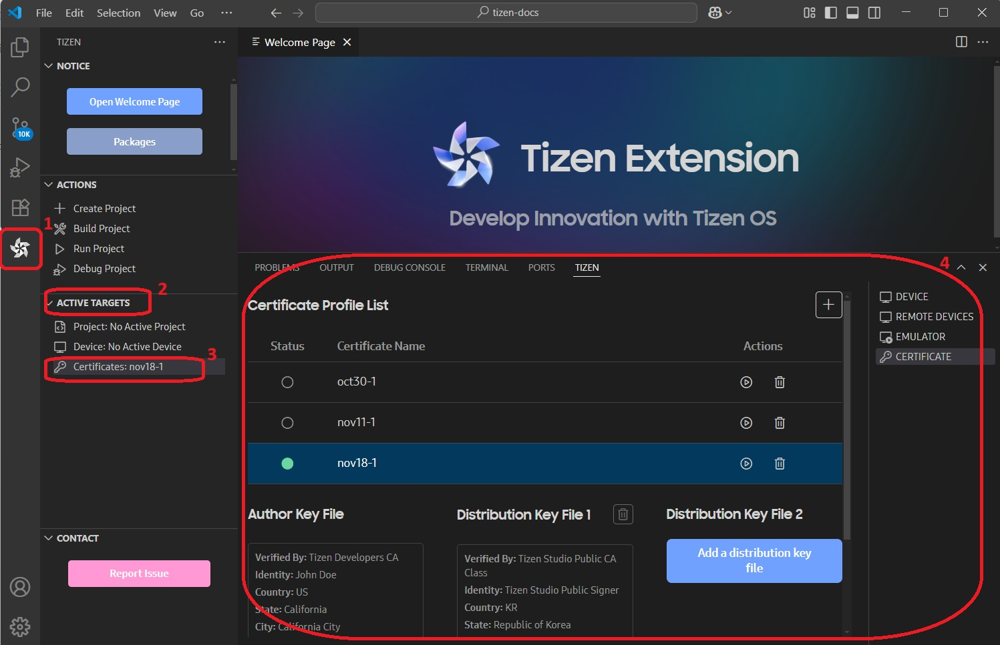
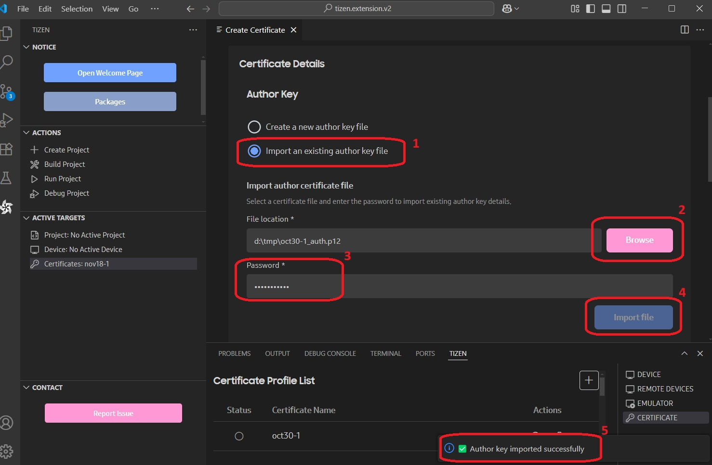
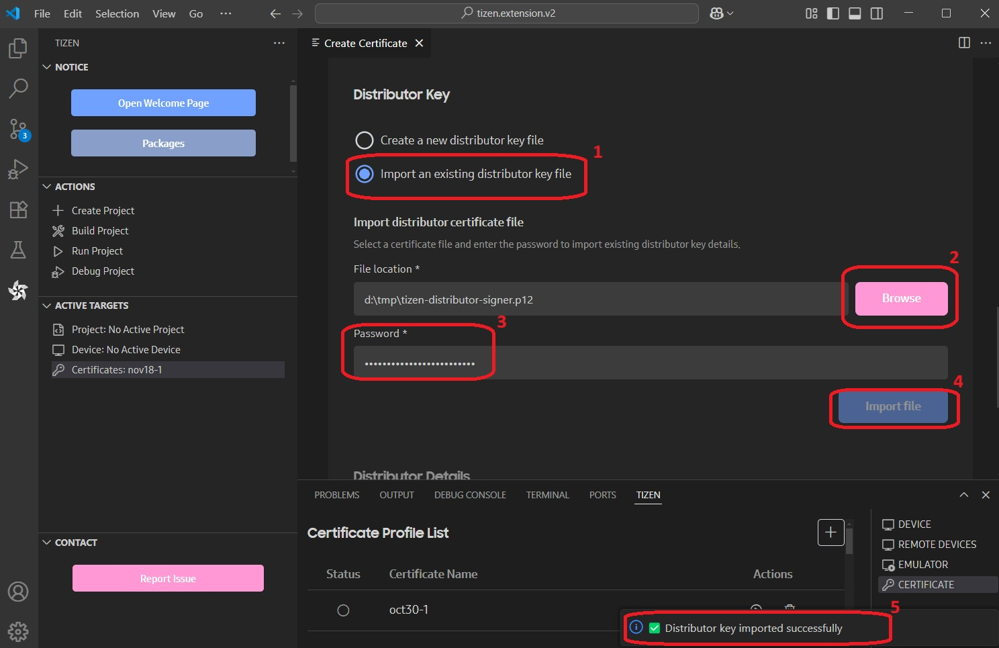
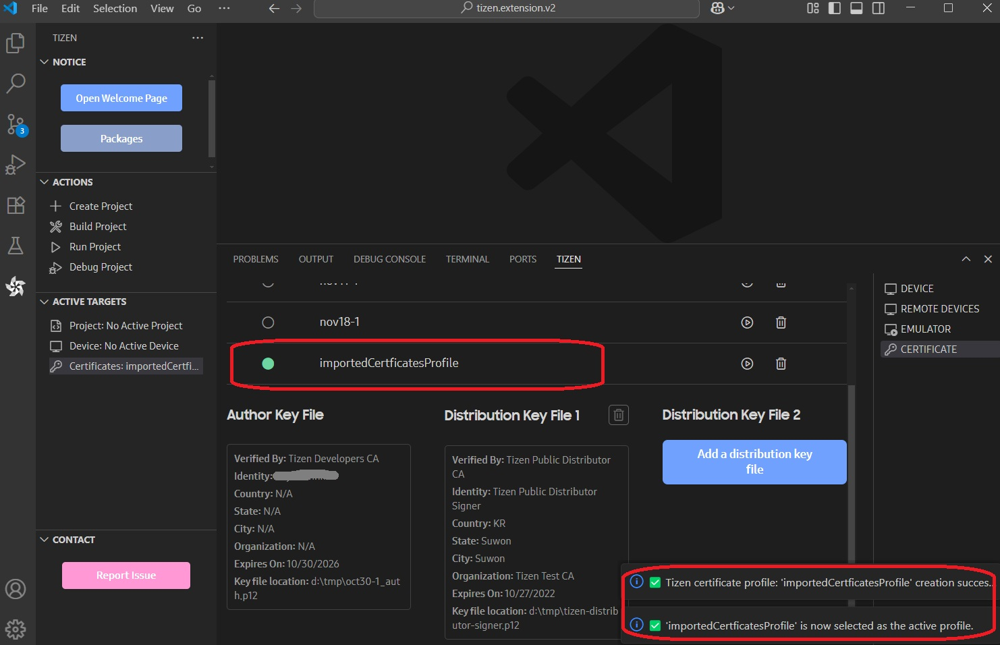

# Managing Certificate Profiles

Before installing your application on a device or submitting it to the official site for Tizen applications, it must be signed with a certificate profile.
The signature verifies the source of the application and ensures that it has not been tampered with since its publication.
A certificate profile is a combination of the certificates used for signing.

## General Information

In the VS Code Activity Bar, click:

**(1) Tizen extension** > **(2) ACTIVE TARGETS > (3) Certificates: *Active certificate profile***.

The **Tizen Panel** will open with the **CERTIFICATE** tab selected.

- The active profile is indicated by the green indicator bullet.
- All applications in this SDK will be signed with this active profile.
- You can create, delete, and set a profile to active here.
- The lower window shows the information of each certificate.
- You can replace the certificate with an existing one.
- The Tizen platform allows multiple distributor certificates (up to two), which supports other device manufacturers or telecommunication companies. However, it is generally not needed for most developers.

## Importing Existing Certificates

If you already have:

- Both the **author keyfile (.p12)** and **distributor keyfile (.p12)** certificates
- Only the **author keyfile (.p12)**
- Or the **distributor keyfile (.p12)**

And you do not require a new certificate from Tizen or Samsung, you can import and use the available certificates to sign your application.
In that case, create a new certificate profile and select existing certificates at each step.

Follow the same steps as mentioned in [Creating a New Profile](cert-create-profile.md#create-a-new-author-certificate).

### Select an Existing Author Certificate

The author certificate must be the same for the application that is to be upgraded.

1. Select **Import an existing author key file** and click **Next**.
2. Click the **Browse** button and locate your author certificate key file.
3. Enter the password of the key file.
4. Click the **Import file** button.
5. If the password is verified, the author key import successful notification will pop up.

### Select an Existing Distributor Certificate

Click **Import an existing distributor key file**, click **Browse** to select your distributor key file (.p12), enter the password, and then click **Import file**.

### Create and Find the Created Profile in the List

After importing and creating, you can find the created profile in the list.

## Troubleshooting

- **Question**: I lost the `author.p12` file. Can I upgrade my application?
- **Answer**: No. If the author key is different, the application cannot be upgraded.
