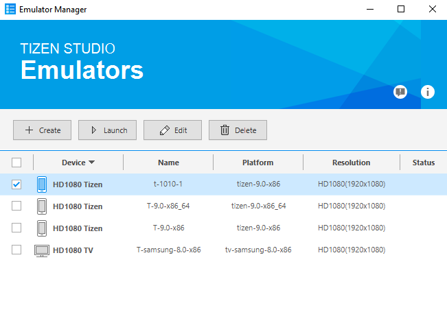
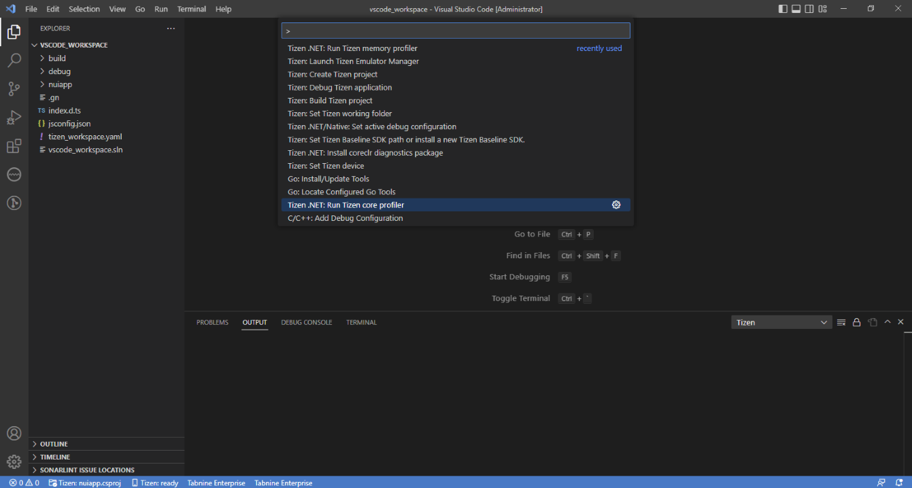
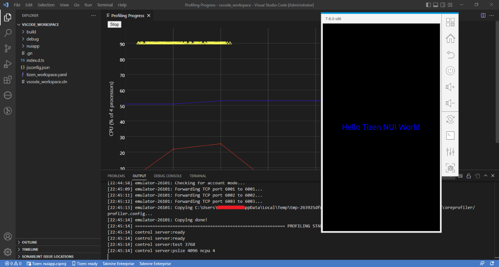
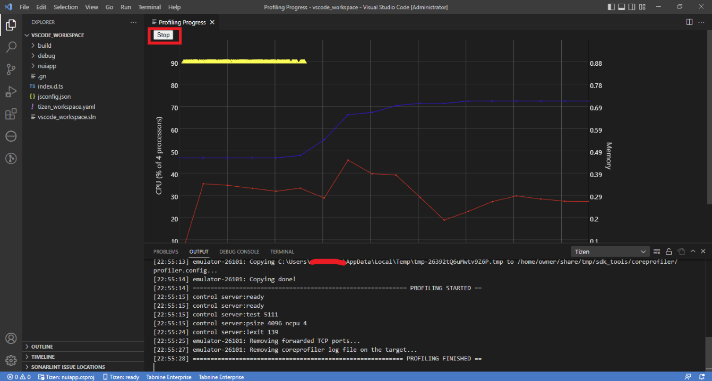

# Core Profiler

- The profiler allows you to analyze the performance of your tizen application. The tools allows to profile CPU and memory usage of app while its running. Currently, profiling is supported only for .NET applications.

## Profiling Progress
After profiling starts, you can see profiling progress in visual studio code view.

## Running Core Profiler
   - If no Tizen device is connected and no Tizen emulators are running then launch Emulator Manager and launch the type of emulator you want to use for running and profiling your application.

     

   - Open the **Command Palette** and select **Tizen.NET: Run Tizen core profiler**.

     

   - If everything is ok then the application starts as if you are running it normally.

     

   - Profiling progress window will be displayed with a "Stop" button in a new tab showing the application's live performance profiling.

     

   - Profiling can be stopped by clicking the "Stop" button.

     

     