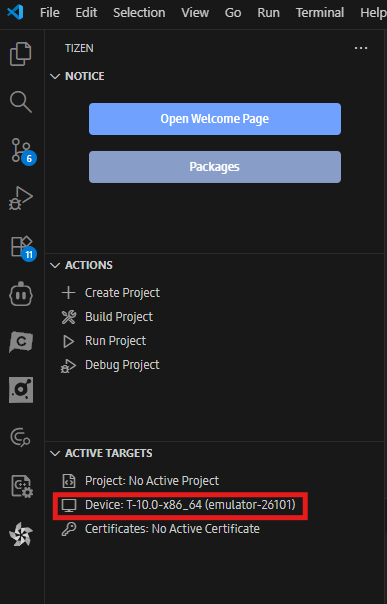
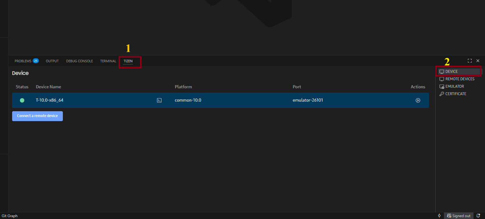
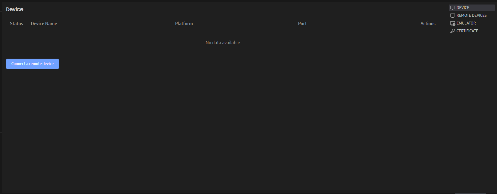
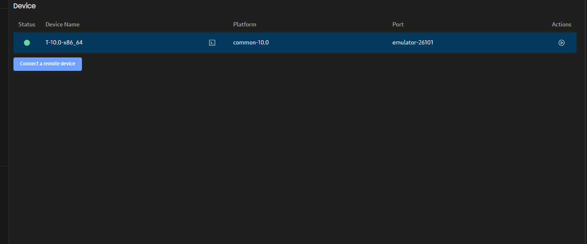
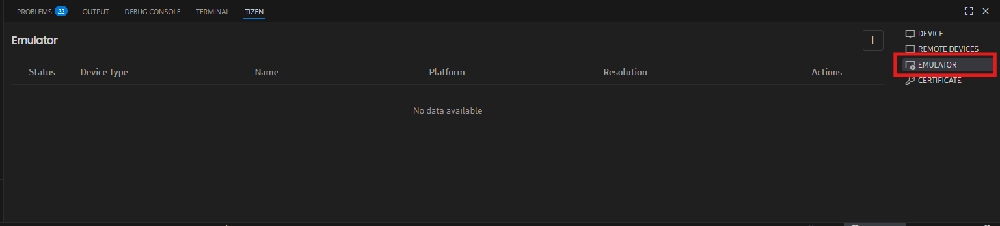
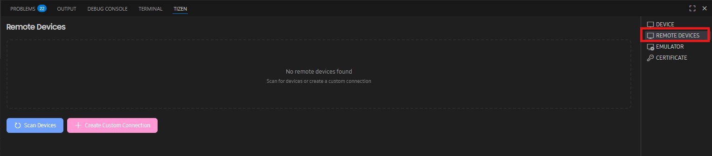
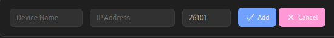
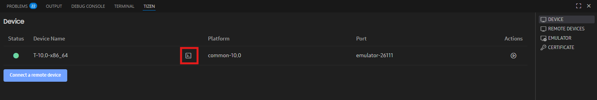
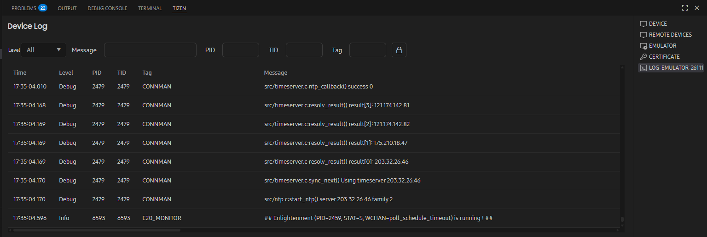

# Monitoring Devices with the Device Manager

**Device Manager** is part of the extension that manages devices and allows you to access logs. A device can be either a virtual device, such as an emulator, or a physical device connected via a USB cable or a wireless connection.

The Device Manager provides a Graphical User Interface (GUI) that is more user-friendly than the Command Line Interface (CLI). You can use it to connect and disconnect devices. It also displays device logs in a table format, allowing you to use filters to find specific log entries.

To use the Device Manager, you must connect a device over the Smart Development Bridge (SDB). Physical devices can be connected via a USB cable, while emulators can be connected through the Emulator Manager. Once connected over SDB, the device automatically appears in the Device Manager, and its logs are displayed in the **Log view**.

## Accessing Device Manager

- There are two different ways to access Device Manager:
  - Click the **Device** on the **Active Targets**. 
    
  - Open Device Manager from **TIZEN** panel. 
    

**Figure: Device Manager main screen**

## Connecting Devices

Device Manager shows both local devices connected to the system and any configured remote devices:

- Only connected local devices (both physical and virtual devices) are listed. Disconnected devices automatically disappear from the list.

**Figure: Connected devices in Device Manager**

Connecting a device to a computer depends on the device type:

- Physical device

  When you connect a local physical device with a USB cable, it automatically appears in Device Manager.

- Virtual device

  To connect a virtual device, click **Emulator** , select the virtual device, and click **Launch**.

  When the emulator finishes booting, the device appears in Device Manager.

- Remote device

  To connect a remote device, follow these steps:

  1. Open the **TIZEN** panel and click on **REMOTE DEVICES** tab
     
  2. In the **Remote Devices** window that appears, you can scan, add, edit, and delete a device. You can click  to see the list of available devices.

  3. To add a remote device, click 
  4. In the **Add Device** dialog that appears, enter the device name, the IP address of the device to which the connection needs to be made, and the port number. The default port number is **26101**.

     

     > [!NOTE]
     > If you are using an emulator, then you need to enter the IP address of the system on which the emulator is launched.

  5. Confirm the IP address and port number of the remote device, and click on the **Connect** button to connect to the remote device.

     When the connection is established, the remote device appears in **Device Manager**.

## Viewing Device Logs

When a device is connected to Device Manager, a device log tab can be opened to view log. You can set different filters for each log tab. Tabs for disconnected devices are shown as inactive, and are reactivated when the device is reconnected.

- Click on the  icon from the device row of which you want to view the log. It will automatically open the log tab.
  

  **Figure: Log view**
  

Each log tab contains a toolbar and a log table. The log table lists log messages in chronological order, and this order cannot be modified. Each log message contains the **Time**, **Level** (priority level of the log message), **Pid** (process ID), **Tid** (thread ID), **Tag** (identification of the log message source), and **Message** fields, and you can create filters for each field.

You can perform a variety of actions in the **Log** view:

- Filtering log messages

  You can filter log messages based on the table columns:

  - To filter log messages based on the **Level**, click the  icon next to the column name, select value you want to show.
  - To filter log messages based on the **PID**, **TID**, **Tag** and **Message** column, enter the string you want to search for in the field at the top of the **Log** view.
