# Get Started with .NET Core Diagnostics

.NET Core Diagnostics supports a number of tools that can be used to diagnose Tizen .NET applications.
It includes dotnet-gcdump, dotnet-dump, and dotnet-trace tools to aid .NET developers in diagnosing their applications.

## Prerequisites

Below are the prerequisites for using Tizen .NET Core Diagnostics in Visual Studio Code:

- Make sure that Tizen Studio version 6.0 or above is installed.
- Make sure to set Tizen Studio Path with the installed 6.0 or above, by using the VS Code command: **Tizen: Wizard to set Tizen Baseline SDK path or install a new.**.

## Tizen .NET Core Diagnostics tools

### dotnet-gcdump

#### Step 1. Run dotnet-gcdump tool
   - If no Tizen device is connected and no Tizen Emulators are running, then launch the type of Emulator you want to use for diagnosing your application:

     

   - Open the **Command Palette** and select **Tizen.NET: Run dotnet diagnostics tools**:

     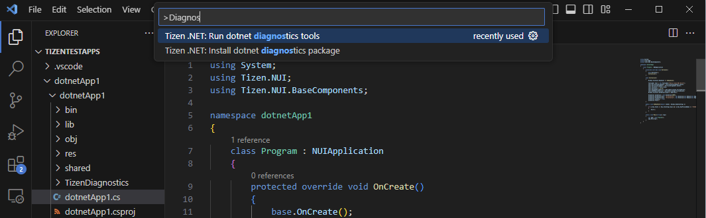
  
   - Now select **gcdump** from the drop down list:

     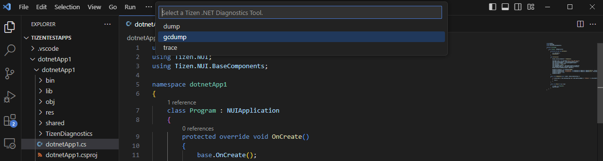

   - If everything is okay then the application starts, and it also starts collecting the **gcdump** file:

     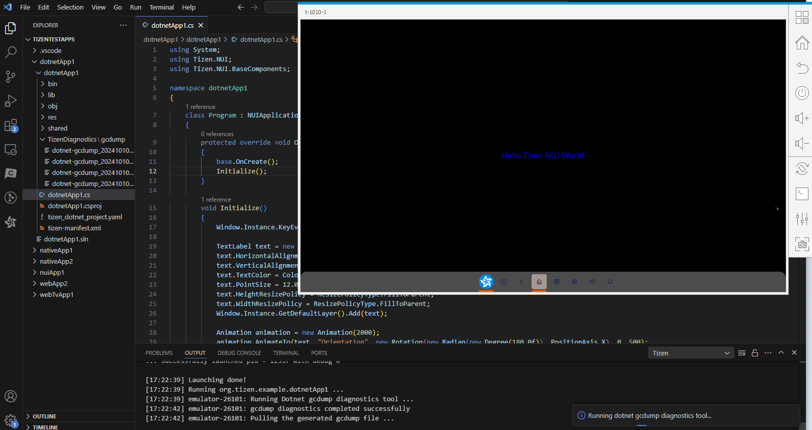

   - Once the gcdump file is collected, a message popup is shown to inform the user, and the file is added to the **gcdump** folder inside the **TizenDiagnostics** folder of the project:
   
     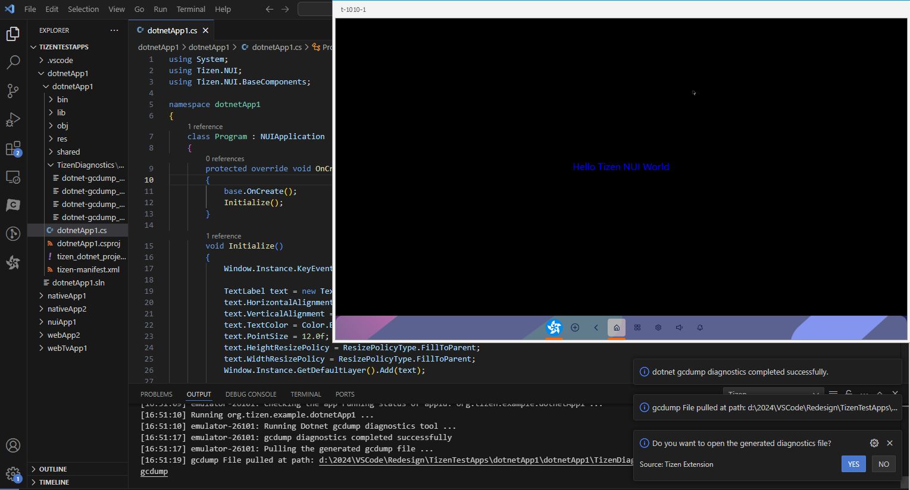

#### Step 2. Analyze the gcdump file
   - Once the gcdump file is collected, a message popup is shown with the option to open the generated gcdump file. Once we click the **YES** option, it will open the file in **PerfView** tool as seen below:
     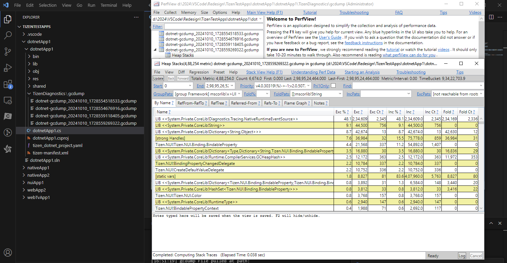

  - Another way to open the **gcdump** file is to right click the gcdump file in **File Explorer Panel** of VS Code and select **Tizen: Open in Diagnostics File Viewer**. It will open the file in **PerfView** tool as seen below:
     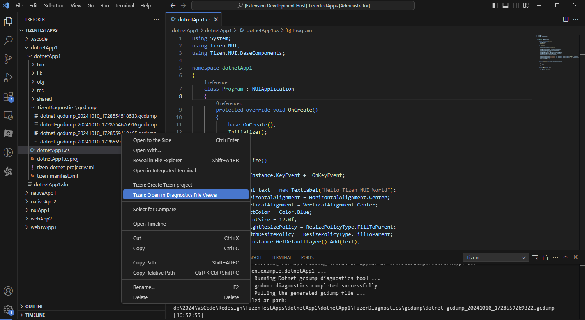

    > [!NOTE]
    > The above two options to open/view gcdump file is supported only in Windows OS.

### dotnet-trace

#### Step 1. Run dotnet-trace tool
   - If no Tizen device is connected and no Tizen Emulators are running, then launch the type of Emulator you want to use for diagnosing your application:

     

   - Open the **Command Palette** and select **Tizen.NET: Run dotnet diagnostics tools**:

     

   - Now select **trace** from the drop down list:

     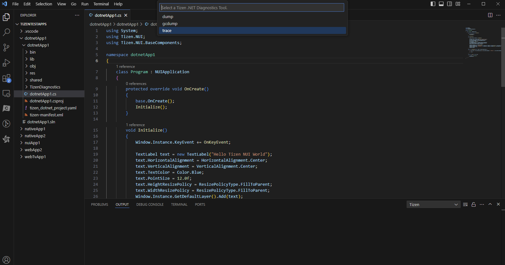
    
   - Now select **profile** from the drop down list:

     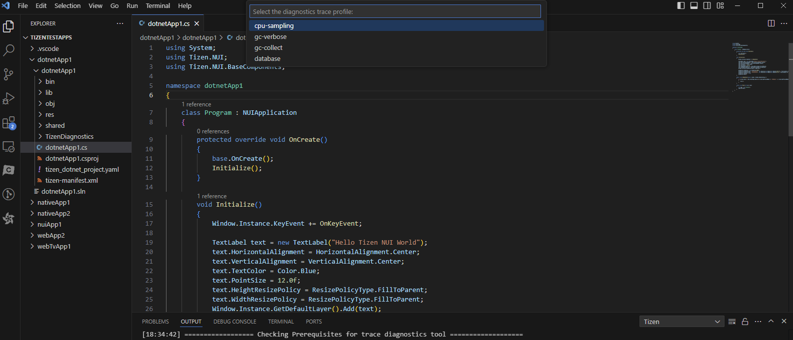

   - Now select **format** from the drop down list:

     

   - If everything is okay then the application starts, and it also starts collecting the trace file:

     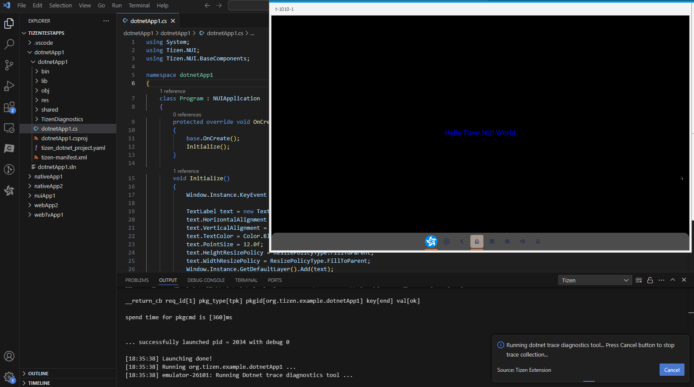

   - Press **Cancel** button above to stop and generate the trace file.

   - Once the trace file is generated, a message popup is shown to inform the user, and the file is added to the **trace** folder inside the **TizenDiagnostics** folder of the project:  

     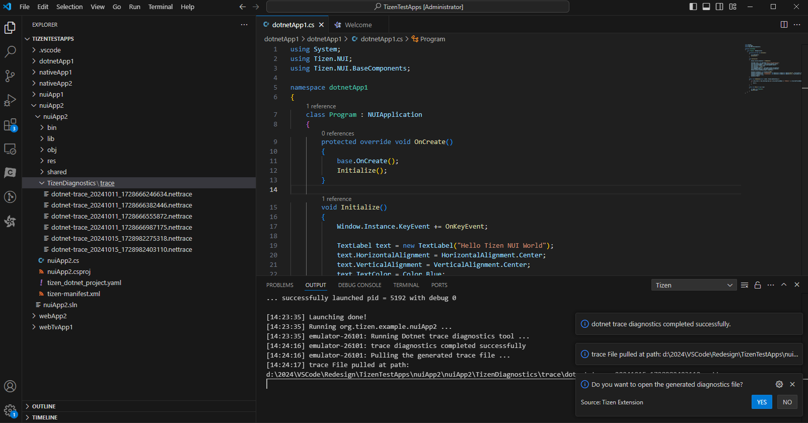

  

#### Step 2. Analyze the trace file
   - There are different tools for different **Format** to view the trace diagnostics data:
   - **nettrace**:
       - Once the trace file is collected, a message popup is shown with the option to open the generated trace file. Once we click the **YES** option. It will open the file in **PerfView** tool as seen below:
       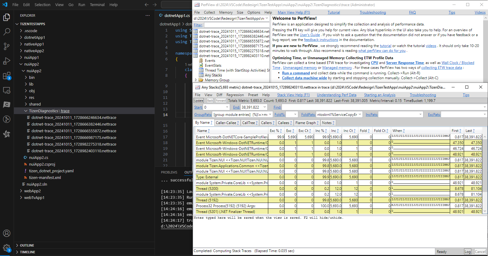
       - Right click the trace (.nettrace) file in **File Explorer Panel** of VS Code, and then select **Tizen: Open in Diagnostics File Viewer**. It will open the file in **PerfView** tool as seen below:
       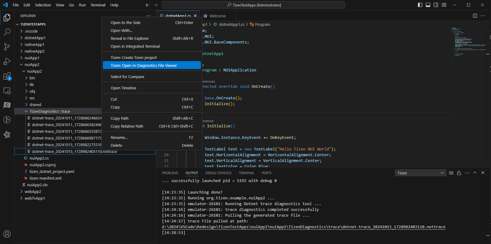
        > [!NOTE]
        > The above two options to open/view nettrace file is supported only in Windows OS.
   - **speedscope**:
       - Right click the trace (.nettrace) file in **File Explorer Panel** of VS Code, and then select **Tizen: Open in Diagnostics File Viewer**. It will open the file in **SpeedScope** web tool as seen below:
       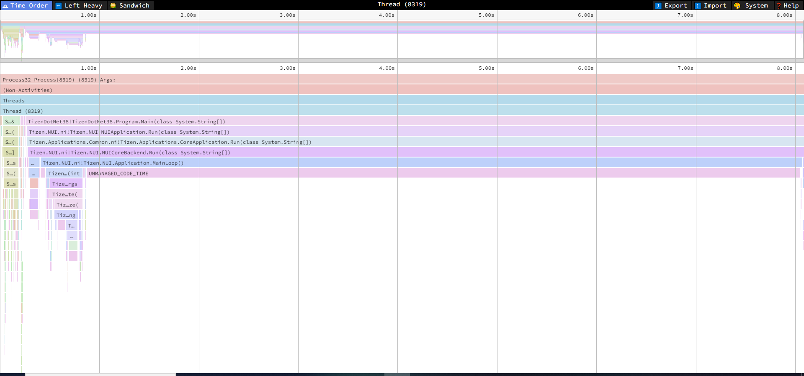  
   - **chromium**:
    Open Google Chrome browser and type: **chrome://tracing**, or the Microsoft Edge browser and type: **edge://tracing**.  
   Now click on **Load** button which fill open file explorer and select the **.chromium** file and click **Open**:
       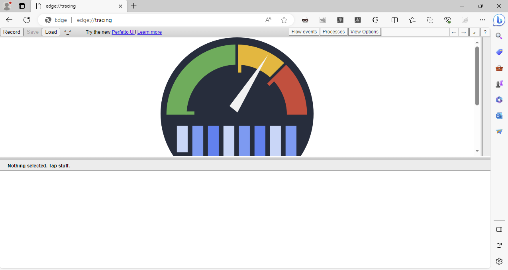

### dotnet-dump

#### Step 1. Run dotnet-dump tool
   - If no Tizen device is connected and no Tizen Emulators are running then launch the type of Emulator you want to use for diagnosing your application:

     

   - Open the **Command Palette** and select **Tizen.NET: Run dotnet diagnostics tools**:

     

   - Now select **dump** from the drop down list:

     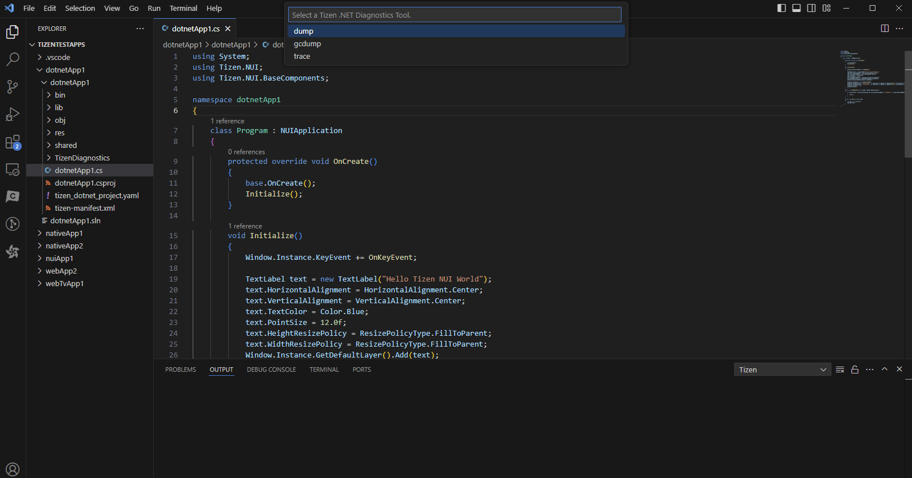
    
   - Now select **dump type** from the drop down list:

     

   - If everything is okay then the application starts, and it also starts collecting the dump file:

     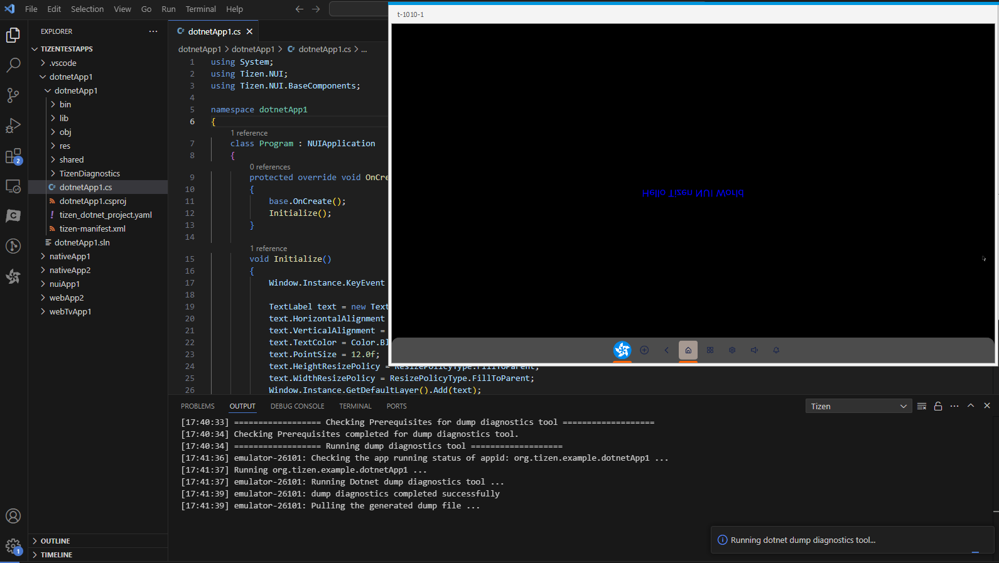

   - Once the dump file is generated, a message popup is shown to inform the user, and the file is added to the **dump** folder inside the **TizenDiagnostics** folder of the project.
   - Dump file analysis is also printed in output panel of VS Code, as shown below:

     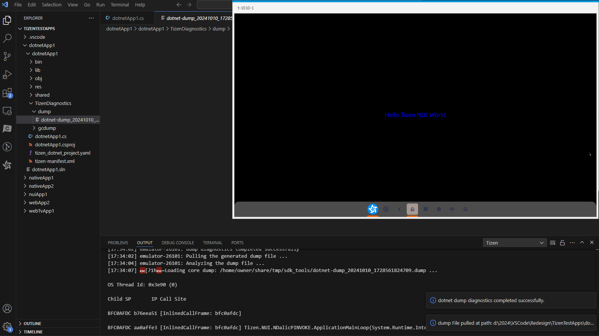

#### Step 2. Analyze the dump file
   - Open the **sdb shell**
   - Go to the folder (**/home/owner/share/tmp/sdk_tools**) containing the dump file
   - Run the command **dotnet dump analyze {file_name}**

     > [!NOTE]
     > Please delete the dump file after analyzing, as it takes up a lot of memory space.

