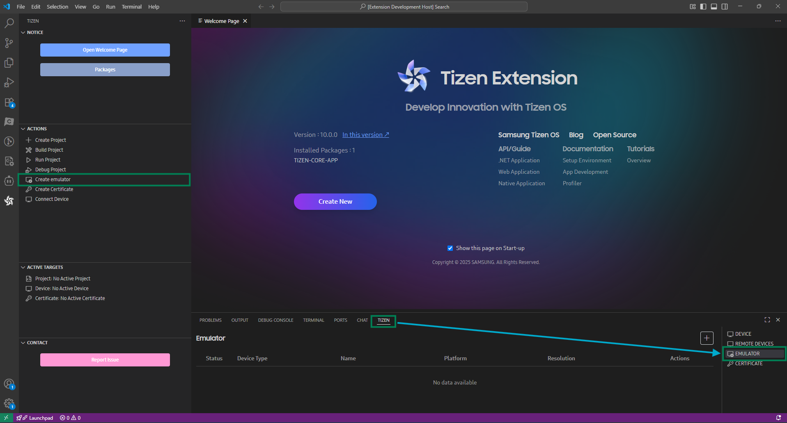
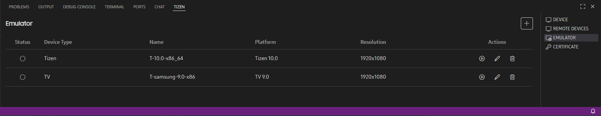
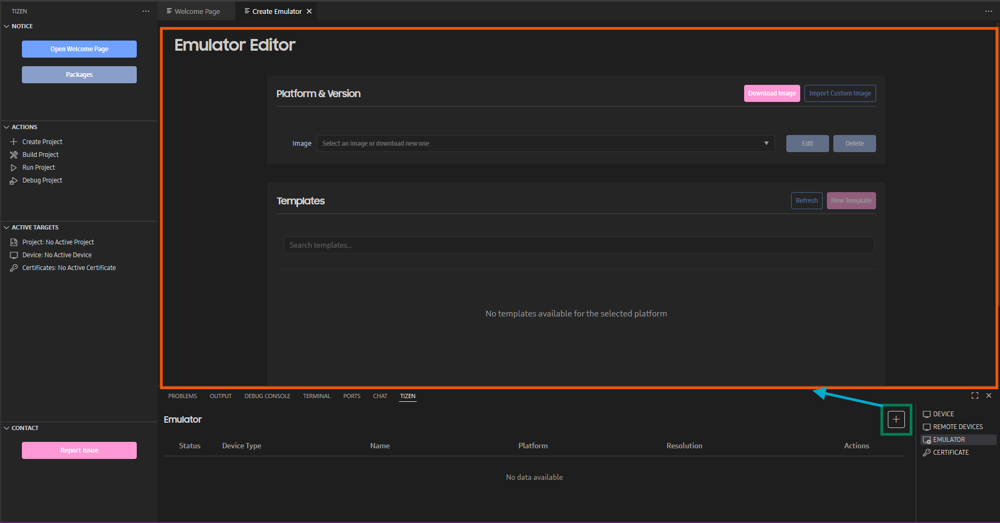
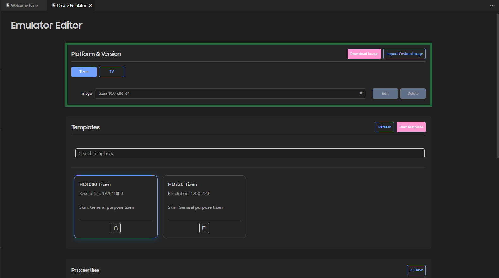
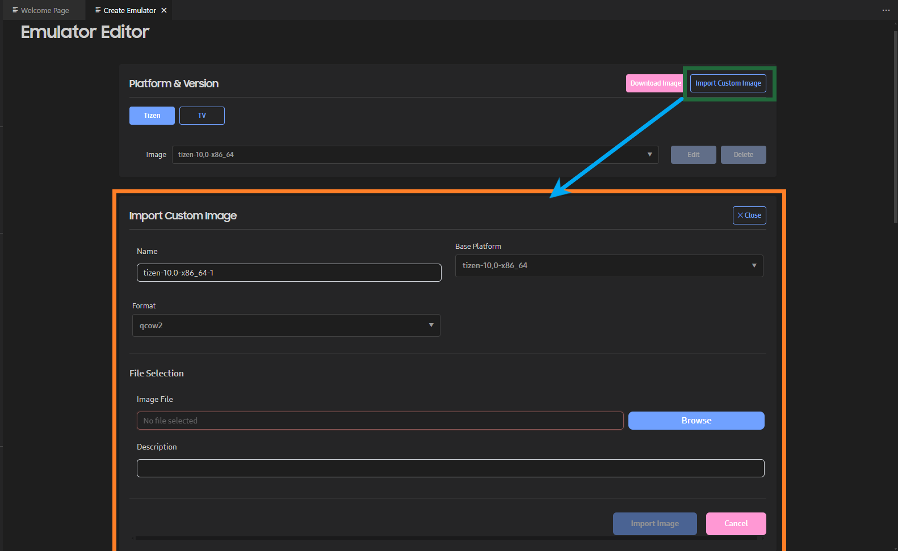
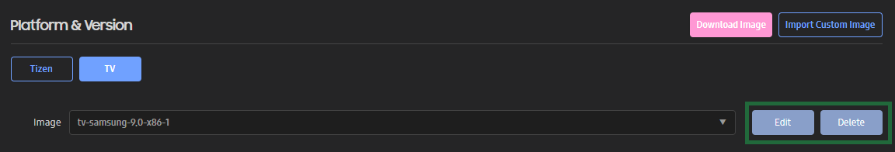
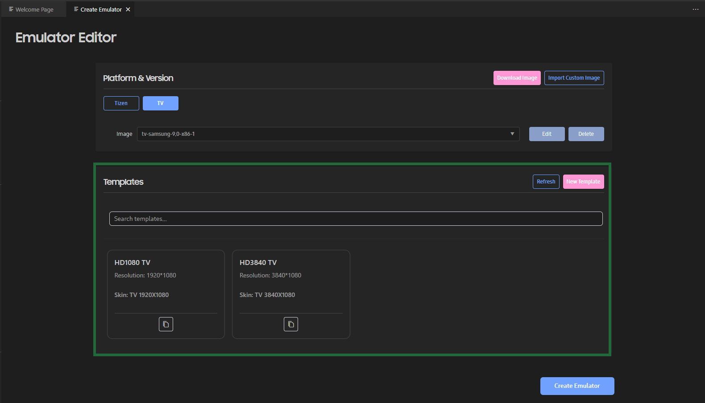
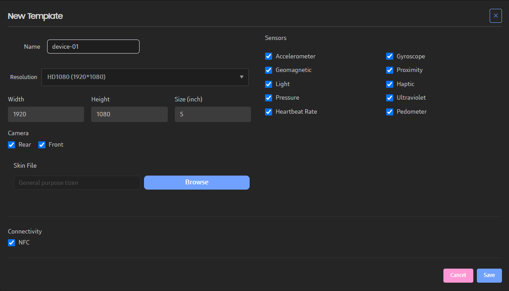

# Managing Emulator Instances

You can use emulators to run your application in a virtual environment.

In order to test the application in a variety of environments, you need a variety of emulators. The Emulator Manager helps you easily create and manage emulator instances. Basically, the Emulator Manager allows you to generate emulator instances from a predefined platform and template. In addition, you can define the settings of the virtual device, such as skin, resolution, and hardware devices.

The main features of the Emulator Manager are:

- Defining a new emulator instance or hardware profile
- Editing an existing emulator instance or hardware profile
- Deleting an emulator instance or hardware profile
- Starting and stopping the emulator instance

## Accessing the Emulator Manager

Emulator manager is a part of Tizen Extension. So, you don't need to install it separately.

Emulator Manager will be available in the panel section of VS Code after installing the Tizen Extension. In the panel select tab **TIZEN > EMULATOR**.

**Figure: Access the Emulator Manager from panel**

All the available Emulator instances will be available in the table area. And you can start, edit or delete an emulator from there.

**Figure: Emultor table**

> [!NOTE]
> At the beginning there is no emulator available in the table. New Emulator instances will be added when you create a new emulator. In addition while installing an emulator platform while creating a project it will provide a default emulator instance for each image architecture available for that platform.

## Downloading an Emulator Platform

The Emulator Manager can help you to download and install available emulator platforms. At the beginning there is no platform available in the Emulator Manager. You need to download and install a platform before you can create an emulator instance.

To download a new emulator platform:

1. In the panel of EMULATOR tab click **Create a new emulator**. This will open **Emulator Editor** window.

2. In the Emulator Editor window click **Download Image** button. This will show the list of all available Tizen platforms.

3. Select the platforms you want to insall from the available downlaod items. 

4. To cancel the download menu just click **XClose** button.

5. Click **Download Selected** button to start the installation.

6. Progress could be seen from the Activity Bar or from the notification area.

> [!NOTE]
> You must have a stable internet connection to perform the installation. And you can't cancel or install new platform during an ongoing installation. In addition, based on the platform you installed default emulator instances will be added in the panel table once the installation is successfull.

## Creating an Emulator Instance

The Emulator Manager can help you to select the recommended platform and template. When you need another device environment, you can edit an existing emulator instance, or create a new one with a more suitable platform and template. You can also create new platforms and templates to suit your needs.

**Figure: Emulator Manager Create Emulator window**

To create a new emulator instance:

1. In the panel of EMULATOR tab click **Create a new emulator** to open **Emulator Editor** window.

2. Select platform profile **Tizen** or **TV**. This will show all available images for the selected profile in a dropdown list.

3. Select the platform image you want to use from the dropdown list. It will show all available templates for the selected platform.

4. Selct the template you want to use from the emulator. After selecting the template it will show the available properties for the selected image and template.

5. Scroll down to see the **Properties** section. Properties section contain different property tabs based on the Platform.

6. Modify the properties as needed. 

7. Click **Create Emulator** button to create and save the emulator instance.

> [!NOTE]
> To run the application faster, switch on CPU VT and GPU. If CPU VT is disabled, check [Increasing the Application Execution Speed](emulator.md#speed) for more information. If GPU is disabled, [install the latest vendor-provided graphic driver](../setup/prerequisites.md#emulator).

### Creating Custom Platforms

To create an emulator, you must first select the platform. You can create, modify, and delete a custom platform, and view the generated platforms. Most application developers do not need a custom platform, but it can be useful for a platform developer.

**Figure: Import Custom Image**

To create a custom platform:

1. In the Emulator Editor, select the target Platform type (Tizen or TV) for which you want to create a custom

2. Click **Import Custom Image** button.

3. In the **Import Custom Image** section, select a Base Platform, Format and Image file.

   You can create a custom platform using a qcow2 or raw format image. Qcow2 is a platform image format that is released with emulator packages. You can also create a qcow2 image by [exporting an emulator](#export).

   A platform image in the development stage is in raw format. If you launch an emulator with a raw image, you can see the current state of the image. This can be useful for platform developers.

4. Click **Import Image** button to save your custom platform.

   The new platform is added to the Image dropdown list.

   **Figure: Import Custom Image**

   

To manage the created custom platforms:

- To edit a platform, click **Edit** button in the Image dropdown section while selecting the custom platform. Make the desired changes and click **Save Image**. You can only edit the custom platforms you have created.
- To delete a platform, click **Delete** button in the Image dropdown section while selecting the custom platform. You can only delete the custom platforms you have created.

### Creating Templates

The Emulator Manager provides several device template types. A device template defines, for example, the screen resolution and size, and the sensors in the device specification. You can make an emulator instance based on the desired template.

**Figure: Device templates**

Follow below steps to create a custom Template:

1. In the Emulator Editor, select the Platform for which you want to create a custom Template.

2. Check the **Templates** section for existing templates. Click **Refresh** to check if there are any new templates available if you want to use existing template to create a new one.

3. You can create a custom template in 2 ways:

   - To create a new template from the beginning:

     1. Click **New Template**.
     2. Define the features for the template.
     3. Click **Save**.

        The new template is added to the card list with Edit and Delete buttons.

   - To create a new template based on an existing one:

     1. Select the template you want to clone.
     2. Click **Duplicate Template** () button. This will create a new Template card with Edit and Delete buttons.
     3. Make the desired changes by clicking on **Edit Template** () button
     4. Click **Save**.

      **Figure: New Template section**

      

To manage the created templates:

- To edit a template, click **Edit Template** () while selecting the target Template card, make the desired changes, and click **Save**. You can only edit the custom templates you have created.
- To delete a template, click **Delete Template** (). You can only delete the custom templates you have created.

## Managing and Launching Emulator Instances

In the Emulator Manager, you can launch edit and delete emulator instances:

1. Open **EMULATOR** in **TIZEN** panel.

2. Find the target Emulator from the table.

3. Manage the instance:

   - To launch the emulator, click **Start** ().
   - To edit an emulator, click **Edit** (), make the desired changes in **Emulator Editor** and click **Save Changes**.
   - To delete an emulator, click **Delete** ().

## Report an issue of Emulator Manager

1. Click **Report Issue** button in the main Activity bar. It will redirect you to dedicated github issue page.

2. Copy the logs from OUTPUT panel while **Tizen Log** is selected and attach to the github issue.

3. If issue is related to a particular emulator instance then you can attach a zip file containing vm_config.xml, vm_launch.conf and logs folder from **C:\Users\<user_name>\.tizen-extension-platform\server\sdktools\sdk-data\emulator\vms\<emulatro_name>** directory.
