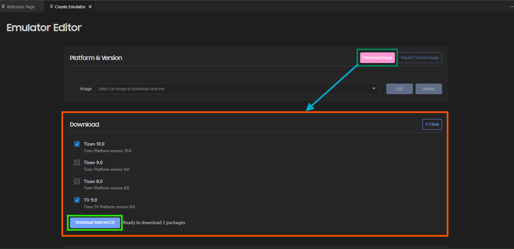
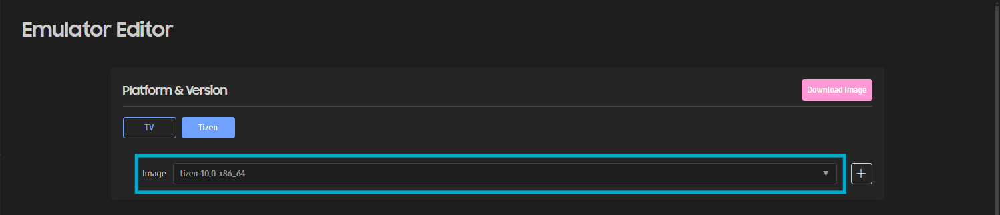
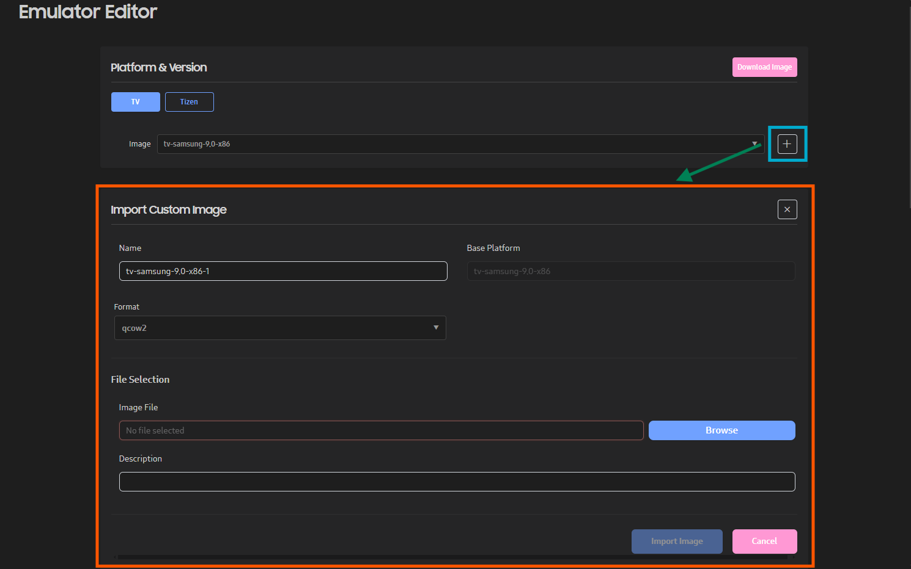
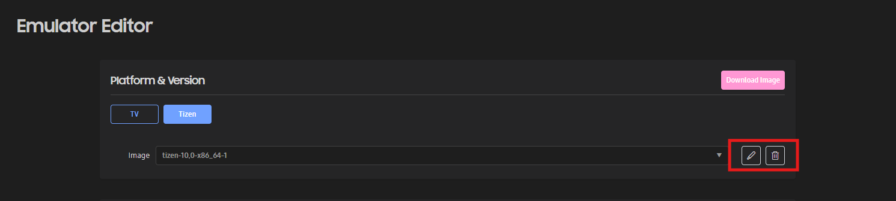

# Managing Emulator Instances

You can use emulators to run your application in a virtual environment.

To test applications in various environments, you need different emulators. The Emulator Manager helps you easily create and manage emulator instances. Essentially, the Emulator Manager allows you to generate emulator instances from a predefined platform and template. Additionally, you can define the settings of the virtual device, such as skin, resolution, and hardware devices.

The main features of the Emulator Manager are:

- Defining a new emulator instance or hardware profile
- Editing an existing emulator instance or hardware profile
- Deleting an emulator instance or hardware profile
- Starting and stopping an emulator instance

## Accessing the Emulator Manager

The Emulator Manager is part of the Tizen Extension, so you do not need to install it separately.

Emulator Manager will be available in the panel section of VS Code after installing the Tizen Extension.

There are two way to open open Emulator manager in panel:
1. **Activity Bar > ACTIONS > Create Emulator**
2. **Penel > TIZEN > EMULATOR**.

**Figure: Access the Emulator Manager from panel**

All available emulator instances are displayed in the table area. You can start, edit, or delete an emulator from there.

**Figure: Emulator table**

> [!NOTE]
> Initially, there are no emulators available in the table. New emulator instances will be added when you create a new emulator. Additionally, when installing an emulator platform while creating a project, a default emulator instance for each image architecture available for that platform will be provided.

## Downloading an Emulator Platform

The Emulator Manager helps you download and install available emulator platforms. Initially, there are no platforms available in the Emulator Manager. You need to download and install a platform before you can create an emulator instance.

To download a new emulator platform:

1. In the **EMULATOR** tab panel, click **Create a new emulator**. This opens the **Emulator Editor** window.

2. In the Emulator Editor window, click the **Download Image** button. This shows a list of all available Tizen platforms.

3. Select the platforms you want to install from the available download items.

4. To cancel the download menu, click the **X Close** button.

5. Click the **Download Selected** button to start the installation.

6. Progress could be seen from the Activity Bar or from the notification area.

> [!NOTE]
> You must have a stable internet connection to perform the installation. You cannot cancel or install a new platform during an ongoing installation. Additionally, based on the platform you installed, default emulator instances will be added to the panel table once the installation is successful.

## Creating an Emulator Instance

The Emulator Manager helps you select the recommended platform and template. When you need a different device environment, you can edit an existing emulator instance or create a new one with a more suitable platform and template. You can also create new platforms and templates to suit your needs.

**Figure: Emulator Manager Create Emulator window**

To create a new emulator instance:

1. In the **EMULATOR** tab panel, click **Create a new emulator** to open the **Emulator Editor** window.

2. Select the platform profile **Tizen** or **TV**. This shows all available images for the selected profile in a dropdown list.

3. Select the platform image you want to use from the dropdown list. It shows all available templates for the selected platform.

4. Select the template you want to use for the emulator. After selecting the template, it shows the available properties for the selected image and template.

5. Scroll down to see the **Properties** section. The Properties section contains different property tabs based on the platform.

6. Modify the properties as needed.

7. Click the **Create Emulator** button to create and save the emulator instance.

> [!NOTE]
> To run the application faster, switch on CPU VT and GPU. If CPU VT is disabled, check [Increasing the Application Execution Speed](emulator.md#speed) for more information. If GPU is disabled, [install the latest vendor-provided graphic driver](../setup/prerequisites.md#emulator).

### Creating Custom Platforms

To create an emulator, you must first select the platform. You can create, modify, and delete a custom platform, and view the generated platforms. Most application developers do not need a custom platform, but it can be useful for platform developers.

**Figure: Emulator Platform Images**

To create a custom platform:

1. In the Emulator Editor, select the target Platform type (Tizen or TV) for which you want to create a custom platform.

2. Select the base platform image from the dropdown menu for which you want to create a custom image.

3. Click () button from the right of selected image.

3. In the **Import Custom Image** section, select a Base Platform, Format, and Image file.

   You can create a custom platform using a qcow2 or raw format image. Qcow2 is a platform image format released with emulator packages. You can also create a qcow2 image by [exporting an emulator](#export).

   A platform image in the development stage is in raw format. If you launch an emulator with a raw image, you can see the current state of the image. This can be useful for platform developers.

4. Click the **Import Image** button to save your custom platform.

   The new platform is added to the Image dropdown list.

   **Figure: Create Custom Image**

   

To manage the created custom platforms:

- To edit a platform, click the **Edit** button in the Image dropdown section while selecting the custom platform. Make the desired changes and click **Save Image**. You can only edit custom platforms you have created.
- To delete a platform, click the **Delete** button in the Image dropdown section while selecting the custom platform. You can only delete custom platforms you have created.

### Creating Templates

The Emulator Manager provides several device template types. A device template defines, for example, the screen resolution and size, and the sensors in the device specification. You can make an emulator instance based on the desired template.

**Figure: Device templates**

Follow these steps to create a custom Template:

1. In the Emulator Editor, select the Platform for which you want to create a custom Template.

2. Check the **Templates** section for existing templates. Click **Refresh** to check if there are any new templates available if you want to use an existing template to create a new one.

3. You can create a custom template in 2 ways:

   - To create a new template from the beginning:

     1. Click **New Template**.
     2. Define the features for the template.
     3. Click **Save**.

        The new template is added to the card list with Edit and Delete buttons.

   - To create a new template based on an existing one:

     1. Select the template you want to clone.
     2. Click the **Duplicate Template** () button. This creates a new Template card with Edit and Delete buttons.
     3. Make the desired changes by clicking the **Edit Template** () button.
     4. Click **Save**.

      **Figure: New Template section**

      

To manage the created templates:

- To edit a template, click **Edit Template** () while selecting the target Template card, make the desired changes, and click **Save**. You can only edit custom templates you have created.
- To delete a template, click **Delete Template** (). You can only delete custom templates you have created.

## Managing and Launching Emulator Instances

In the Emulator Manager, you can launch, edit, and delete emulator instances:

1. Open **EMULATOR** in the **TIZEN** panel.

2. Find the target Emulator in the table.

3. Manage the instance:

   - To launch the emulator, click **Start** ().
   - To edit an emulator, click **Edit** (), make the desired changes in the **Emulator Editor**, and click **Save Changes**.
   - To delete an emulator, click **Delete** ().

## Reporting an Issue with Emulator Manager

1. Click the **Report Issue** button in the main Activity bar. It will redirect you to the dedicated GitHub issue page.

2. Copy the logs from the OUTPUT panel while **Tizen Log** is selected and attach them to the GitHub issue.

3. If the issue is related to a particular emulator instance, you can attach a zip file containing `vm_config.xml`, `vm_launch.conf`, and the logs folder from the `C:\Users\<user_name>\.tizen-extension-platform\server\sdktools\sdk-data\emulator\vms\<emulator_name>` directory.
