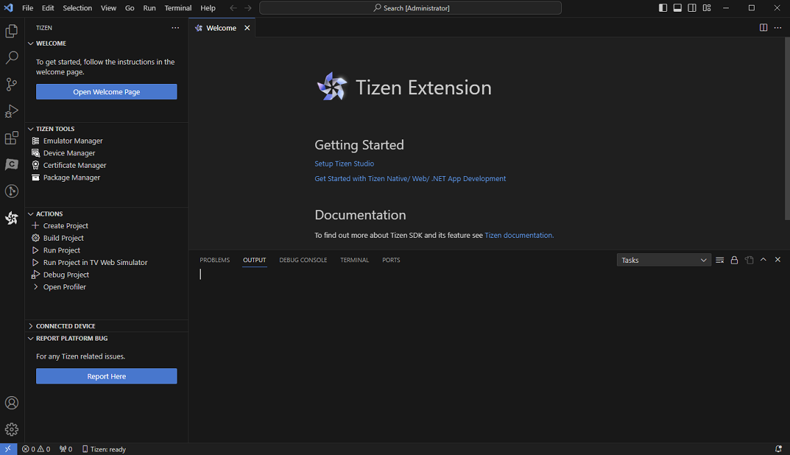
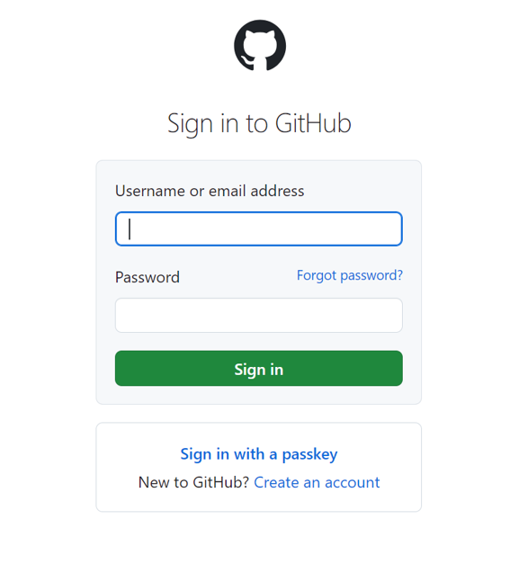
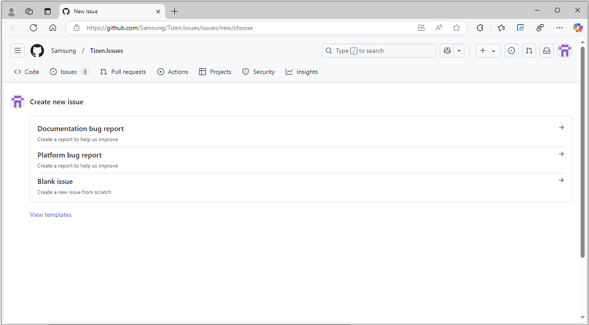

# Reporting Issues and Bugs

Reporting an issue or bug is a key feature that enables you to directly report any problems that occur while using Visual Studio Code (VS Code) for Tizen platforms. To report an issue, follow these steps:

1. Launch VS Code and locate the **Activity Bar**.

2. Click the **Tizen** icon on the Activity Bar to open the Tizen extension view.

   

3. Click the **Report Here** button located at the bottom of the Tizen extension view to report an issue.

4. A GitHub page will open in your default browser. Enter your GitHub username or email address and password to sign in.

   

5. After signing in, a new page will open. You can report three types of bugs/issues:

   - **Documentation bug report**: Click the **Documentation bug report** section to report any issue associated with the documentation of VS Code for Tizen.
   - **Platform bug report**: Click the **Platform bug report** section to report any issue that arises while using the VS Code extension for Tizen.
   - **Blank issue**: Click the **Blank issue** section to report any issue from scratch that arises while using the VS Code extension for Tizen.

   