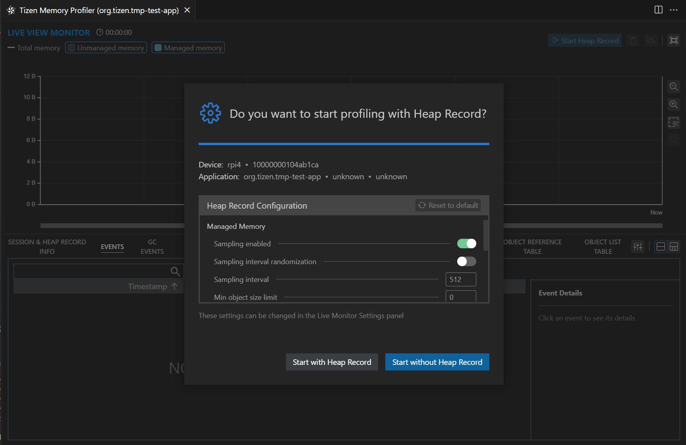
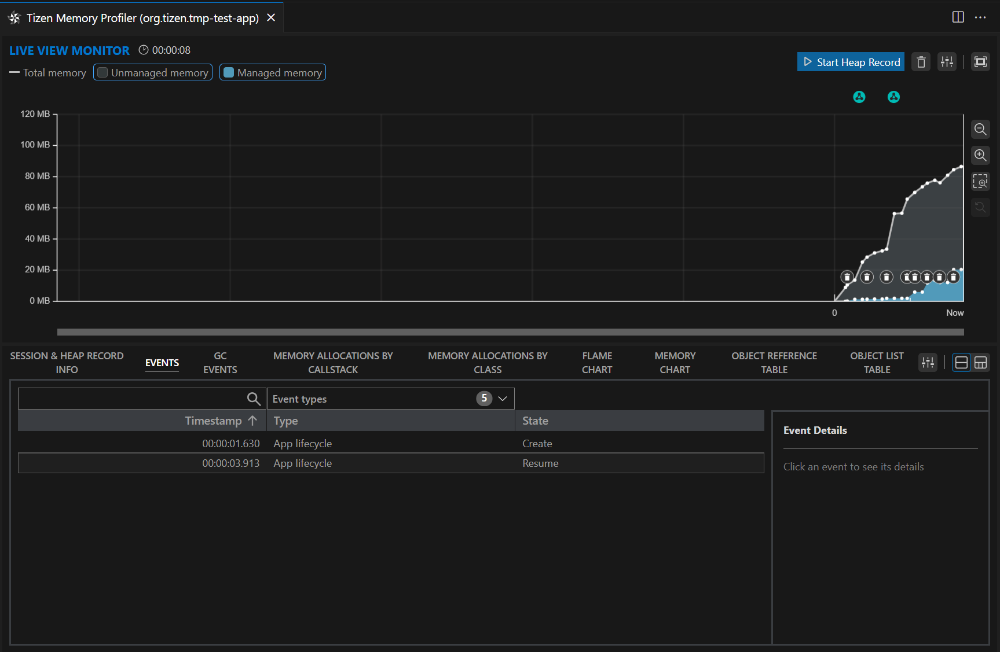

# Getting Started

## Supported Environments
   - Device
     - [Tizen 9.0](https://download.tizen.org/releases/milestone/TIZEN/Tizen-9.0/) or later version and equipped with [armv7l](https://download.tizen.org/releases/milestone/TIZEN/Tizen-9.0/Tizen-9.0-Unified/tizen-9.0-unified_20241030.071206/images/standard/tizen-headed-armv7l/) architecture platform are supported.
   - Host OS
     - Windows 10 or higher versions are supported.
     - Ubuntu 18.04 or higher versions are supported.
     - macOS Big Sur to Sonoma versions are supported.

## Preparation
1. [Install VS Code](https://code.visualstudio.com/download)
2. [Install Tizen SDK](https://docs.tizen.org/application/vscode-ext/Tizen/dotnet/)
   - Install VS Code [Tizen Extension](https://marketplace.visualstudio.com/items?itemName=tizen.vscode-tizen-csharp)
   - Install Tizen Baseline SDK
     - You can install it from VS Code's command palette(`Ctrl + Shift + P`) by selecting `Tizen: Wizard to set Tizen Baseline SDK path or install a new`.

## Installation
* Install Tizen Memory Profiler
   - You can download the Extension package from the following links:
      - [TizenMemoryProfiler extension](https://marketplace.visualstudio.com/items?itemName=TizenProfiler.tmp-vscode-ext)
   - Follow the VS Code [extension  installation guide](https://code.visualstudio.com/docs/editor/extension-marketplace#_install-from-a-vsix) to install the Tizen Memory Profiler extension.

## Launch
1. Connecting the Host PC to the Device
   - Connect the Device to the Host PC through a USB cable or IP address.
   - Use the command `sdb devices` to check if the connection between the Device and the Host PC is successful.
   ```shell
      $ sdb devices
        List of devices attached
        10000000104ab1ca        device          rpi4
   ```
2. Launching Tizen Memory Profiler in VS Code
   - [Create a new Tizen application project](https://docs.tizen.org/application/dotnet/get-started/first-app/#deploy-and-run-your-application) or open an existing project directory.
   - Installing Tizen Applicaiton
     - Select `Tizen: Install Tizen application` from the VS Code's command palette (`Ctrl + Shift + P`) to install your written application on the device.
   - Launch the application in profiling mode
     - Choose `Tizen Memory Profiler: Run` from the VS Code's command palette (`Ctrl + Shift + P`) to run the application.
     - Before running the application, you will see the following profile start selection window.



   - You can start the application in profiling mode by selecting either the `Start with Heap Record` or `Start without Heap Record` button to perform analysis.


