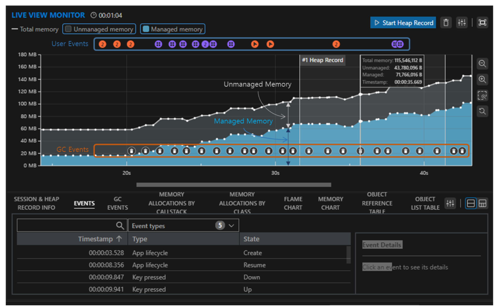

# Tizen Memory Profiler

This is a tool that provides information to analyze memory usage of Tizen platform's .NET applications.

The key information provided by Tizen Memory Profiler is as follows:

- Real-time information
   - Physical memory usage in native and .NET managed regions
   - Garbage collection (GC) events and time taken for GC
   - Application events, user input events

- Memory allocation information
   - Callstack information integrated with native/managed per memory allocation
   - Class/object information of managed memory allocation
   - Statistics such as flame charts, memory usage charts
