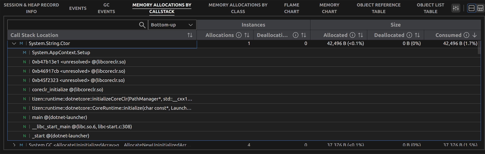

# Key Features

## Live view monitor panel
This is a panel that shows the real-time status of the application being profiled.
- The displayed information is shown at the actual time it occurs according to the flow of the application's execution time.
- You can check the physical memory usage through the graph in the center. Physical memory usage is divided into memory areas in the .Net managed area.
- The icons at the top of the graph indicate events such as application lifecycle events and user input.

  -  - Application lifecycle event

  -  - Device rotated event

  -  - Key pressed event

  -  - Mouse click event

- The trash can icons at the bottom of the graph indicate when a garbage collection (GC) occurred.

- When you hover your mouse cursor over the graph, you can check the specific memory usage at that point in time.

- To compare memory usage between two points in time, select a point on the graph with your mouse to set the reference (yellow).
  Then, move the cursor to see a detailed comparison of memory usage at that point versus the reference.

## Session & Heap Record Info panel

This is a panel that provides comprehensive information related to profiling sessions.

You can see this panel by selecting the `Session & Heap Record Info` tab at the bottom of the graph.

- On the right side of the panel, it provides information about the currently profiled session.

  

- When a Heap Record session is started, summary information about each Heap Record session is provided.
  - This includes start/end time, total session duration, total allocated memory size, allocation count per second, and total used memory size.

- When a user selects a specific section of a Heap Record session, that section is separated into a separate session and summary information is displayed as a subrange.

## Events panel

This is a panel that provides event information generated from devices and applications.

You can view this panel by selecting the `Events` tab at the bottom of the graph.

- You can check in detail the events occurred during profiling in the list.
  - It provides information on the time when the event occurred, its type, and status.
  - If you select a specific event, it will be marked as a light green line on the top graph so that you can see the relationship between the event and the information within the graph.

## GC events panel

This panel provides information about [Garbage Collection(GC)](https://learn.microsoft.com/en-us/dotnet/standard/garbage-collection/fundamentals) events that occurred during application execution in the .NET Runtime.

You can view this panel by selecting the `GC Events` tab at the bottom of the graph.

- You can see details of GC events that occurred during profiling in a list.
  - It provides information on when the event occurred, its duration, depth, and reason for occurrence.
    - Detailed information about GC is provided through [CLR ETW event](https://learn.microsoft.com/en-us/dotnet/framework/performance/clr-etw-events), especially `GC Reason` , which indicates why GC occurred. This may vary greatly depending on internal conditions of .NET and small differences can cause GCs to occur due to different reasons. For more detailed information on various causes of GC, please refer to the [.NET ETW Garbage Collection Events](https://learn.microsoft.com/en-us/dotnet/framework/performance/garbage-collection-etw-events?redirectedfrom=MSDN#gcstart_v1-event) or [gc.h](https://github.com/dotnet/coreclr/blob/release/3.1-publicPoolNames/src/gc/gc.h#L57) file in coreclr.
  - When you select a specific GC event, it will be indicated as a green line on the graph at the top so that you can relate the event with other information within the graph.

- The GC Event details box on the right provides more detailed information about GC events provided by the .NET runtime.

  - The GC global heap history provides information such as specific causes of GC occurrences and execution time for each step of the GC.

    

  - GC per heap history provides information on each heap's state before and after a GC event occurs.

    

## Memory allocation by callstack

- In Memory allocation by callstack, it shows a callstack that is a mix of native and managed functions in both Top-down or Bottom-up order

  - Allocations
    - Total number of objects created with this function
  - Deallocations
    - Total number of deallocations for objects created with this function
  - Allocated
    - Total heap memory size for objects created through this function
  - Dealloated
    - Total heap memory size that has been deallocated for objects created through this function
  - Consumed
    - Total heap memory size consumed by objects created through this function, calculated as Allocated minus Deallocated
  - Bottom-up
    - The callstack is shown in the order of calling the caller function to the callee function.

  - Top-down
    - The callstack is shown in the order of calling the callee function to the caller function.

## Memory allocation by class

  - Memory allocations by class shows information about objects created under a specific class name.
    - Allocations
      - Total number of instances created through that class
      - Example: 11 instances were created under the class name `System.Signature`
    - Deallocations
      - Total number of deallocations for instances created through that class
      - Example: 4 deallocations occurred for instances created under the class name `System.Signature`
    - Peak
      - The maximum value obtained by subtracting total deallocations from total creations for that class
      - Example: 9 peaks occurred for instances created under the class name `System.Signature`
    - Allocated
      - Total heap memory size allocated to instances created through that class
      - Example: 5632 bytes of total heap memory was allocated to instances created under the class name `System.Signature`
    - Deallocated
      - Total heap memory size deallocated from instances created through that class
      - Example: 20488 bytes of total heap memory was deallocated from instances created under the class name `System.Signature`
    - Consumed
      - Total heap memory size consumed by instances created through that class, calculated as Allocated minus Deallocated
      - Example: 3584 bytes of heap memory was consumed by instances created under the class name `System.Signature`
    - Peak
      - Maximum value of Consumed heap memory size
      - Example: 4608 bytes of heap memory was consumed at its peak for instances created under the class name `System.Signature`
    - Object ID
      - List of heap memory addresses for instances created through that class
    - Size
      - Heap memory size allocated to each instance
    - State
      - in memory : Indicates that the instance is currently present in the heap
      - collected : Indicates that the instance has been deallocated through garbage collection

## Flame chart

- In a flame chart, it visually represents the callstack from bottom to top in a concise manner.
  - Allocations
    - Percentage of calling functions compared to the maximum calling function (100%)
    - Calling order: From bottom to top
    - Color meanings
      - Green: Native functions
      - Blue: Managed functions
    - Preview support: Located at the lower right corner of the screen
  - Allocated, Deallocations, Deallocated, Consumed
    - Same as Allocations

## Memory chart

- The memory chart lists large objects in size order.
  - Consumed
    - Total consumed size
    - Updates the parent function
    - Color meaning
      - Distinguish between called functions
    - Icon on right side
      - Supports show and hide of the corresponding function when clicked
  - Allocated, Allocations, Instances
    - Same as Consumed

## Object reference table

- The object reference table shows the reference relationships of objects created with class names and the objects that refer to them in a tree form.
  - GC#1
    - Shows the list of surviving objects after the first GC occurrence.
    - The index increases each time a GC occurs.
  - Instances
    - Total number of objects created with the corresponding class name.
    - Example: The total number of objects created with the name `System.Reflection.RuntimeMethodInfo` is shown as 374.
  - Shallow Size
    - Total heap memory size of objects created with the corresponding class name.
    - Example: The total heap memory size of objects created with the name `System.String` is shown as 57,890 bytes.

## Object List table

- The Object List table lists information about objects created under a class name.
  - GC#1
    - Shows the list of surviving objects after the first garbage collection.
    - The index increases each time a GC occurs.
  - Instances
    - Displays the class name.
    - Example: `RuntimeMethodInfo`
  - Object Id
    - Displays the heap memory address of the object created under the class name.
    - Example: One of the objects created under the name `RuntimeMethodInfo` shows a heap memory address of 0xad40a8f8.
  - Size
    - Displays the size of the heap memory occupied by the object created under the class name.
    - Example: The heap memory size of the object (0xad40a8f8) created under the name `RuntimeMethodInfo` is shown to be 56 bytes.
  -  Graph view panel
    - Display a graph of reference relationships between objects.

