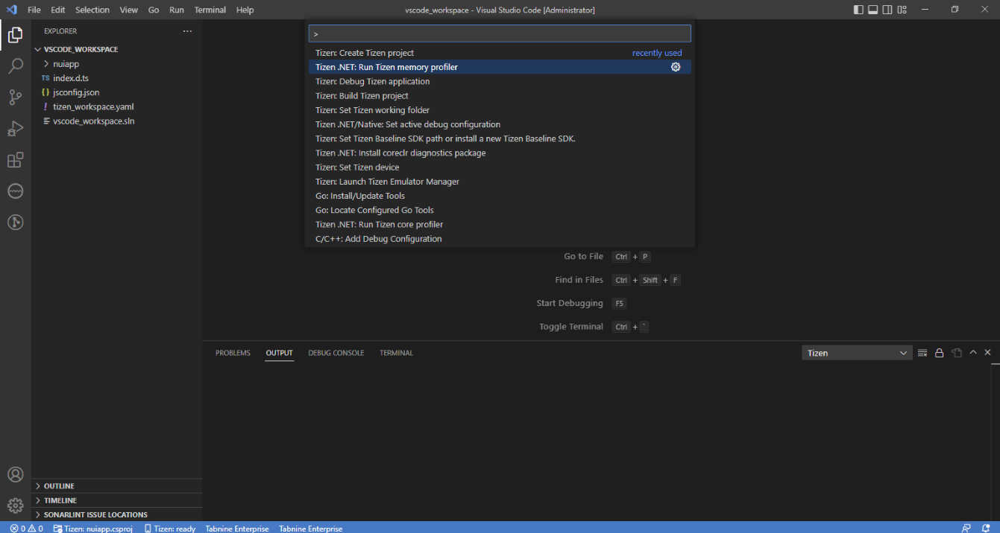
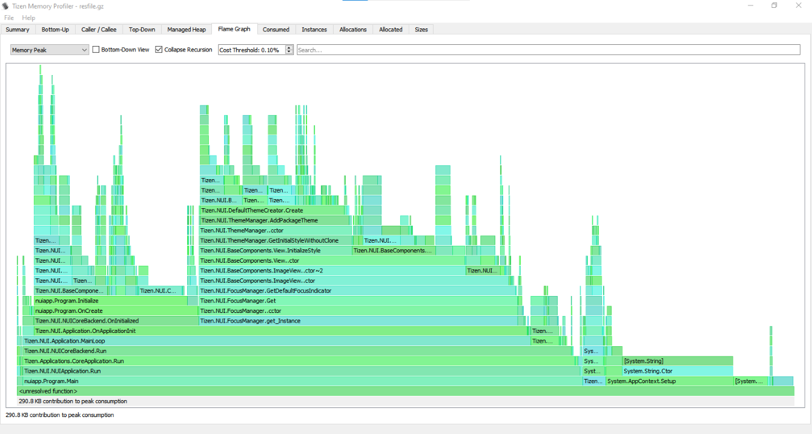

# Get Started with Memory Profiling

### Running Memory Profiler
   - If no Tizen device is connected and no Tizen emulators are running then launch Emulator Manager and launch the type of emulator you want to use for running and profiling your application.

     

   - Open the **Command Palette** and select **Tizen.NET: Run Tizen memory profiler**.

     

   - If everything is OK then the application starts as if you run it normally.

     

   - The memory profiling data will be displayed with the Memory Profiler GUI after closing the application. The application can be closed by pressing "Back" button.

     

### Analyzing the results
   - The GUI application provides several views to the memory profiling data. The views include:

       - summary page with information on which process was profiled, its total runtime, some memory related statistics, and so on.
       - bottom-up table tree view of the code locations that allocated memory with their aggregated cost and stack traces
       - caller/callee table
       - top-down table tree view of the code locations
       - managed heap table tree view
       - flame graph visualization (explanation: <http://www.brendangregg.com/FlameGraphs/memoryflamegraphs.html>)
       - consumed memory size over time graph
       - number of instances over time graph
       - number of memory allocations over time graph
       - size of memory allocated over time graph
       - allocation histogram displaying the number of allocations (the total number and the several topmost code locations) belonging to one of the groups divided by allocation size (0 - 8 bytes, 9 - 16 bytes, ... , 512 bytes - 1 KB, more than 1 KB)

#### Flame graph view sample

   

#### Memory allocations graph view sample

   

#### Allocation histogram view sample

   
