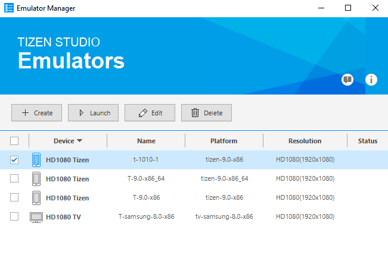

# Legacy Memory Profiler

**Heaptrack Profiler** is a powerful diagnostic tool designed specifically for developers working on Tizen .NET applications in VS Code. It provides valuable insights into application performance by analyzing memory usage patterns.

This profiling tool monitors and analyzes memory allocation, deallocation, and consumption within the application during runtime. By tracking memory behavior over time, it helps pinpoint areas where excessive memory usage occurs, enabling you to optimize the code and improve overall efficiency.

With detailed visualizations and metrics, the Memory Profiler empowers developers to:

- Identify memory leaks and fragmentation.
- Optimize garbage collection strategies.
- Reduce unnecessary object allocations.
- Enhance responsiveness through efficient memory utilization.

By leveraging this tool's capabilities, you can ensure your Tizen apps run smoothly, efficiently, and reliably across various device types and configurations.

## Running Memory Profiler

1. If no Tizen device is connected and no Tizen emulators are running, launch the **Emulator Manager** and launch the type of emulator you want to use for running and profiling your application.

   

2. Open the **Command Palette** and select **Tizen .NET: Run Tizen memory profiler**.

   

3. If everything is okay, the application starts as if you are running it normally.

   

4. The memory profiling data will be displayed with the Memory Profiler GUI after closing the application. The application can be closed by pressing the **Back** button.

   

## Analyzing the Results

The GUI application provides several views of the memory profiling data. The views include the following:

- **Summary page**: Information on which process was profiled, its total runtime, some memory-related statistics, and so on.
- **Bottom-up table tree view**: Code locations that allocated memory with their aggregated cost and stack traces.
- **Caller/Callee table**.
- **Top-down table tree view**: Code locations.
- **Managed heap table tree view**.
- **Flame graph visualization**: (Explanation: [http://www.brendangregg.com/FlameGraphs/memoryflamegraphs.html](http://www.brendangregg.com/FlameGraphs/memoryflamegraphs.html))
- **Consumed memory size over time graph**.
- **Number of instances over time graph**.
- **Number of memory allocations over time graph**.
- **Size of memory allocated over time graph**.
- **Allocation histogram**: Displays the number of allocations (the total number and the several topmost code locations) belonging to one of the groups divided by allocation size (0 - 8 bytes, 9 - 16 bytes, ..., 512 bytes - 1 KB, more than 1 KB).

### Flame Graph View Sample

### Memory Allocations Graph View Sample

### Allocation Histogram View Sample

