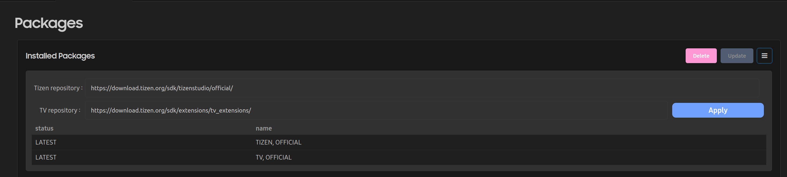

# Configuring the Packages

The Packages configuration allows you to manage the packages of the VS Code Extension for Tizen. With the Packages configuration, you can change the options for the package repository for the main and extension SDK.

## Configuring the Main SDK Repository

You can set the configuration for installing or updating SDK components using one of the following methods.

### Configuring the Package Repository

The Package Repository configuration enables you to define the server locations for downloading and updating SDK components and related packages. You can directly configure the repository URLs for both Tizen and TV development environments within the extension.

**Figure: Packages View with Repository Settings**

To set the package repository:

1. In the Primary Sidebar, open the **Notice** view.
2. Click the **Packages** button.
   - The **Packages** page will open.
3. On the **Packages** page, click the **Repository Setting** icon  in the upper-right corner.
4. In the configuration panel, enter the repository URL for either the **Tizen Repository** or the **TV Repository**, as needed.
5. Click **Apply** to validate and save the configuration.
   - Once the settings are applied, the **Update** button becomes active.
6. Click **Update** to synchronize and install the latest packages from the specified repositories.

## Tizen SDK Installation Directory

`$HOME/.tizen-extension-platform/server/sdktools/data`

## .NET SDK and Tizen Workload Installation Directory

`$HOME/.tizen-extension-platform/server/sdktools/dotnet`
