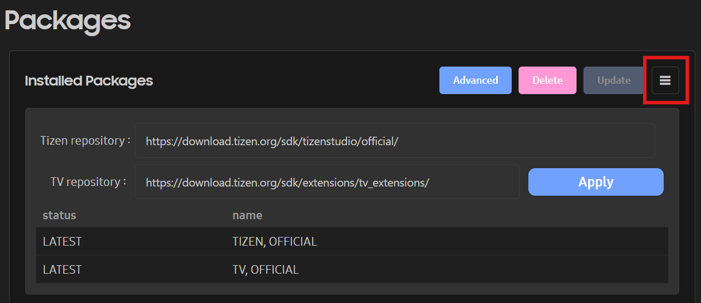

# Configuring the Packages

The Packages configuration allows you to manage the packages of the VS Code Extension for Tizen. With the Packages configuration, you can change the options for the package repository for the main and extension SDK.

## Configuring the Main SDK Repository

You can configure the installation and update settings for SDK components.

### Configuring the Package Repository

The Package Repository configuration allows you to define server locations for downloading and updating SDK components and related packages. You can configure repository URLs for both Tizen and TV development environments directly within the extension.

**Figure: Packages View with Repository Settings**

To configure the package repository:

1. Open the **Notice** view in the Primary Sidebar.
2. Click the **Packages** button to open the **Packages** page.
3. Click the **Repository Setting** icon () in the upper-right corner.
4. In the configuration panel, enter the repository URL for the **Tizen Repository** or **TV Repository** as needed.
5. Click **Apply** to validate and save the configuration.
   The **Update** button becomes active once the settings are applied.
6. Click **Update** to synchronize and install the latest packages from the specified repositories.

## Tizen SDK Installation Directory

`$HOME/.tizen-extension-platform/server/sdktools/data`

## .NET SDK and Tizen Workload Installation Directory

`$HOME/.tizen-extension-platform/server/sdktools/dotnet`

## Advanced Package Installation

To install the full SDK for a specific platform version, use the **Advanced** feature.

**Figure: Advanced Package Installation**

