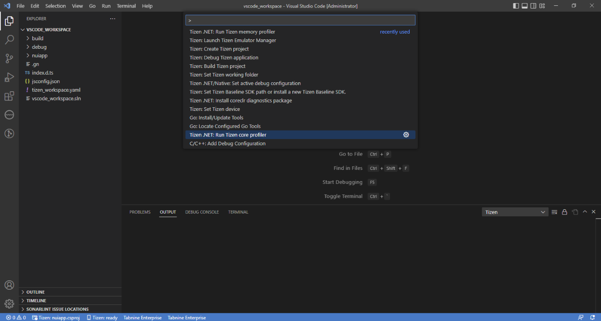
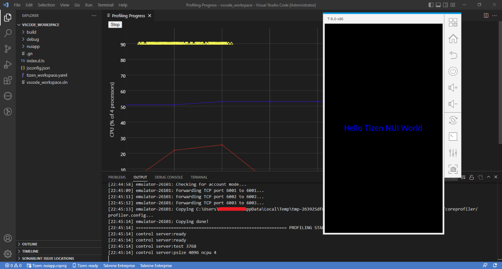

# Get Started with Performance Profiling

### Running Core Profiler
   - If no Tizen device is connected and no Tizen emulators are running then launch Emulator Manager and launch the type of emulator you want to use for running and profiling your application.

     

   - Open the **Command Palette** and select **Tizen.NET: Run Tizen core profiler**.

     

   - If everything is OK then the application starts as if you run it normally.

     

   - Profiling progress window will be displayed with stop button in a new tab which shows live performance profiling of the application.

     

   - Profiling can be stopped by clicking stop button.

     
