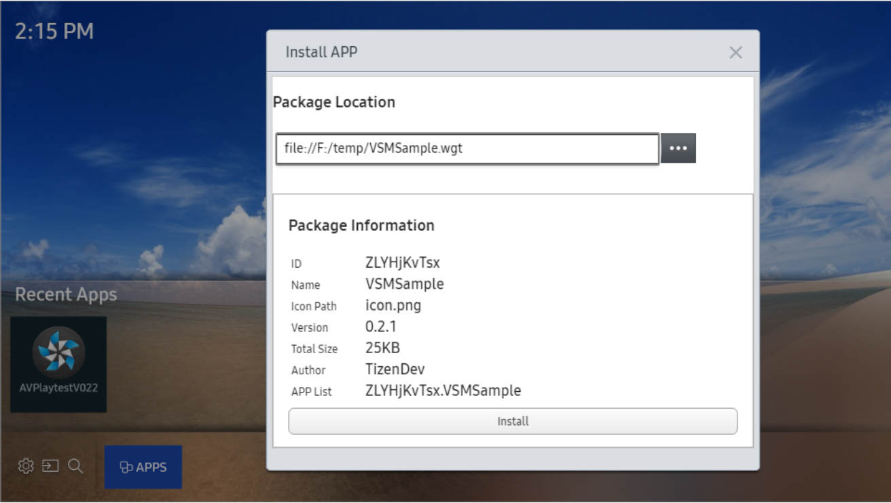

# TV Simulator

The Samsung TV Simulator simulates the runtime environment of Samsung TV Web applications. You can test your applications on the simulator and save significant development and testing time. The simulator is useful when quick prototype development is required. It is suitable for UI development or testing application features which use basic Samsung Product or Tizen APIs.

To use the simulator, the Samsung TV SDK must be installed.

## Run TV Web Simulator and install Web Application
- Select active web app from project explorer with `Tizen: Set Tizen Working Folder` command.
- Run TV Web Simulator with `Tizen Web: Run TV Web Simulator` command.
- You also can test web application by installing .wgt file on TV Web Simulator
  - Right-click the simulator and select "Install Application"
  - Click "...", select the ".wgt" file, and click "Open".
  - Confirm the package information, and click Install"

   

To get started with TV Web Simulator, see the guide [Samsung TV Simulator](https://developer.samsung.com/smarttv/develop/getting-started/using-sdk/tv-simulator.html)
