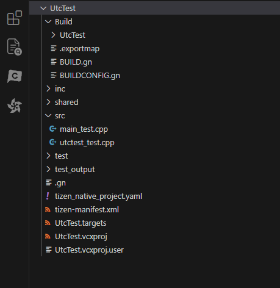
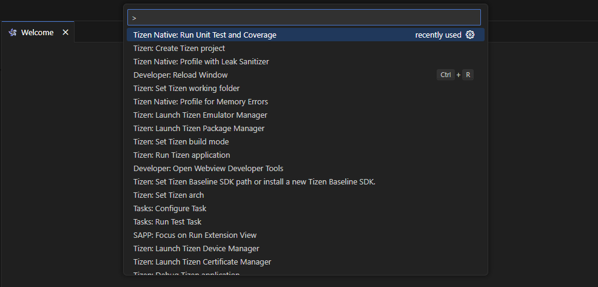
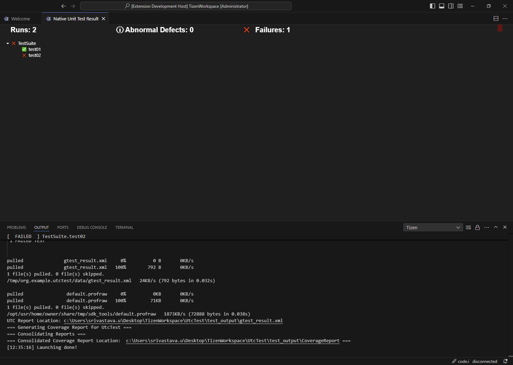
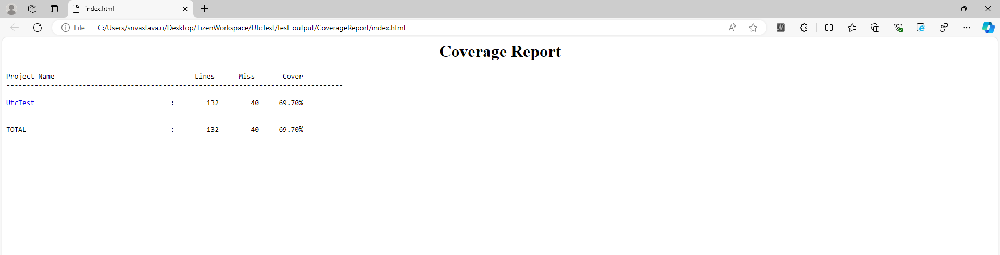
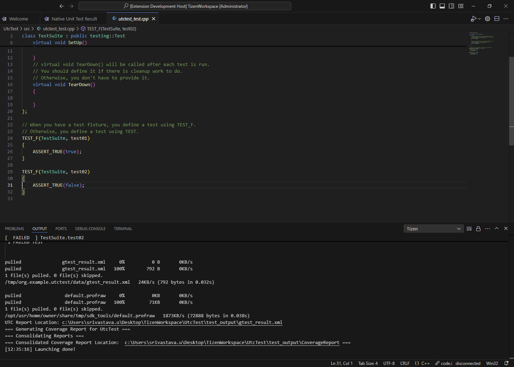

# Get Unit Test Information with Code Coverage
Unit Test and Code Coverage is a tool that helps you to understand the code quality of your application. It provides you with the information about how much of your code is covered by unit tests. This is done by providing an interface for viewing and analyzing Native unit test results. It displays the test results in a tree view, illustrating the number of runs, defects, and failures where you can see the details of each test suite and test case.
 

This helps with the testing experience by allowing you to conveniently review, and understand the outcomes of your Native unit tests within the VS code extension.

## To use the Unit Test and Code Coverage
To use the Unit Test and Code Coverage tool:
- Create a GTest application.
- In the **File Explorer view**, click on **view** and select **Command Palette > Tizen: Create Tizen Project > Native > Tizen > Tizen-9.0 > GTest**, then specify the desired project name for your GTest application. This will initiate the creation process and set up the necessary environment for running Native Unit tests within  VS code extension:

    
 

- In the **File Explorer view**, click on **view** and select **Command Palette > Tizen Native: Run Unit Test and Coverage**:

    
     

- All the **unit tests present in the Unit Test project** are executed, and the **coverage is determined based on the code covered by the unit tests**.
- It also includes a **progress bar** that visually represents the **number of failures occurring** during the execution of Native unit tests:

    
     

- After the **Unit Test** project completes its execution, **VS code extension displays the code coverage information in the browser in form of HTML**. The Unit Test Result and Code Coverage views provide a summary of the unit test results and code coverage percentage for each of the files, as illustrated in the following figure:

 

## Source File Navigation on Failure
- When a failure occurs, you can click on the **Failure Test Suite** associated with the failure which is generated in **Tree view**.
- This action will open the corresponding source file in your editor and **navigate to the exact location where the failure has occurred**, as illustrated in the following figure:

