# Introduction

WebAssembly (WASM) provides a way to run C and C++ code (among others) on the web at near native speed. WebAssembly is designed to complement and run alongside JavaScript. By using the WebAssembly JavaScript APIs, you can load WebAssembly modules into a JavaScript Smart device application and share functionality between the two. WebAssembly is being developed as a web standard via the W3C WebAssembly Working Group and Community Group with active participation from all major browser vendors.

[Click here](https://developer.samsung.com/smarttv/develop/extension-libraries/webassembly/webassembly.html) for more information on Tizen WebAssembly and it's application structure.

VS Code extension for Tizen supports **Tizen WebAssembly application** developers, helps to generate, update and package an application, also run and debug an application on Tizen targets.

## Prerequisites

Below are the prerequisites for using **Tizen WebAssembly (WASM)** in Visual Studio Code:

- Make sure that Tizen Studio Version 6.0 or above is installed.
- Make sure to set the Tizen Studio Path with the installed 6.0 or above Tizen Studio path using VS Code Command: **Tizen: Wizard to set Tizen Baseline SDK path or install a new.**.
- Make sure that latest [Visual Studio Code](https://code.visualstudio.com) is installed.
- Make sure that **Tizen Extension** from the market place is installed. **Tizen Extension** can be installed by searching in the Extensions view ( Ctrl+Shift+X ).
- Make sure Tizen Emscripten SDK setup is done.

## Tizen Emscripten SDK Setup  
1. Download and extract the [Tizen Emscripten SDK](https://developer.samsung.com/smarttv/develop/extension-libraries/webassembly/download.html) suitable for your OS. 
2. Setup the Tizen Emscripten and use it with Visual Studio Code.
   > These steps guide using *emsdk* without changing development host environment variables permanently.

   - Open the **Command Palette** and select **Tizen Web: Wizard to set Tizen WASM emsdk path**.
     - It launches a wizard to browse the folder and set.
     - Browse the *emsdk* directory and set it.

    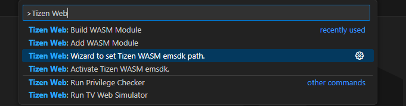

   - Open the **Command Palette** and select **Tizen Web: Activate Tizen WASM emsdk path**.
     - It activates the *emsdk* tool to be used by the Tizen VS Code extension.

    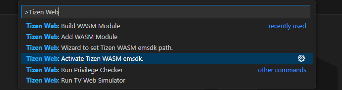

## Developing a Tizen WASM Application
The following section demonstrates the steps essential for developing a Tizen WASM application using *Tizen* extension.

> Use CTRL+SHIFT+P to activate the *Command Palette*.

1. Create an empty Tizen web project
    - In VS Code, click **View** > **Command Palette**.
    - In the input field of the **Command Palette** that appears, type **Tizen : Create Tizen Project** and press **Enter**.
    - Select **Web** from the project type list and press **Enter**.
    - Select a **profile** and press **Enter**.
    - Select a **profile version** and press **Enter**.
    - Select a **template** and press **Enter**.
    - Provide the name of the project and press **Enter**.
    - Make the body tag empty (if not empty already) of the index.html file.

2. Add a WASM module choosing from existing sample.
    - Run Add Wasm Module

     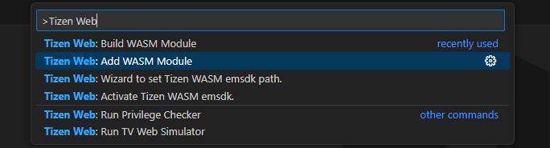

    - Choose language

     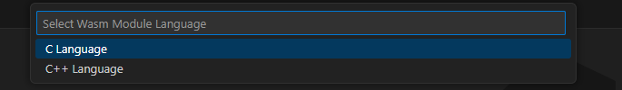

    - Provide name for Wasm module

    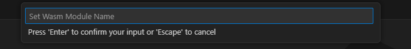

    - Select the module mode

    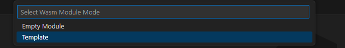

    - Choose hello Triangle

    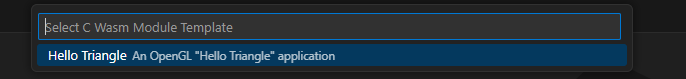

    - If everything is ok then the wasm module is added to the Tizen Web project and a success message is shown in VS Code.

    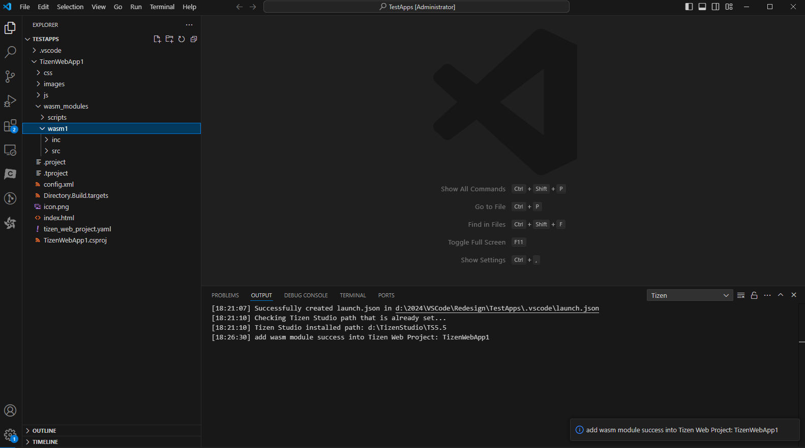

3. Build the WASM module.
    - Run Build Wasm Module
    
     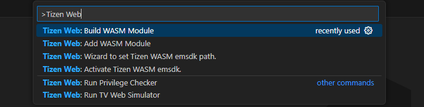
    
    - Select Build Mode
    
     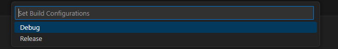

    - If everything is ok then the wasm module build starts and build messages are shown in output console of VS Code.
    - Once build is completed, it shows the build success message.
    - **NOTE: First wasm module build after emsdk activation may take take upto 15-20 minutes (to create emscripten cache files) depending on type of OS (Windows/Linux/MAC).**

     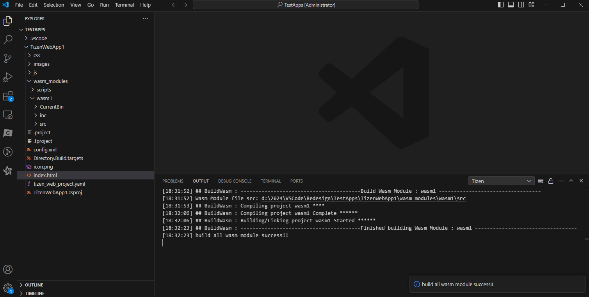

4. Running the Web WASM Application.
    - Run Tizen Application
    
     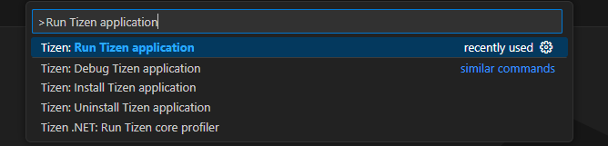
    
    - Appication is built, packaged and launched on the connected Tizen Emulator/Device.

     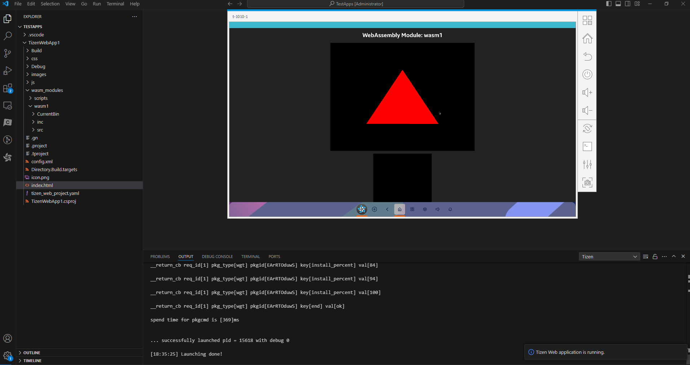