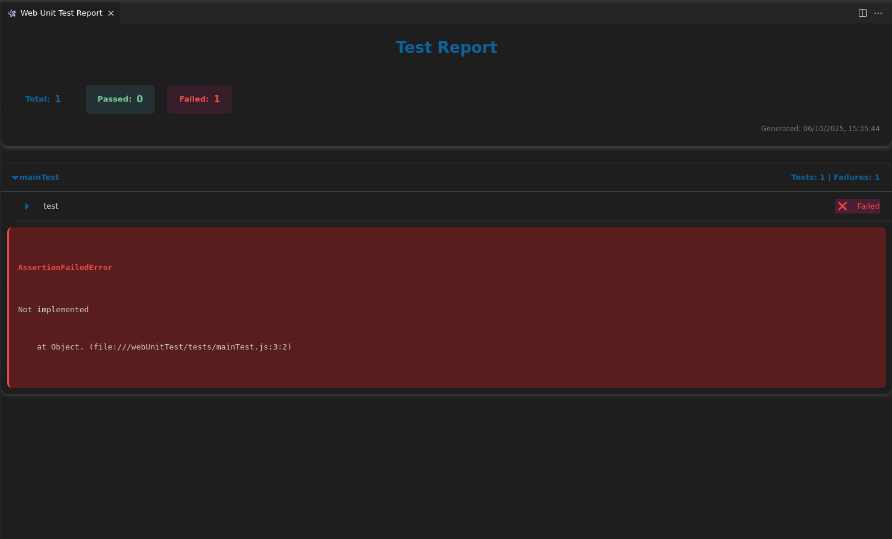

# Tizen Web: Run Unit Test and Coverage

## Prerequisite

Before using the "Tizen Web: Run Unit Test and Coverage" command, please ensure you have completed the setup described in [Tizen-Add-Web-Unit-Test-Documentation.md](add-web-unit-test.md).

## Overview

The "Tizen Web: Run Unit Test and Coverage" command, accessible from the VS Code command palette, empowers Tizen developers to execute web application unit tests directly on a connected Tizen device or an emulator. A key feature of this command is its ability to automatically gather test reports upon completion.

## How to Run

1.  Open the Command Palette in VS Code (Ctrl+Shift+P or Cmd+Shift+P).
2.  Type and select `Tizen Web: Run Unit test and Coverage`.

## What Happens When You Run the Command

Upon executing the "Tizen Web: Run Unit test and Coverage" command, the following sequence of actions will occur:

1.  **Test Execution**: Your Tizen web application will be launched and run as a unit test suite on the selected target (device or emulator).
2.  **Result Collection**: The Tizen extension will automatically capture the test results from the device or emulator logs.
3.  **Output Storage**: The collected test results, including coverage data if applicable, will be formatted in XML and saved to your project's build output directory (typically `Debug/wut_report.xml` relative to your project root).
4.  **Result Display**: A new web panel will automatically open within VS Code, presenting a user-friendly view that only displays information for failed test cases, mirroring the relevant data from the XML file.

    
