# Welcome Page: Tizen Extension for Visual Studio Code   

## Open Welcome Page
   - Click on the **Tizen Extension** icon present in **Activity Bar**:

     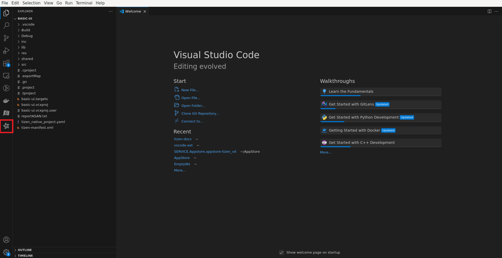

     Select **Open Welcome Page** from the sidebar:

     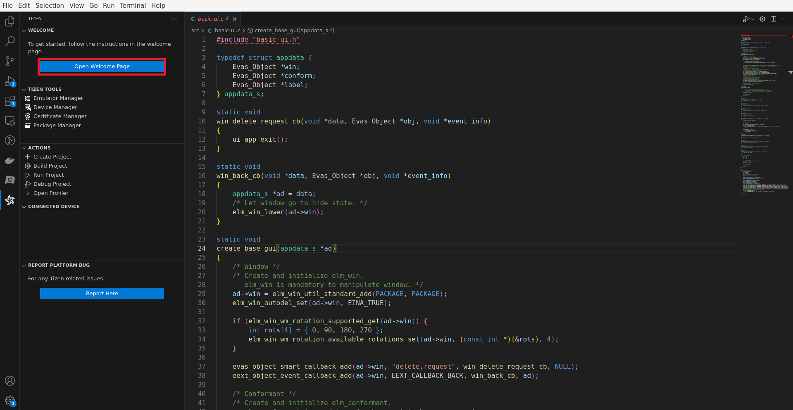

     - The **Welcome Page** will open in a new tab:

     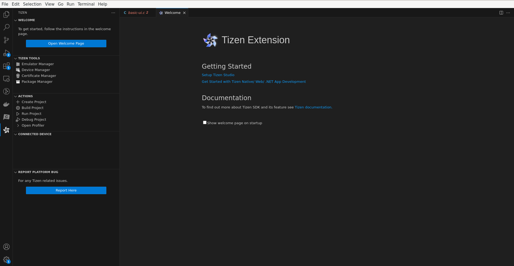

## Install Tizen SDK

   - Click on **Setup Tizen Studio** to launch Tizen **SDK Install Wizard** in a new tab:

     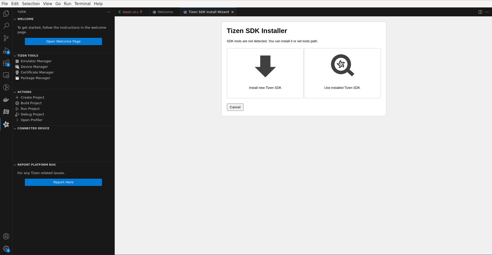

     - To install **new Tizen SDK**, select **Install new Tizen SDK**:
  
     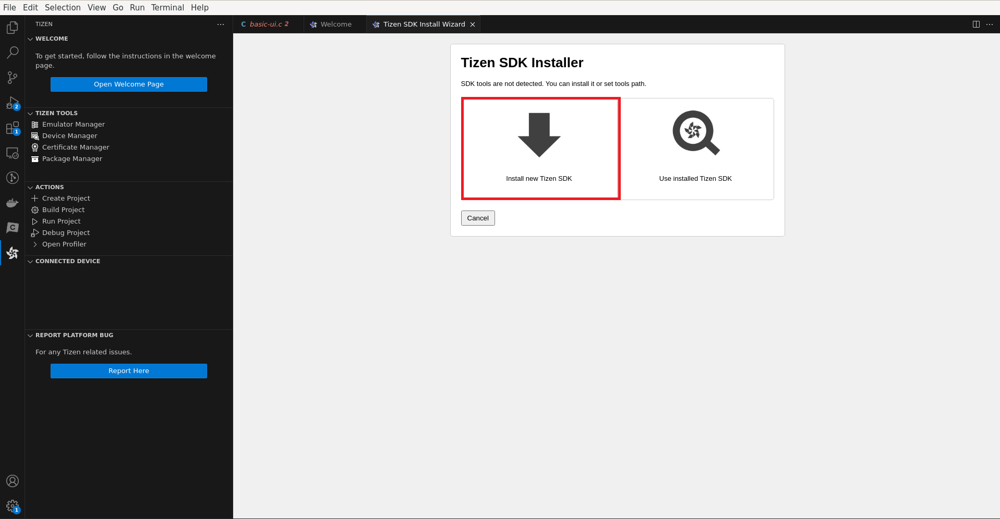

     - Accept the license agreement by clicking **I Agree**:  

     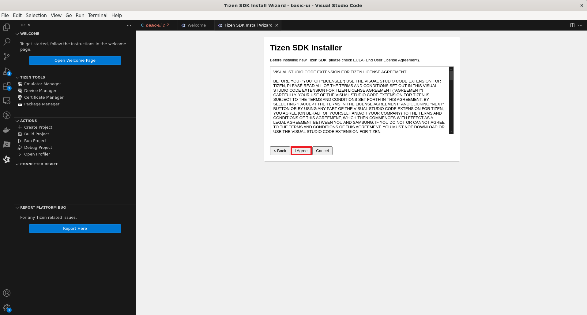

     - Choose an **empty folder** to install Tizen SDK:

     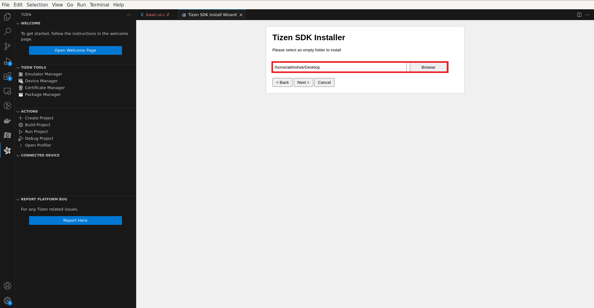

     - The installation process will begin:

     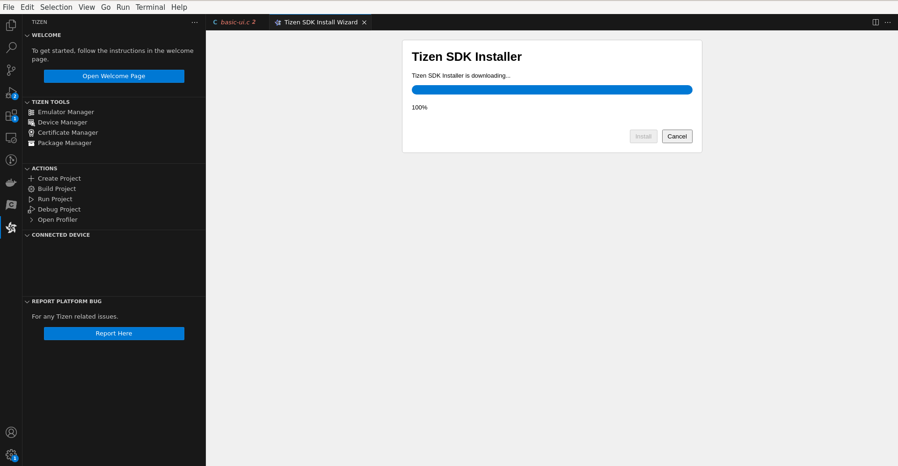

## Use Existing Tizen Baseline SDK

   - To use an **existing Tizen SDK**, select **Use Installed Tizen SDK**:

     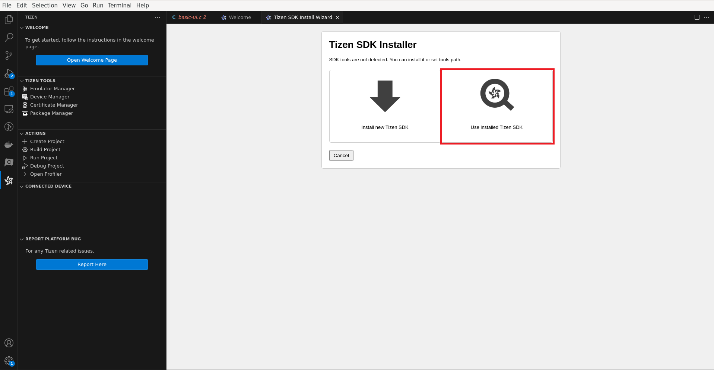

     - Select the **path** where the **Tizen SDK is installed**:

     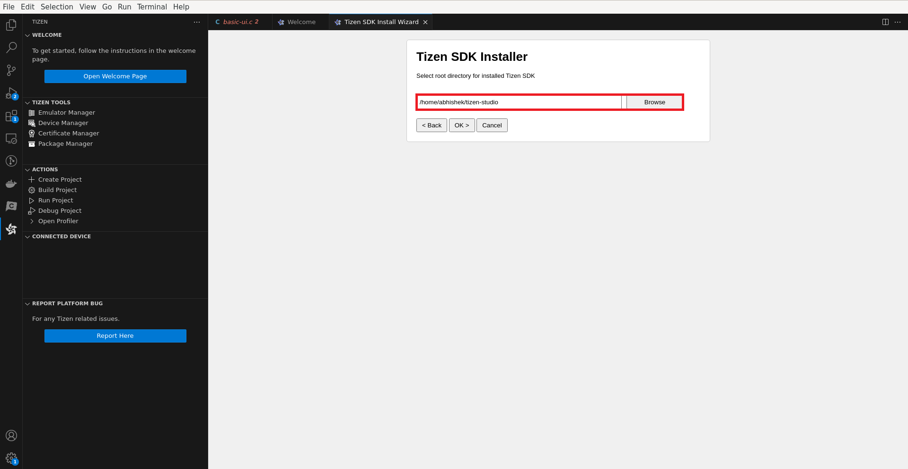

     - A **pop-up** will confirm if Tizen SDK is **set** correctly:

     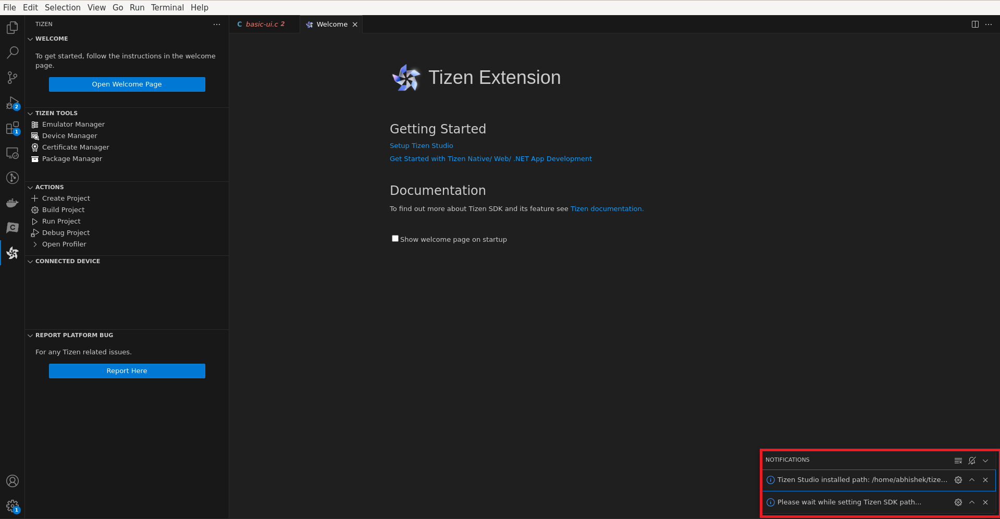

   - For more information about **Tizen Native/Web/Dotnet app development**, click as shown in following figure:
     
     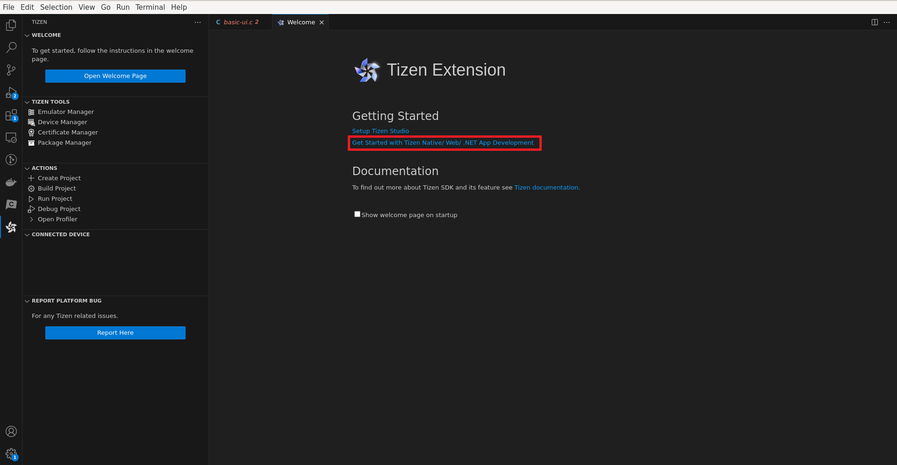

     - A new page will be opened in the default browser:

     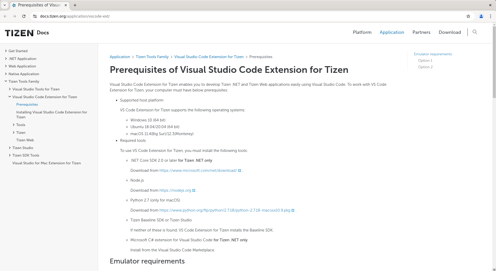

   - For more information about **Tizen SDK and its features**, click here:

     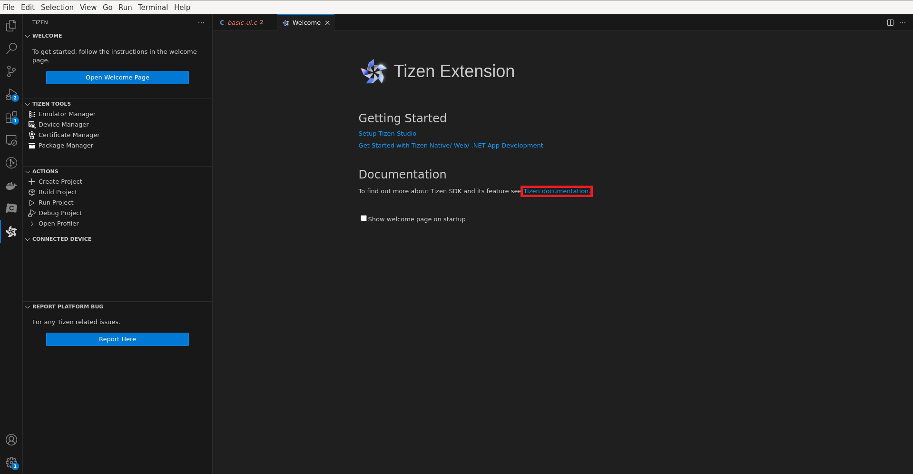

     Tizen documentation page will be opened in the default browser:

     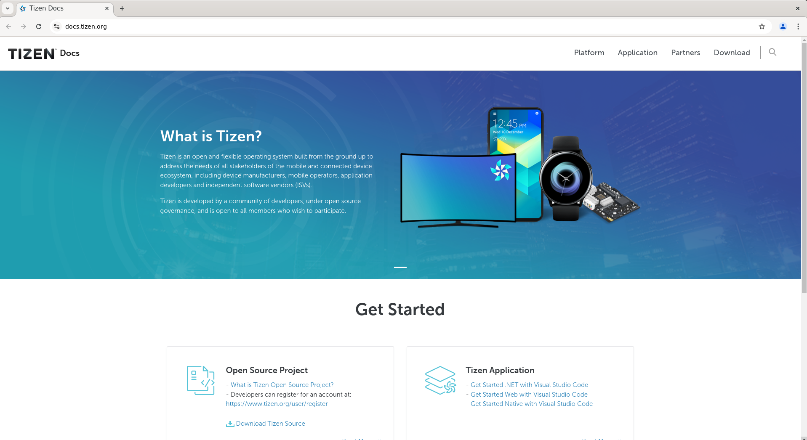