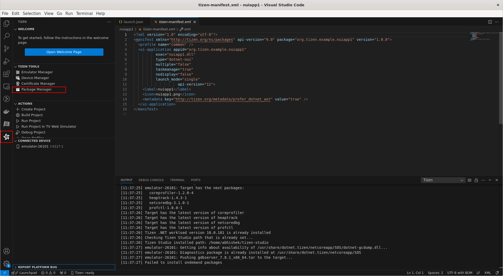
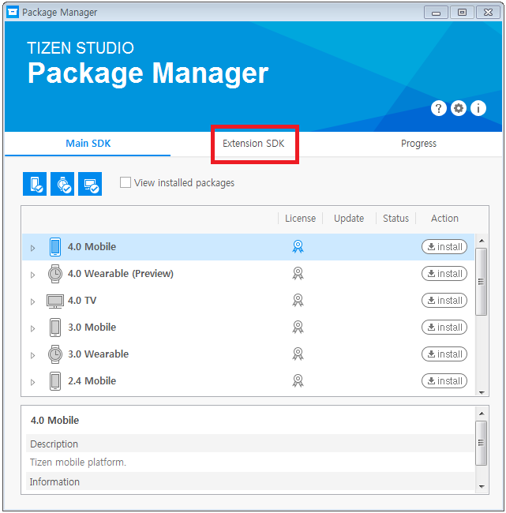
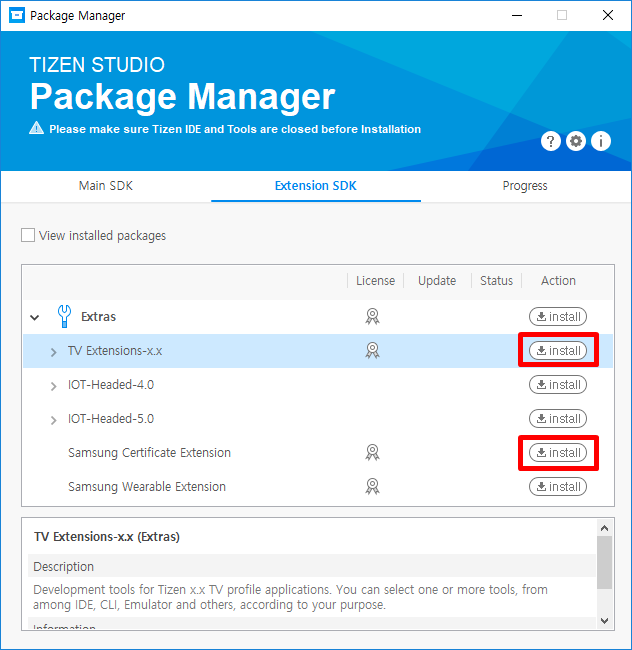
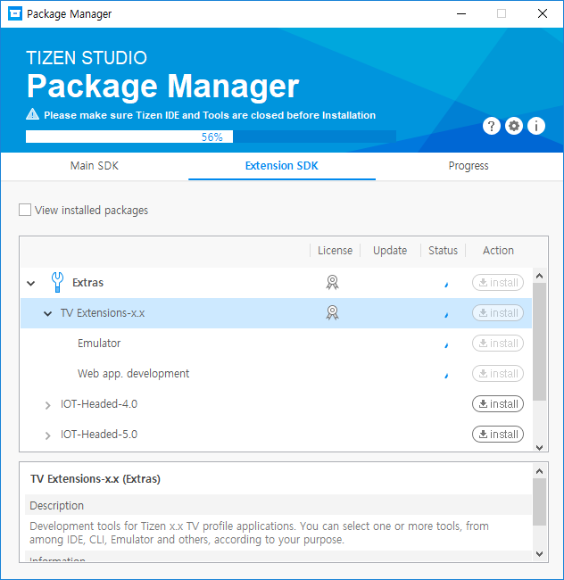
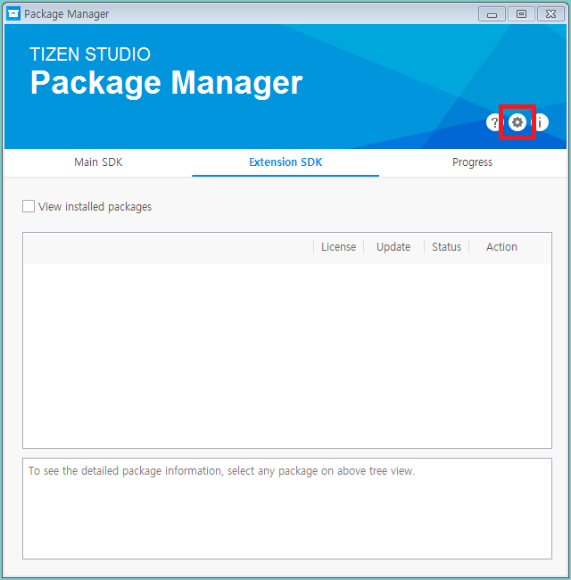
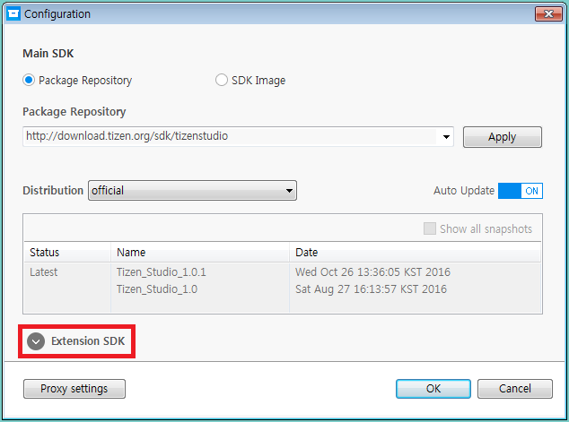
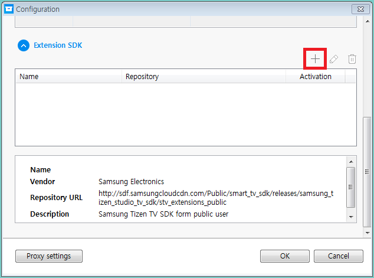
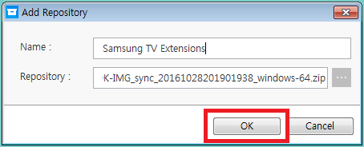
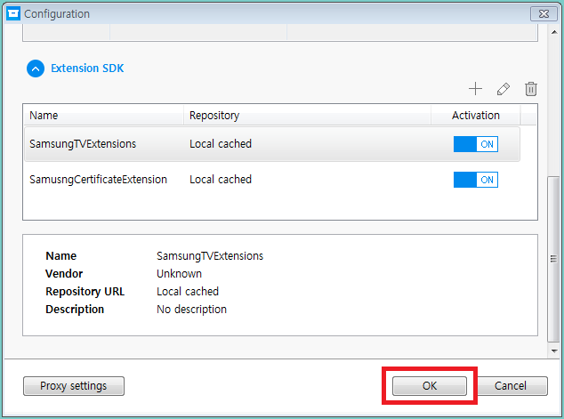

# Install TV extension & certificate extenstion guide

This function provides a step-by-step guide to installing TV and certificate extensions using the Tizen Studio Package Manager.

## Installing Required Extensions

You can install the required extensions using the online repository. If your firewall settings do not allow you to access the repository, you can also install the extensions from local images.

To install the extensions using the online repository:

1. Open the Package Manager: **Tizen Extension > Package Manger**. The Package Manager window opens.

    

2. In the Package Manager, select the "Extension SDK" tab.

    

3. Click "install" next to TV Extensions-<version> and "Samsung Certificate Extension".

    

4. Accept the software licenses.
The licenses contain important legal notices. Read them in full, and click "Accept All" only if you agree with the license statements.

5. Wait while the extensions are installed.

    

To install the extensions from local images:

1. Dowanload the following images:
    * [Samsung TV Extensions](https://developer.samsung.com/smarttv/develop/tools/tv-extension/download.html)
    * [Samsung Certificate Extension (direct download)](https://d3unf4s5rp9dfh.cloudfront.net/SmartTV_doc/tizen-certificate-extension_2.0.11.zip)

2. In the Package Manager, click "Configuration"

    

3. Unfold the Extension SDK configuration panel by clicking "Extension SDK" at the bottom of the dialog box.

    

4. To add a local image, click "+".

    

    The "Add Repository" dialog opens.

5. Enter values to the "Name" and "Repository" fields.
    Enter the full path of the SDK image file in the "Repository" box, or click "..." next to the field to open the file browser and select the image file.

6. Click "OK" to close the "Add Repository" dialog.

    

    When you select the image file in the repository list, the image's origin information is displayed.

7. Click "OK" to confirm.

    

8. Select the "Extension SDK" tab.

9. Click "Install" next to the added extensions.

10. Accept the software licenses.
The licenses contain important legal notices. Read them in full, and click "Accept" only if you agree with the license statements.

11. Wait while the extensions are installed.

Through the Tizen Studio Package Manager, you can also [update the SDK tools](https://developer.samsung.com/SmartTV/develop/getting-started/setting-up-sdk/installing-tv-sdk/updating-tv-sdk.html) or [uninstall them](https://developer.samsung.com/SmartTV/develop/getting-started/setting-up-sdk/installing-tv-sdk/uninstalling-tv-sdk.html).
