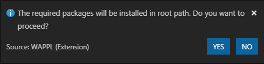
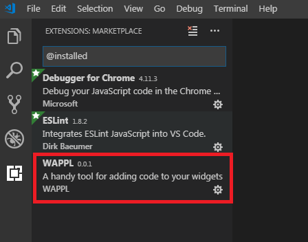
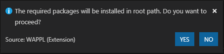
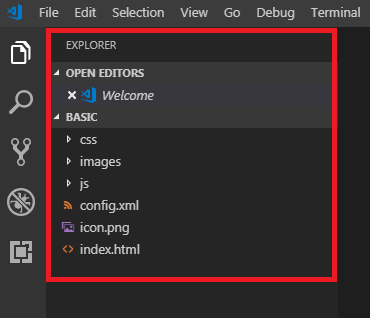

# Visual Studio Code Extension for Tizen Web

Visual Studio Code Extension for Tizen Web (VS Code Extension for Tizen Web) is a Visual Studio Code extension that enables you to easily develop Tizen Web applications using Visual Studio Code.

You can install VS Code extension in one of the following ways:
- Install from Marketplace 
- Install using a VSIX file

Before installing VS Code Extension for Tizen Web, check [Prerequisites of Visual Studio Code Extension for Tizen](index.md).

## Install from Marketplace 

To install VS Code Extension for Tizen Web from the Visual Studio Code Marketplace, follow these steps:

1. In the VS Code at the bottom of the **Activity Bar** click **Extensions** ().

   

2. In the **Extensions** view, enter **Tizen Web** as search term in the **Search Extensions in Marketplace** field.
3. Locate **Visual Studio Code Extension for Tizen Web** in the search results and click **Install**.
4. After the installation is complete, click **Reload** to activate the extension.
5. Once the extension activates, install the SDK to effectively use the extension.
6. Open **Command Palette** and enter **Create Wizard Project**. The confirmation message dialog appears:

   

   > **Note**
   >
   > Extension is a convenient way to create a project. It asks whether you want to use an existing Tizen baseline SDK installation or install a new one.

  - To perform a fresh installation, click **YES**.

    To perform a fresh installation and to begin the Tizen Baseline SDK installation, click YES. Else, click No, if you have already done the installation.

    > **Note**  
    >
    > In case you click **No**, it is assumed that the installation is done and the project is already created.

## Install using VSIX file

To install VS Code Extension for Tizen Web using a VSIX file, follow these steps:

1. In the VS Code at the bottom of the **Activity Bar**, click **Extensions** ().
2. Click **More** () in the top-right corner and select **Install from VSIX**.

   

3. Select an appropriate VSIX file in the file browser and click **Install**.
4. After the installation is complete, to activate the extension, click **Reload**.

   

5. After the extension activates, open **Command Palette** and enter **Create Wizard Project**. Choose, whether you want to use an existing Tizen Baseline SDK installation or install a new one:

   

   - To perform a fresh installation, click **YES**.

     To perform a fresh installation and to begin the Tizen Baseline SDK installation, click **YES**. Else, click **No**.
     > **Note** 
     >
     > In case you click **No**, it is assumed that the installation is done and the project is already created.

## Install Emulator Images

If you do not have a real device, you can run applications in the Tizen emulator.

To download emulator images, you can use Tizen Package Manager or Tizen Emulator Manager.

- To use Tizen Package Manager, follow these steps:
  1. Open **Command Palette** and enter **Run Package-Manager**.
  2. To select profiles and versions that you need for your project, click **Install**.

     

- To use Tizen Emulator Manager, follow these steps:

  > **Note**  
  >
  > Tizen Emulator Manager shows the emulator images installation window only when no images are installed on your computer.

  1. Open **Command Palette** and enter **Run Emulator-Manager**.
  2. Select the profiles and versions that you want to install and click **Ok**.

     

## Develop Applications

The following section explains how to use VS Code Extension for Tizen Web to develop the applications:

### Create Tizen Web Project

To create a Tizen Web project, follow these steps:

1. Open **Command Palette** and enter **Create Wizard Project**.

   

2. Select the **Template** project type and click **Next**.

   

3. Select the application profile and version from the drop-down list and click **Next**.

   

4. Select the **Basic UI** template and click **Next**.

    > **Note**
    >
    > The list is different depending on the type and profile of the previously selected project.

    

5. To complete the project creation in workspace, enter **Project name** and click **Finish**.
    > **Note**
    >
    > packageId is an optional field, it is not mandatory to enter details in this field because the packageId will generate the details automatically.

    

6. If you checked all this, the project is created.

   

### Create Tizen Certificate

To create Tizen Certificate, follow these steps:

  1. Open **Command Palette** and enter **Create Tizen Certificate**.
  2. Enter the name of the certificate.
  3. Enter the password of the certificate.
  4. Enter the profile name of the certificate. (Extension is .p12)
  > **Note**
  > 
  > If it is created properly, profilename.p12 will be created in tizen-studio/keystore/author.

### Add Tizen Certificate

To add Tizen Certificate, follow these steps:

  1. Open **Command Palette** and enter **Add Tizen Certificate**.
  2. Enter the name of the certificate.
  3. Enter the password of the certificate.
  4. Enter the profile name of the certificate. (Extension is .p12)
  > **Note**
  > 
  > You can verify the added certificate by running **Certificate Manager**.

### Remove Tizen Certificate

To remove Tizen Certificate, follow these steps:

If you want to change the Certificate, you need to remove the added Certificate.

  1. Open **Command Palette** and enter **Remove Tizen Certificate**.
  2. Enter the name of the certificate.
  > **Note**
  >
  > When you run Certificate Manager, the certificate will be deleted.

### Build Project

To build project, follow these steps:

  1. Open **Command Palette** and enter **Build Tizen App**.
  2. Enter the folder name of the project you want to build. (Folder name, not path)
  3. When the build is complete, it succeeds, and there is successful generation of `wgt` package popup. Also, you will see a build success log in the terminal at the bottom of the vscode.

  

> **Note**  
> 
> If you have a Tizen device and you want to deploy the application into it, you must first generate, and then add a certificate.

### Deploy and Run Application in Emulator

To deploy and run application, follow these steps:

1. Open **Command Palette** and enter **Run Emulator-Manager**. The Tizen Emulator Manager is launched.

   > **Note**  
   >
   > You cannot launch an emulator directly from VS Code. Instead, you must launch the Tizen Emulator Manager and use it to launch the emulator you need.

2. Create and launch an emulator instance in the Emulator Manager.
3. To deploy your application to the target, enter **Install Tizen App** in the **Command Palette**.
4. To run the application on the emulator, enter **Run Tizen App** in the **Command Palette**.

To install your project:

  1. Open **Command Palette** and enter **Install Tizen App**.
  2. Enter the folder name of the project you want to install. (Folder name, not path)
  3. When the installation is successfully completed, the installation app is generated. Also, you will see a build success log in the **terminal** at the bottom of the vscode.

  

> **Note** 
> 
> If you have a Tizen device and you want to deploy the application to it, you must first generate, and then add a certificate.

To run your project:

  1. Open **Command Palette** and enter **Run Tizen App**.
  2. Enter the folder name of the project you want to run. (Folder name, not path)
  3. When the run is complete, it succeeds, and there is successful generation of launch app popup. Also, you will see a build success log in the terminal at the bottom of the vscode.

  

> **Note**  
>
> If you have a Tizen device and you want to deploy the application to it, you must first generate, and then add a certificate.
>
> In addition, vscode terminal displays successful launch log messages:
> 
> 1. debug 0 means normal launch.
> 2. debug 1 means launching an Inspector available.

### Debug Application in Emulator

To debug application, follow these steps:

> **Note**
>
> Ensure the following:
> - Emulator is launched
> - Device is connected to the PC
> - Chrome browser is installed

1. Open **Command Palette** and enter **Debug Tizen App**.
2. Enter the name of the Tizen Web App you want to run.
3. A successful popup is created and the app is launched.

> **Note**
> 
> In addition, `vscode` terminal displays successful launch log messages:
>
> - debug `0` means normal launch.
> - debug `1` means launching an inspector available from command line
> - additionally, debug the connected port as shown in the following log

  

4. Connect **Debug Tizen App** with **Inspector**.
5. Open **Command Palette** and enter **Run Inspector**.
6. Enter the port number on your local PC. For example, 9999
7. In Chrome browser, the **Inspector** automatically launches and associates with the launched app.

    

### Debug Application in Web Simulator

To debug application, follow these steps:

1. Open **Command Palette** and enter **Run Web Simulator**.
2. After the Web Simulator is launched, enter the path of the file in the box. For example, file:///C:/workspace/basic/index.html.

    

## Tizen Web with Code IntelliSense

VS Code Extension for Tizen Web supports IntelliSense, which includes the following features:

- Code Completion
- Hover
- Signature Help
- Document View document

You can use these features to easily develop application using TAU.

### Features

### Code completion
  
  Display a list of recommended values when specifying attributes or APIs.

  

- Hover
  
  Display a description of the attribute or API when the mouse over attritubes

    

- Signature Help
  
  Displays an information of API parameters when using the API

    

- Document Viewer
  
  Displays a document related with attributes or APIs.
    > **How to use the Document Viewer**
    > 
    > Click the "Search in TAU document" on the context menu

    

## Troubleshoot

This section contains instructions for common problems with the Tizen Baseline Web IDE.

- To troubleshoot red screen error, follow these steps:

  a. Launch **Web Simulator**. 
  b. When the red screen is created, press **F12**.  
  c. Click **Application Tab** at the top-end immediately after the Chrome Devtool opens. 
  d. Select **Clear storage** and click **Clear site data**. 
  e. Exit Devtool and Simulator and launch again.
