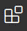
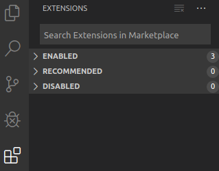
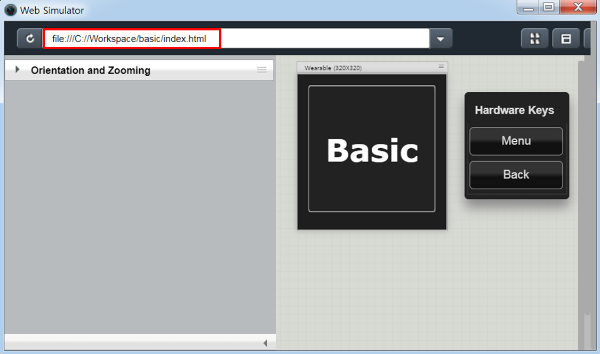
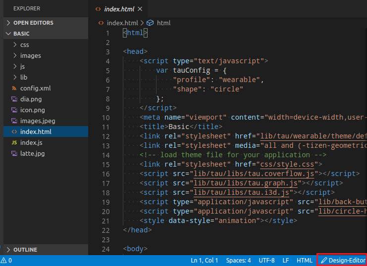

# Visual Studio Code Extension for Tizen Web

Visual Studio Code Extension for Tizen Web (VS Code Extension for Tizen Web) is a Visual Studio Code Extension that enables you to easily develop Tizen Web applications using Visual Studio Code.

You can install VS Code Extension for Tizen Web in one of the following ways:
- Install from Marketplace 
- Install using a VSIX file

Before installing VS Code Extension for Tizen Web, see [Prerequisites of Visual Studio Code Extension for Tizen](index.md).

## Install from Marketplace 

To install VS Code Extension for Tizen Web from the Visual Studio Code Marketplace, follow these steps:

1. In the Activity Bar of VS Code, click **Extensions** .

   

2. In the **EXTENSIONS** view that appears, click the search box at the top and type **Tizen Web**.
3. In the **Tizen Web** search result that appears, click **Install**.
4. After the installation is complete, to activate the extension, click **Reload**.

    After the extension is active, **Tizen Web** installation is complete.

## Install using VSIX file

To install VS Code extension for Tizen Web from a VSIX file, follow these steps:

1. In the Activity Bar of VS Code, click **Extensions** .
2. In the **EXTENSIONS** view that appears, click **More**  > **Install from VSIX**.

   

3. In the **Install from VSIX** window that appears, select an appropriate VSIX file and click **Install**.
4. After the installation is complete, to activate the extension, click **Reload**.

    After the extension is active, **Tizen Web** installation is complete.

## Install emulator images

If you do not have a real device, you can run your application in a virtual environment using Tizen Emulator. To download the emulator images, you can use Tizen Package Manager or Tizen Emulator Manager.

- To use Tizen Package Manager, follow these steps:
  1. In VS Code, click **View** > **Command Palette**.
  2. In the input field of the **Command Palette** that appears, type **Tizen Web: Run Package-Manager** and press **Enter**.
  3. Select the profiles and versions for your project, and click **install**.

     

- To use Tizen Emulator Manager, follow these steps:

  > [!NOTE]
  > Tizen Emulator Manager shows the emulator images installation window only when no images are installed on your computer.

  1. In VS Code, click **View** > **Command Palette**.
  2. In the input field of the **Command Palette** that appears, type **Tizen Web: Run Emulator-Manager** and press **Enter**.
  3. Select the profiles and versions for your project, and click **Ok**.

     

## Develop applications

This section explains how to use VS Code Extension for Tizen Web to develop applications.

### Change Tizen SDK path

To change a Tizen SDK path, follow these steps:

1. In VS Code, click **View** > **Command Palette**.
2. In the input field of the **Command Palette** that appears, type **Tizen Web: Change Tizen SDK Path** and press **Enter**.
3. In the change notification that appears, perform one of the following:
    - To keep the current path, click **Keep**.
    - To change the path, click **Change Path**. In the input field of the Command Palette that appears, type the path and press **Enter**.

      > [!NOTE]
      > The default path for:
      >
      > - Window OS: `c:\tizen-studio`
      >
      > - Linux OS: `/home/username/tizen-studio`

      

### Install Tizen Baseline SDK

> [!NOTE]
> You must install Oracle Java Development Kit (JDK) 8 or OpenJDK 12 for Tizen Studio 3.5 and higher.
>
> For more information on download and install, see [Oracle Java Download page](https://www.oracle.com/technetwork/java/javase/downloads/jdk8-downloads-2133151.html).

To install a Tizen Baseline SDK, follow these steps:

1. In VS Code, click **View** > **Command Palette**.
2. In the input field of the **Command Palette** that appears, type **Tizen Web: Install Tizen Baseline SDK** and press **Enter**.
3. In the notification that appears, perform one of the following:
    - If SDK is already installed, click **YES**, and run **Tizen Web: Change SDK Path**.

      

    - If SDK is not installed, to perform a fresh installation, click **NO**. In the notification that appears:

      - To start the Tizen Baseline SDK installation, click **Install**.
      - If the path of the popup is **null**, change the path by clicking **Change Path**.

      

    Proceed with the installation. The installation progress appears in the log. The extension reloads when the installation is complete.

    
### Change workspace path

To change a workspace path, follow thse steps:

1. In VS Code, click **View** > **Command Palette**.
2. In the input field of the **Command Palette** that appears, type **Tizen Web: Change Workspace Path** and press **Enter**.
3. In the change notification that appears, perform one of the following:
    - To keep the path, click **Keep**.
    - To change the path, click **Change Path**. In the input field of the **Command Palette** that appears, type the path and press **Enter**.

        > [!NOTE]
        > The default path for:
        >
        > - Window OS: `c:\workspace`
        >
        > - Linux OS: `/home/username/workspace`

        

### Change Chrome path

To change a Chrome browser path, follow these steps:

1. In VS Code, click **View** > **Command Palette**.
2. In the input field of the **Command Palette** that appears, type **Tizen Web: Change Chrome Path** and press **Enter**.
3. In the change notification that appears:
    - To keep the path, click **Keep**.
    - To change the path, click **Change Path**. In the input field of the **Command Palette** that appears, type the path and press **Enter**.
    
    > [!NOTE]
    > If the installation is complete with the **Chrome** installer, the path is set to below default path:
    >
    > - Window OS: `C:\Program Files (x86)\Google\Chrome\Application\chrome.exe`
    >
    > - Linux OS: `/opt/google/chrome/google-chrome`

    

### Create Tizen Web project

To create a Tizen Web project, follow these steps:

1. In VS Code, click **View** > **Command Palette**.
2. In the input field of the **Command Palette** that appears, type **Tizen Web: Create Wizard Project** and press **Enter**.

3. Click **New Project**.

   

4. Select the project type and click **Next**.

   

5. Select the application profile, the version from the drop-down list, and click **Next**.

   

6. Select the application template, for example **Basic UI**, and click **Next**.

    > [!NOTE]
    > The application template options that appear will differ based on the type and profile of the previously selected project.

    

7. To complete the project creation in workspace, enter **Project name** and click **Finish**.
    > [!NOTE]
    > **Package ID** is an optional field and the details are generated automatically.

    

### Create and add Tizen certificate

To create and add Tizen Certificate, follow these steps:

  1. In VS Code, click **View** > **Command Palette**.
  2. In the input field of the **Command Palette** that appears, type **Tizen Web: Create and Add Tizen Certificate** and press **Enter**.
  3. Enter the name of the certificate.
  4. Enter the password of the certificate.
  
      The certificate is now added.
      > [!NOTE]
      > To view the added certificate, type **Tizen Web: Run Certificate-Manager** in **Command Palette**.

### Remove Tizen certificate

If you want to change the Certificate, you need to remove the added Certificate. To remove Tizen Certificate, follow these steps:

  1. In VS Code, click **View** > **Command Palette**.
  2. In the input field of the **Command Palette** that appears, type **Tizen Web: Remove Tizen Certificate** and press **Enter**.
  3. Enter the name of the certificate.

      The certificate is now removed.
      > [!NOTE]
      > To view the **Tizen Certificate Manager** window, type **Tizen Web: Run Certificate-Manager** in Command Palette.

### Build your project

To build project, follow these steps:

  1. In VS Code, click **View** > **Command Palette**.
  2. In the input field of the **Command Palette** that appears, type **Tizen Web: Build Tizen App** and press **Enter**.
  3. Enter the folder name of the project you want to build. For example, type only `basic` to enter the `c:\workspace\basic` path.

      

      > [!NOTE] 
      > If you have a Tizen device and want to build the application into it, then you must first generate a certificate and add it.

### Exclude build list

To build the project after removing unwanted files, follow these steps:

  1. In VS Code, click **View** > **Command Palette**.
  2. In the input field of the **Command Palette** that appears, type **Tizen Web: Make Exclude Build List** and press **Enter**.
  3. Enter the name of the file to remove. 
  
      > [!NOTE]
      > Separate the file name with commas and ensure that there is no space between them. For example, file1.txt,file2.txt.
  
      **.buildignore** file is created with the input data in the project folder and the build excludes the input data and generates a packaged `wgt` file.

      

### Deploy and run your application in emulator

To deploy and run application, follow these steps:

1. In VS Code, click **View** > **Command Palette**.
2. In the input field of the **Command Palette** that appears, type **Tizen Web: Run Emulator-Manager** and press **Enter**.

   > [!NOTE]
   > To launch an emulator in VS Code, you must launch Tizen Emulator Manager and select the emulator you want to launch.

3. Create and launch an emulator instance in the Emulator Manager.
4. To deploy your application to the target, in the **Command Palette** type **Tizen Web: Install Tizen App**.
5. To run the application on the emulator, in the **Command Palette** type **Tizen Web: Run Tizen App**.

To install project:

1. In VS Code, click **View** > **Command Palette**.
2. In the input field of the **Command Palette** that appears, type **Tizen Web: Install Tizen App** and press **Enter**.
3. Enter the folder name of the project you want to install.
    > [!NOTE]
    > Ensure that you enter the name of the folder and not the path.

    
    
    The app launches automatically when the installation completes successfully.

    > [!NOTE]
    > If you have a Tizen device and want to deploy the application into it, then you must first generate a certificate and add it.

To run project if your app is already installed, follow these steps:

  1. In VS Code, click **View** > **Command Palette**.
  2. In the input field of the **Command Palette** that appears, type **Tizen Web: Run Tizen App** and press **Enter**.
  3. Enter the folder name of the project that you want to run. 
      > [!NOTE]
      > Ensure that you enter the name of the folder and not the path.
  
      When the installation is successfully completed, an install successful notification appears. Also, you will see a build success log in the terminal at the bottom of the vscode.
  
      

        > [!NOTE]
        > If you have a Tizen device and want to deploy the application into it, then you must first generate a certificate and add it.
        >
        > In addition, `vscode` terminal displays successful launch log messages:
        >
        > - debug `0` means normal launch.
        > - debug `1` means launching an inspector available from command line.

### Debug your application in emulator

1. In VS Code, click **View** > **Command Palette**.
2. In the input field of the **Command Palette** that appears, type **Tizen Web: Debug Tizen App** and press **Enter**.
3. Enter the name of the Tizen Web App you want to run. 

    A successful notification appears and the app is launched. Also, you will see a successful launch log in the terminal on the vscode.

    - debug `0` means normal launch.
    - debug `1` means launching an inspector available from command line.

    When port information is displayed in **OUTPUT**, it means that it is launched in debug mode.

    

    > [!NOTE]
    > Ensure the following:
    > - Emulator is launched, or device is connected to the PC
    > - Chrome browser is installed

4. In Chrome browser, the **Inspector** automatically launches and associates with the launched app.

    > [!NOTE] 
    > If you have a Tizen device and want to deploy the application into it, then you must first generate a certificate and add it.

### Debug your application in Web simulator

To debug application, follow these steps:

1. In VS Code, click **View** > **Command Palette**.
2. In the input field of the **Command Palette** that appears, type **Tizen Web: Run Web Simulator** and press **Enter**.
3. After the **Web Simulator** is launched, enter the path of the file in the box. For example, file:///C://Workspace/basic/index.html.

    

### Quick action execution
Right-click on the **project folder** to use the extension function in the menu.

For more information on each function, see:
- [Tizen Web: Build Tizen App](#Build-Project)
- [Tizen Web: Debug Tizen App](#Deploy-and-Run-Application-in-Emulator)
- [Tizen Web: Install Tizen App](#Deploy-and-Run-Application-in-Emulator)
- [Tizen Web: Make Exclude Build List](#Exclude-Build-List)
- [Tizen Web: Run Tizen App](#Deploy-and-Run-Application-in-Emulator)

## Tizen Web with Design Editor

Visual Studio Code Extension for Tizen Web supports WYSIWYG Design Editor features such as **Preview**, **JavaScript Assistant**, **Structure View**, **New Page**, **HTML Assistant**, **Undo**, and **Redo**. 

You must select the **HTML extension file** in the file explorer before you launch Design Editor.

### Run Design Editor

To run Design Editor, perform one of the following:

- Using Command Palette

    1. To launch Design Editor, click **View** > **Command Palette** in VS Code.
    2. In the input field of **Command Palette** that appears, type **Tizen Web: Run Design-Editor** and press **Enter**.

        A new tab is created and Design Editor is launched.

- Using Design-Editor button

    To launch Design Editor, click **Design-Editor** on the VS Code window as shown in the following figure:

    

- Using right-click options

    1. To launch Design Editor, select the HTML file that you want to launch and right-click.
    2. From the list that appears, click **Tizen Web: Run Design-Editor**.

        

### Features

Following are the WYSIWYG Design Editor features:

- Drag and Drop a component

    You can drag and drop a component from the Widgets palette to the canvas.

    
    
- Change component properties

    After placing the UI components, you can set the component properties in the Attributes palette.

    

- Preview

    You can use **Preview**  in the toolbar to display the preview of the edited page.

    
   
- JavaScript Assistant

   You can use **JavaScript Assistant**  in the toolbar to edit the Javascript code with **JavaScript Assistant Wizard** .

    

- Structure View

   You can use **Structure View**  in the toolbar to see the DOM tree of the page.

   

- New Page 

   You can use **New Page**  in the toolbar to add a new page with empty, header, footer, or list template.

   

- HTML Assistant

   You can use **HTML Assistant**  in the toolbar to edit the HTML code.

   

- Undo or Redo 

   You can use **Undo**  or **Redo**  in the toolbar to undo or redo any action.

### Usage of Design Editor 

- Usage of Radio button with HTML Assistant

    

- Usage of Popup with Javascript Assistant

    

## Tizen Web with code IntelliSense

VS Code Extension for Tizen Web supports IntelliSense. You can use these features to easily develop application using TAU.

### Features

- Code Completion

  Displays a list of recommended values when specifying attributes or APIs.

  

- Hover
  
  Displays a description of an attribute or an API when you hover the mouse over that attribute or API.

  

- Signature Help
  
  Displays information about the API parameters.

  

- Document Viewer
  
  Displays a document related with attributes or APIs. To use the document viewer, follow these steps:
  1. Place the mouse cursor on the TAU element that you want to check and right-click.
  2. Click **Search in TAU document**.

  

## Troubleshoot

This section contains instructions for common problems with the Tizen Baseline Web IDE.

Red Screen:

1. In VS Code, click **View** > **Command Palette**.
2. In the input field of the **Command Palette** that appears, type **Run Web Simulator** and press **Enter**.
3. If the red screen appears, press **F12**.
4. In the **DevTools** window that appears, click **Application**.
5. In the **Application** side bar that appears, click **Clear storage** and click **Clear site data**.
6. Close **DevTools** and **Web Simulator**, and launch **Web Simulator** again.
