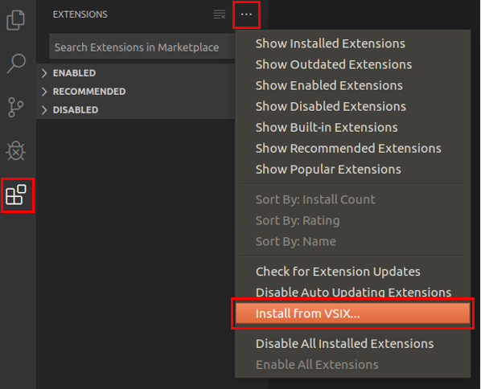
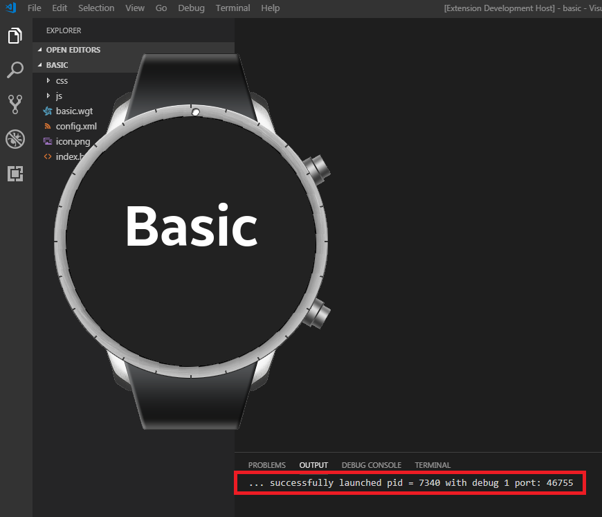
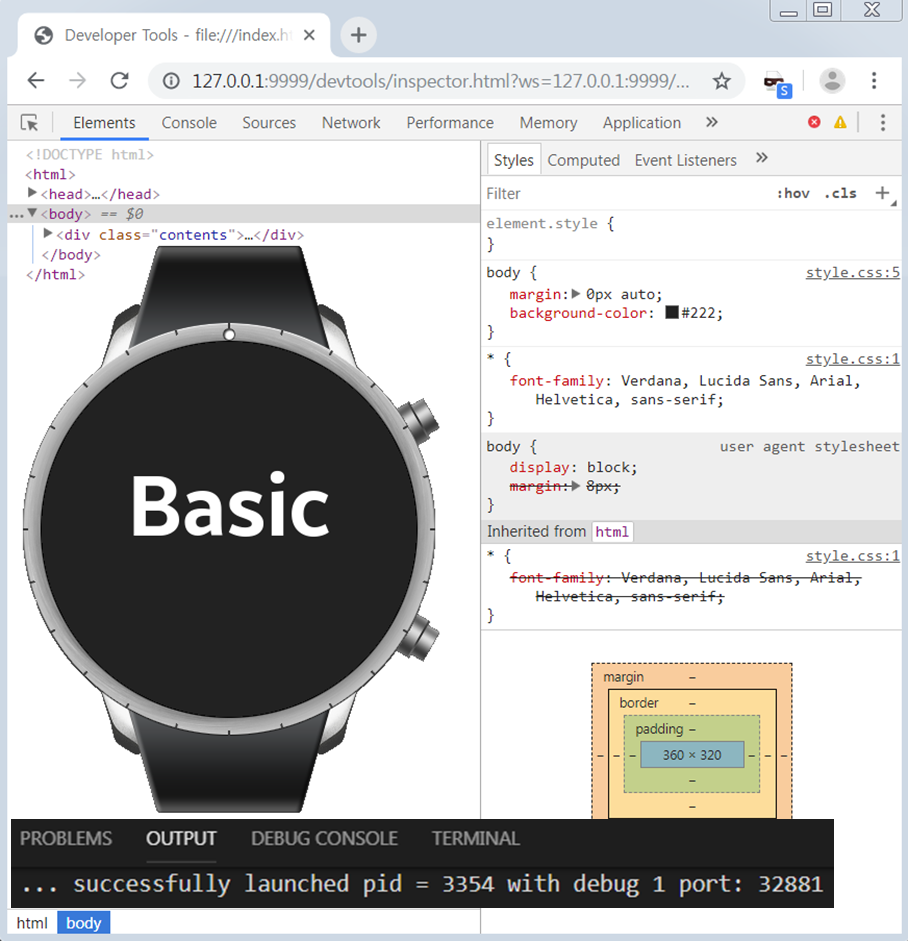

# Visual Studio Code Extension for Tizen Web

Visual Studio Code Extension for Tizen Web (VS Code Extension for Tizen Web) is a Visual Studio Code Extension that enables you to easily develop Tizen Web applications using Visual Studio Code.

You can install VS Code Extension for Tizen Web in one of the following ways:
- Install from Marketplace 
- Install using a VSIX file

Before installing VS Code Extension for Tizen Web, check [Prerequisites of Visual Studio Code Extension for Tizen](index.md).

## Install from Marketplace 

To install VS Code Extension for Tizen Web from the Visual Studio Code Marketplace, follow these steps:

1. In the Activity Bar of VS Code, click **Extensions** .

   

2. In the **EXTENSIONS** view that appears, click the search box at the top and type **Tizen Web**.
3. In the **Tizen Web** search result that appears, click **Install**.
4. After the installation is complete, to activate the extension, click **Reload**.

    After the extension is active, **Tizen Web** installation is complete.

## Install using VSIX File

To install VS Code extension for Tizen Web from a VSIX file, follow these steps:

1. In the Activity Bar of VS Code, click **Extensions** .
2. In the **EXTENSIONS** view that appears, click **More**  > **Install from VSIX**.

   

3. In the **Install from VSIX** window that appears, select an appropriate VSIX file and click **Install**.
4. After the installation is complete, to activate the extension, click **Reload**.

    After the extension is active, **Tizen Web** installation is complete.

## Install Emulator Images

If you do not have a real device, you can run your application in a virtual environment using Tizen emulator. To download the emulator images, you can use Tizen Package Manager or Tizen Emulator Manager.

- To use Tizen Package Manager, follow these steps:
  1. In VS Code, click **View** > **Command Palette**.
  2. In the input field of the **Command Palette** that appears, type **Run Package-Manager** and press **Enter**.
  3. Select the profiles and versions for your project, and click **install**.

     

- To use Tizen Emulator Manager, follow these steps:

  > **Note**  
  >
  > Tizen Emulator Manager shows the emulator images installation window only when no images are installed on your computer.

  1. In VS Code, click **View** > **Command Palette**.
  2. In the input field of the **Command Palette** that appears, type **Run Emulator-Manager** and press **Enter**.
  3. Select the profiles and versions for your project, and click **Ok**.

     

## Develop Applications

This section explains how to use VS Code Extension for Tizen Web to develop applications.

### Create Tizen Web Project

To create a Tizen Web project, follow these steps:

1. In VS Code, click **View** > **Command Palette**.
2. In the input field of the **Command Palette** that appears, type **Create Wizard Project** and press **Enter**.
3. The installation notification appears. To perform a fresh installation and begin the Tizen Baseline SDK installation, click **YES**. If **NO** is clicked, it is assumed that you have already done the installation and the project is created.

   

4. Click **New Project**.

   

5. Select the project type and click **Next**.

   

6. Select the application profile, the version from the drop-down list, and click **Next**.

   

7. Select the application template, for example **Basic UI**, and click **Next**.

    > **Note**
    >
    > The application template options that appear will differ based on the type and profile of the previously selected project.

    

8. To complete the project creation in workspace, enter **Project name** and click **Finish**.
    > **Note**
    >
    > **Package ID** is an optional field and the details are generated automatically.

    

### Create Tizen Certificate

To create Tizen Certificate, follow these steps:

  1. In VS Code, click **View** > **Command Palette**.
  2. In the input field of the **Command Palette** that appears, type **Create Tizen Certificate** and press **Enter**.
  3. Enter the name of the certificate.
  4. Enter the password of the certificate.
  5. Enter the profile name of the certificate. (Extension is .p12)
      > **Note**
      > 
      > profilename.p12 will be created in tizen-studio/keystore/author.

### Add Tizen Certificate

To add Tizen Certificate, follow these steps:

  1. In VS Code, click **View** > **Command Palette**.
  2. In the input field of the **Command Palette** that appears, type **Add Tizen Certificate** and press **Enter**.
  3. Enter the name of the certificate.
  4. Enter the password of the certificate.
  5. Enter the profile name of the certificate. (Extension is .p12)
      > **Note**
      > 
      > To view the added certificate, type **Run Certificate-Manager** in **Command Palette**.

### Remove Tizen Certificate

If you want to change the Certificate, you need to remove the added Certificate. To remove Tizen Certificate, follow these steps:

  1. In VS Code, click **View** > **Command Palette**.
  2. In the input field of the **Command Palette** that appears, type **Remove Tizen Certificate** and press **Enter**.
  3. Enter the name of the certificate.
  4. The certificate is now removed from the **Tizen Certificate Manager** window.
      > **Note**
      >
      > To view the **Tizen Certificate Manager** window, type **Run Certificate-Manager** in Command Palette.

### Build Project

To build project, follow these steps:

  1. In VS Code, click **View** > **Command Palette**.
  2. In the input field of the **Command Palette** that appears, type **Build Tizen App** and press **Enter**.
  3. Enter the folder name of the project you want to build. For example, type only `basic` to enter the `c:\workspace\basic` path.

      

      > **Note**  
      > 
      > If you have a Tizen device and want to build the application into it, then you must first generate a certificate and add it.

### Deploy and Run Application in Emulator

To deploy and run application, follow these steps:

1. In VS Code, click **View** > **Command Palette**.
2. In the input field of the **Command Palette** that appears, type **Run Emulator-Manager** and press **Enter**.

   > **Note**  
   >
   > To launch an emulator in VS Code, you must launch Tizen Emulator Manager and select the emulator you want to launch.

3. Create and launch an emulator instance in the Emulator Manager.
4. To deploy your application to the target, type **Install Tizen App** in the **Command Palette**.
5. To run the application on the emulator, type **Run Tizen App** in the **Command Palette**.

To install project:

1. In VS Code, click **View** > **Command Palette**.
2. In the input field of the **Command Palette** that appears, type **Install Tizen App** and press **Enter**.
3. Enter the folder name of the project you want to install.
    > **Note**
    >
    > Ensure that you enter the name of the folder and not the path.

    

    > **Note** 
    > 
    > If you have a Tizen device and want to deploy the application into it, then you must first generate a certificate and add it.

To run project:

  1. In VS Code, click **View** > **Command Palette**.
  2. In the input field of the **Command Palette** that appears, type **Run Tizen App** and press **Enter**.
  3. Enter the folder name of the project that you want to run. 
      > **Note**
      >
      > Ensure that you enter the name of the folder and not the path.
  
      When the installation is successfully completed, an install successful notification appears. Also, you will see a build success log in the terminal at the bottom of the vscode.
  
      

        > **Note**  
        >
        > If you have a Tizen device and want to deploy the application into it, then you must first generate a certificate and add it.
        >
        > In addition, `vscode` terminal displays successful launch log messages:
        >
        > - debug `0` means normal launch.
        > - debug `1` means launching an inspector available from command line.

### Debug Application in Emulator

1. In VS Code, click **View** > **Command Palette**.
2. In the input field of the **Command Palette** that appears, type **Debug Tizen App** and press **Enter**.
3. Enter the name of the Tizen Web App you want to run. 

    A successful notification appears and the app is launched. Also, you will see a successful launch log in the terminal on the vscode.

    - debug `0` means normal launch.
    - debug `1` means launching an inspector available from command line.

    When port information is displayed in **OUTPUT**, it means that it is launched in debug mode.

    

    > **Note**
    >
    > Ensure the following:
    > - Emulator is launched, or device is connected to the PC
    > - Chrome browser is installed

4. Connect **Debug Tizen App** with **Inspector**.
5. Open **Command Palette** and type **Run Inspector**.
6. Enter the port number to be used on the local computer. For example, 9999.
7. In Chrome browser, the **Inspector** automatically launches and associates with the launched app.

    > **Note** 
    > 
    > If you have a Tizen device and want to deploy the application into it, then you must first generate a certificate and add it.

### Debug Application in Web Simulator

To debug application, follow these steps:

1. In VS Code, click **View** > **Command Palette**.
2. In the input field of the **Command Palette** that appears, type **Run Web Simulator** and press **Enter**.
3. After the **Web Simulator** is launched, enter the path of the file in the box. For example, file:///C://Workspace/basic/index.html.

    

## Tizen Web with Code IntelliSense

VS Code Extension for Tizen Web supports intelliSense. You can use these features to easily develop application using TAU.

### Features

- Code Completion

  Displays a list of recommended values when specifying attributes or APIs.

  

- Hover
  
  Displays a description of an attribute or an API when you hover the mouse over that attribute or API.

  

- Signature Help
  
  Displays information about the API parameters.

  

- Document Viewer
  
  Displays a document related with attributes or APIs. To use the document viewer, follow these steps:
  1. Place the mouse cursor on the TAU element that you want to check and right-click.
  2. Click **Search in TAU document**.

  

## Troubleshoot

This section contains instructions for common problems with the Tizen Baseline Web IDE.

Red Screen:

1. In VS Code, click **View** > **Command Palette**.
2. In the input field of the **Command Palette** that appears, type **Run Web Simulator** and press **Enter**.
3. If the red screen appears, press **F12**.
4. In the **DevTools** window that appears, click **Application**.
5. In the **Application** side bar that appears, click **Clear storage** and click **Clear site data**.
6. Close **DevTools** and **Web Simulator**, and launch **Web Simulator** again.
