# Visual Studio for Mac Extension for Tizen

Visual Studio for Mac Extension for Tizen is an extension, which enables you to develop Tizen .NET applications easily using various Tizen project templates with Visual Studio for Mac.

## Prerequisites

To work with Visual Studio for Mac Extension for Tizen, your computer must have:

- At least 5.6 GB of available disk space
- macOS Mojave version 10.14 (Community, Professional, and Enterprise)
- Visual Studio 2019 for Mac version 8.2 and higher (Community, Professional, and Enterprise)
- Java Development Kit (JDK)

  > [!NOTE]
  > To use Tizen Baseline SDK version earlier than version 3.7, you must install [Oracle Java Development Kit(JDK) 8](https://www.oracle.com/technetwork/java/javase/downloads/jdk8-downloads-2133151.html) and [Java for OS X 2017-001](https://support.apple.com/kb/DL1572) together or [OpenJDK 12 and OpenJFX](../tizen-studio/setup/openjdk.md#install-openjdk-for-macos).

## Install Visual Studio for Mac Extension

To install Visual Studio for Mac Extension for Tizen:

1. In the Visual Studio Mac IDE menu, select **Visual Studio > Extensions**.

   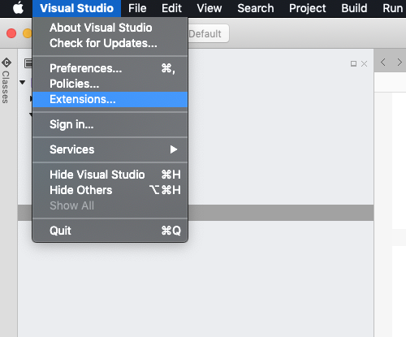

2. In the **Extension Manager** dialog that appears, click **Gallery**.

	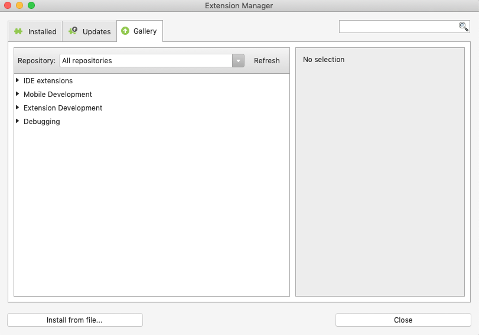
   
3. To get the latest extensions, click **Refresh**.

	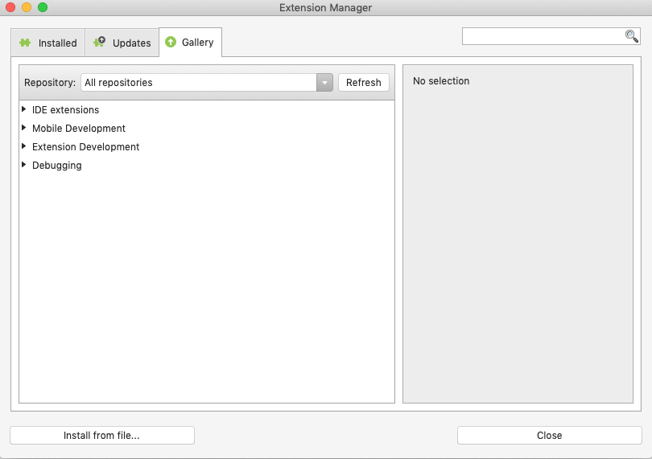
	
4. After the extension list is refreshed, expand **IDE extensions**, select **Visual Studio for Mac Extension for Tizen**, and click **Install**.

	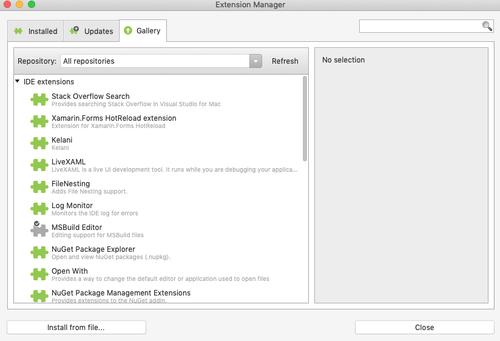
	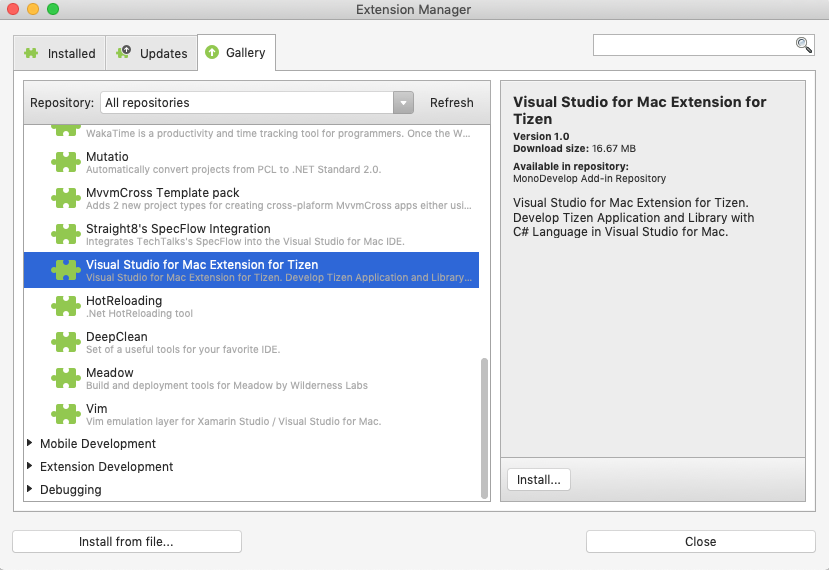

5. In the **VisualStudio** dialog that appears, click **Install**.

    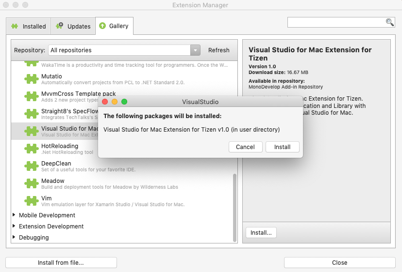 

   The extension is installed. 
   
   > [!NOTE]
   > To complete the installation, restart the IDE.
   
   After successful installation, **Tizen** appears in the project wizard.
   
   

## Install Tizen Baseline SDK

Baseline SDK contains Tizen-specific libraries and tools such as profiler, debugger, and so on.

After installing the Visual Studio Mac Extension for Tizen, you must set up the Tizen Baseline SDK. You can either:

- [Install a new Tizen Baseline SDK](#install-a-new-tizen-baseline-sdk) if you have not already installed the SDK.
- [Configure an existing Tizen Baseline SDK](#configure-an-existing-tizen-baseline-sdk) if you want to use the installed SDK.

### Install a new Tizen Baseline SDK

1. In the Visual Studio Mac IDE menu, go to **Tools > Tizen > Tizen Package Manager**.
2. Select **Install new Tizen SDK**.
  
   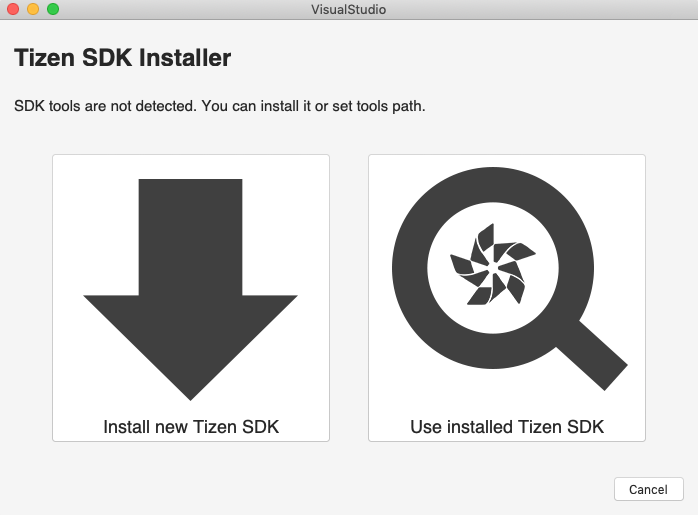

3. Read the license document and click **I Agree**.

   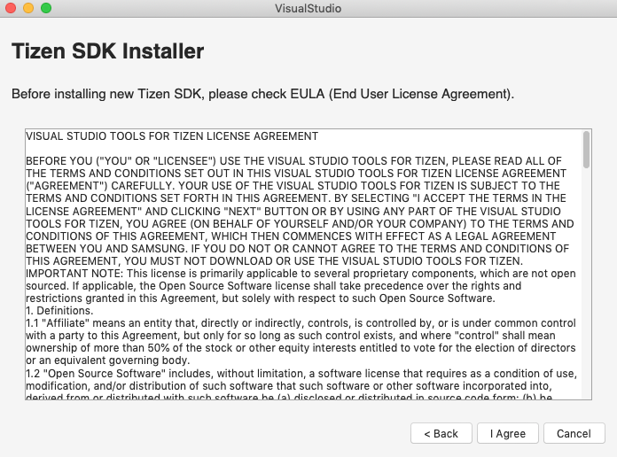

4. Enter the root directory path where you want to install the Tizen Baseline SDK and click **Next**.

   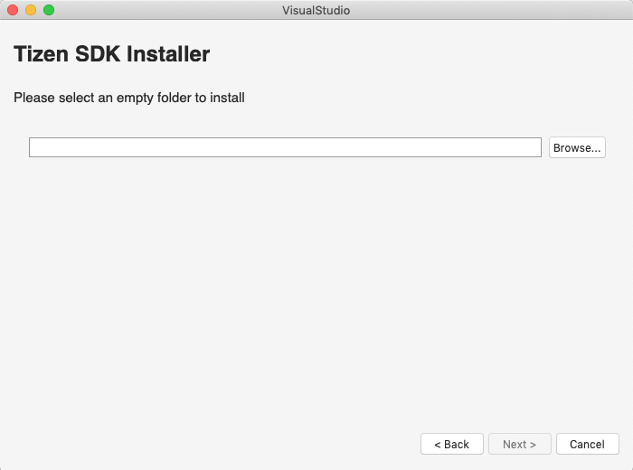

   The Tizen SDK installer is downloaded and the Baseline SDK is installed automatically.

   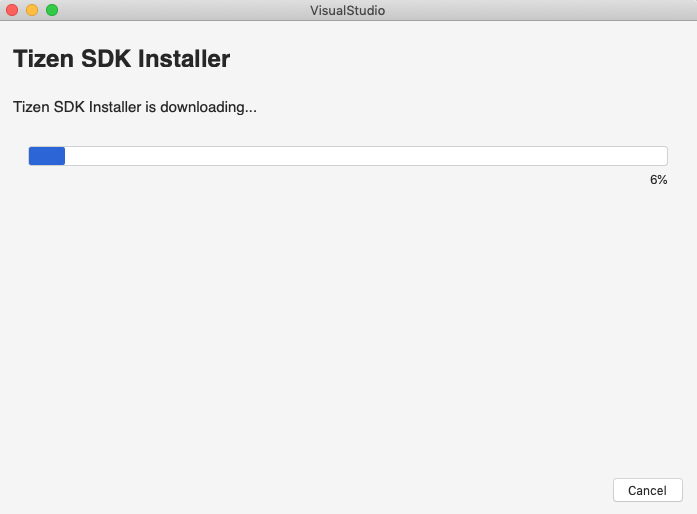

5. In the **Package Manager** window that appears, select **Main SDK**.

6. Select **Tizen SDK tools** and click **install**. You can see the installation progress in the **Progress** tab.

   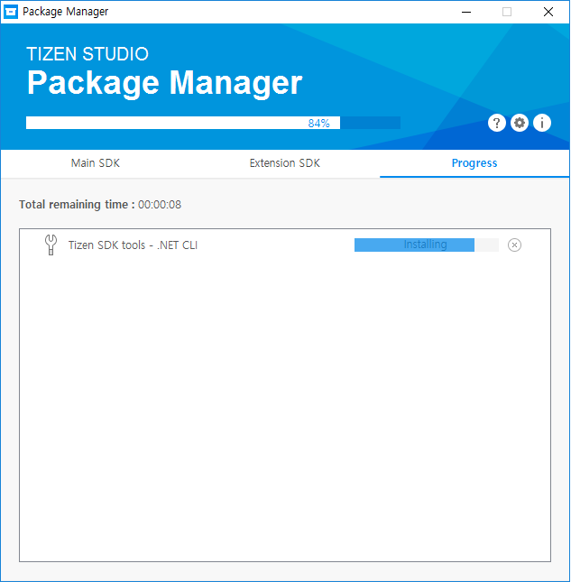

### Configure an Existing Tizen Baseline SDK 

You can also use Tizen Package Manager to configure the Tizen Baseline SDK path and each tool path directly:

- To set up the Tizen Baseline SDK path:

  1. In the Visual Studio Mac IDE menu, select **Tools > Tizen > Tizen Package Manager**.
  2. Select **Use installed Tizen SDK**.

     

  3. Enter the root directory of your existing Tizen Baseline SDK installation and click **OK**.

     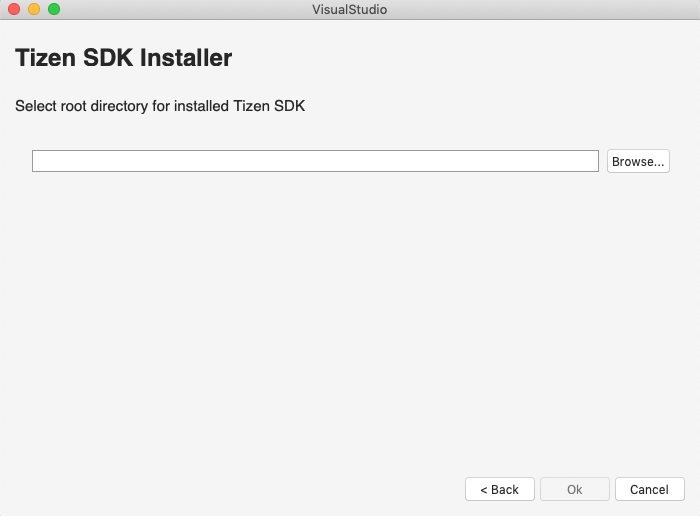
	 
     The Tizen Baseline SDK is installed automatically.

     > [!NOTE]  
     > If the installer gives a warning about your Tizen Studio version being too low, update the Tizen Baseline SDK by using the Tizen Package Manager after setting the tool path.

- To set up each tool path directly:

  1. In the Visual Studio Mac IDE menu, select **Project > Solution Options > Tizen > Tools**.
  2. Enter the root directory of your existing Tizen Studio installation in the **Tool Path(Tizen SDK)** field.

     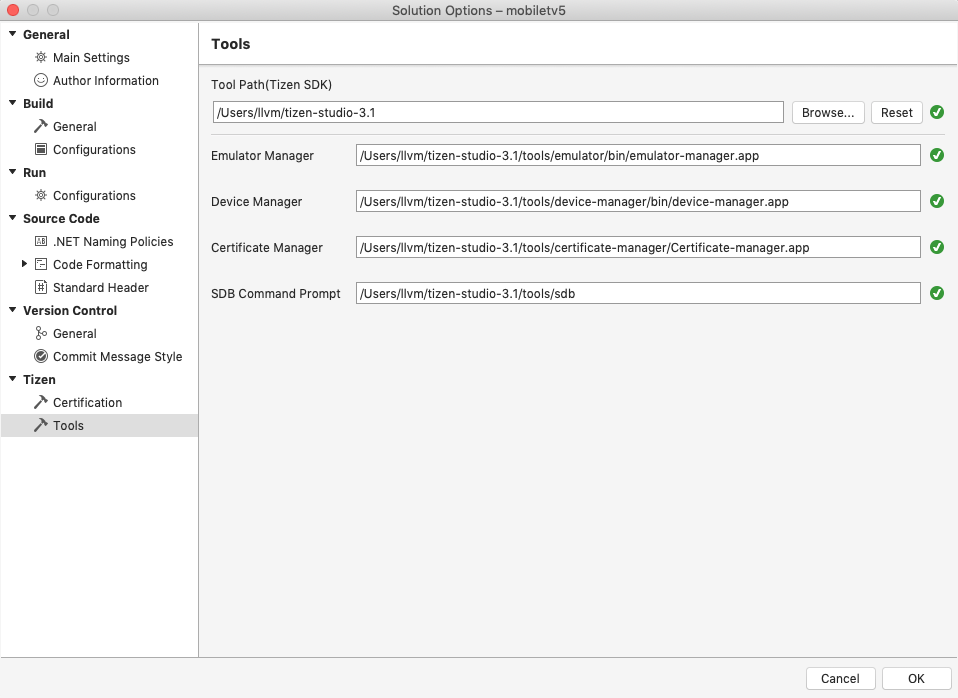

     The other tools paths are configured automatically.

## Troubleshoot

If you encounter any issue with the installation, verify whether the Tizen Baseline SDK is installed correctly. 

To verify that, go to **Project > Solution Options > Tizen > Tools** and verify the tool path.

