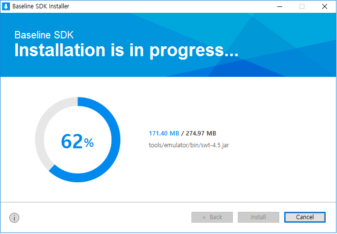
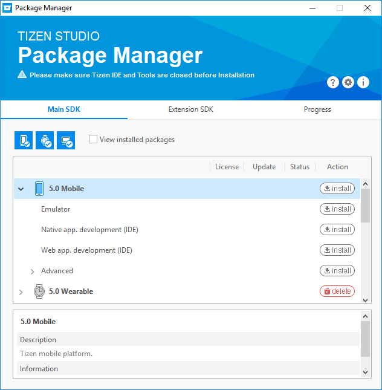
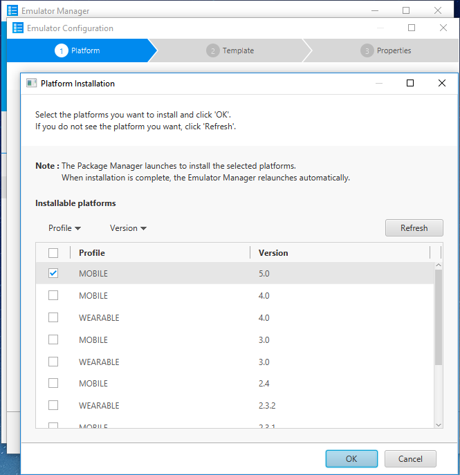

# Installing Visual Studio for Mac Extension for Tizen

## Prerequisites

To work with Visual Studio for Mac Extension for Tizen, your computer must have:

- At least 5.6 GB of available disk space
- macOS Mojave 10.14: Community, Professional, and Enterprise.	
- Visual Studio Mac 2019 (Community, Professional, Enterprise) Version 8.2 and above.

- Java Development Kit (JDK)

  You must install Oracle Java Development Kit (JDK) 8 or OpenJDK 10 to use 
Tizen Baseline SDK. Make sure you download and install the EXACT version.

  - [Oracle Java Development Kit(JDK) 8](https://www.oracle.com/technetwork/java/javase/downloads/jdk8-downloads-2133151.html) and [Java for OS X 2015-001](https://support.apple.com/kb/DL1572)
 
  - OpenJDK 10 and OpenJFX [OpenJDK 10 and OpenJFX Installation Guide](https://developer.tizen.org/development/articles/openjdk-10-and-openjfx-installation-guide#install-openjdk-for-macos).

For Oracle JDK, Java for OS X 2015-001 is required to support legacy Java software on macOS.

## Visual Studio for Mac Extension for Tizen Installation

You must install the **Visual Studio for Mac Extension for Tizen** and the **Baseline SDK** to use the Tizen SDK tools.

### Installing the Extension

The **Visual Studio for Mac Extension for Tizen** can be installed by following the below steps.

1. In the Visual Studio Mac IDE menu, go to **Visual Studio** tab and click on **Extensions...** option in the menu.

   

2. Extension Manager dialog is opened. In that click on **Gallery** tab which is present at the top left.

	
   
3. Click on the **Refresh** button to get the latest extensions.

	
	
4. After the extension list is refreshed, Expand the **IDE Extensions** list present in the **Gallery** tab and select the 
   **Visual Studio for Mac Extension for Tizen** option and click on **Install...** button present at bottom right.

	
	

5. After **Install...** button is clicked. A pop-up window comes up, Click on **Install...** button. 	
      
        
	 

   The extension is installed. Please restart the IDE once the installation is completed.   
   
   After successful installation, **Tizen** option can be seen in the project wizard.
   
   

### Installing the Tizen Baseline SDK

After installing the Visual Studio Mac Extension for Tizen, you must set up the Tizen baseline SDK:

1. In the Visual Studio Mac IDE menu, go to **Tools &gt; Tizen &gt; Tizen Package Manager**.
2. Select **Install new Tizen SDK**.

> **Note**
> If the Tizen Studio is already installed in your computer, simply [set the Tizen baseline SDK path](#set-tizen-baseline-sdk) to the existing SDK instead of reinstalling it.
   
   

3. Read the license document and click **I Agree**.

   

4. Enter the root directory path where you want to install and click **Next**.

   

   The Tizen SDK installer is downloaded and the baseline SDK is installed automatically.

   

   

   Finally, the Tizen Package Manager installs the Tizen SDK tools.

   

### Setting the Tizen Baseline SDK Path 

You can also use the Tizen Package Manager to set up the Tizen baseline SDK path or each tool path directly:

- To set up the Tizen baseline SDK path:
  1. In the Visual Studio IDE menu, go to **Tools &gt; Tizen &gt; Tizen Package Manager**.
  2. Select **Use installed Tizen SDK**.

     

  3. Enter the root directory of your existing Tizen Studio installation.

     

  > **Note**  
  > If the installer gives a warning about your Tizen Studio version being too low, update the Tizen Studio by using the Tizen Package Manager after setting the tool path.

- To set up each tool path directly:
  1. In the Visual Studio Mac IDE menu, go to **Project &gt; Solution Options &gt; Tizen &gt; Tools**.
  2. Enter the root directory of your existing Tizen Studio installation in the **Tool Path** field.

     

     The other tools paths are automatically set up.

### Installing Emulator Images

If you do not have a real device, you can run applications in the Tizen emulator.

To download emulator images, you can use the Tizen Package Manager or the Tizen Emulator Manager:

- To use the Tizen Package Manager:
  1. In the Visual Studio Mac IDE menu, go to **Tools &gt; Tizen &gt; Tizen Package Manager**.
  2. Select the profiles and versions you want to install and click **Install**.

     

- To use the Tizen Emulator Manager:

  > **Note**  
  > The Tizen Emulator Manager shows the emulator images installation window only when no images are installed on your computer.

  1. In the Visual Studio Mac IDE menu, go to **Tools &gt; Tizen &gt; Tizen Emulator Manager**.
  2. Select the profiles and versions you want to install and click **OK**.

     

## Troubleshooting

If you encounter problems with the installation:

- To make sure the baseline Tizen SDK is installed correctly, check the tool path by selecting **Project &gt; Solution Options &gt; Tizen &gt; Tools**.

  

