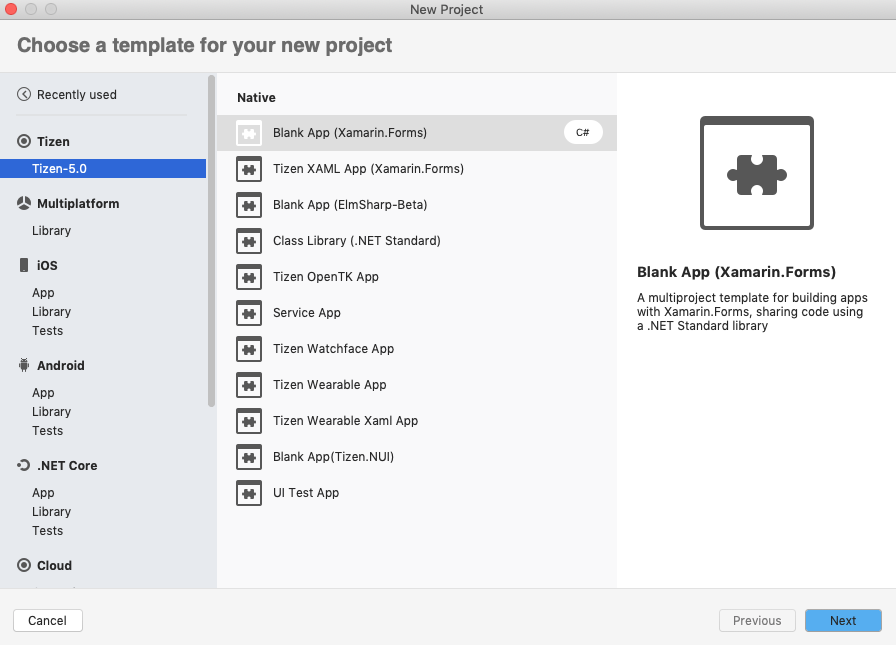

# Visual Studio for Mac Extension for Tizen

Visual Studio for Mac Extension for Tizen is an extension for Microsoft Visual Studio for Mac. It enables you to develop Tizen .NET applications easily with Visual Studio for Mac.

## Prerequisites

To work with Visual Studio for Mac Extension for Tizen, your computer must have:

- At least 5.6 GB of available disk space
- macOS Mojave 10.14: Community, Professional, and Enterprise.	
- Visual Studio 2019 for Mac (Community, Professional, Enterprise) Version 8.2 and higher.

- Java Development Kit (JDK)

  You must install Oracle Java Development Kit (JDK) 8 or OpenJDK 12 to use 
Tizen Baseline SDK. Make sure you download and install the EXACT version.

  - [Oracle Java Development Kit(JDK) 8](https://www.oracle.com/technetwork/java/javase/downloads/jdk8-downloads-2133151.html) and [Java for OS X 2015-001](https://support.apple.com/kb/DL1572)
 
  - OpenJDK 12 and OpenJFX: [OpenJDK 12 and OpenJFX Installation Guide](../tizen-studio/setup/openjdk.md#install-openjdk-for-macos).

For Oracle JDK, Java for OS X 2015-001 is required to support legacy Java software on macOS.

## Visual Studio for Mac Extension for Tizen Installation

This section describes how to install the **Visual Studio for Mac Extension for Tizen** and the **Baseline SDK** to use the Tizen SDK tools.

### Install the Extension

To install Visual Studio for Mac Extension for Tizen:

1. In the Visual Studio Mac IDE menu, go to **Visual Studio** and click **Extensions...**.

   

2. Extension Manager dialog is opened. Click **Gallery** at the top left.

	
   
3. Click **Refresh** to get the latest extensions.

	
	
4. After the extension list is refreshed, expand the **IDE extensions** in the **Gallery** tab and select the 
   **Visual Studio for Mac Extension for Tizen**. Click **Install...** at the bottom right.

	
	

5. Click **Install** in the pop-up window.

	 

   The extension is installed. Restart the IDE once to complete the installation.
   
   After successful installation, **Tizen** is in the project wizard.
   
   

### Install the Tizen Baseline SDK

After installing the Visual Studio Mac Extension for Tizen, you must set up the Tizen baseline SDK:

1. In the Visual Studio Mac IDE menu, go to **Tools &gt; Tizen &gt; Tizen Package Manager**.
2. Select **Install new Tizen SDK**.

   > **Note**
   >
   > If Tizen Studio is already installed in your computer, simply [set the Tizen baseline SDK path](#set-tizen-baseline-sdk) to the existing SDK instead of reinstalling it.
   
   

3. Read the license document and click **I Agree**.

   

4. Enter the root directory path where you want to install and click **Next**.

   

   The Tizen SDK installer is downloaded and the baseline SDK is installed automatically.

   

   

   Finally, the Tizen Package Manager installs the Tizen SDK tools.

   

### Set the Tizen Baseline SDK Path 

You can also use the Tizen Package Manager to set up the Tizen baseline SDK path or each tool path directly:

- To set up the Tizen Baseline SDK path:
  1. In the Visual Studio IDE menu, go to **Tools &gt; Tizen &gt; Tizen Package Manager**.
  2. Select **Use installed Tizen SDK**.

     

  3. Enter the root directory of your existing Tizen Studio installation.

     

  > **Note**  
  > If the installer gives a warning about your Tizen Studio version being too low, update Tizen Studio by using the Tizen Package Manager after setting the tool path.

- To set up each tool path directly:
  1. In the Visual Studio Mac IDE menu, go to **Project &gt; Solution Options &gt; Tizen &gt; Tools**.
  2. Enter the root directory of your existing Tizen Studio installation in the **Tool Path** field.

     

     The other tools paths are automatically set up.

### Install Emulator Images

If you do not have a real device, you can run applications in the Tizen Emulator.

To download emulator images, you can use the Tizen Package Manager or the Tizen Emulator Manager:

- To use the Tizen Package Manager:
  1. In the Visual Studio Mac IDE menu, go to **Tools &gt; Tizen &gt; Tizen Package Manager**.
  2. Select the profiles and versions you want to install and click **Install**.

     

- To use the Tizen Emulator Manager:

  > **Note**
  >
  > The Tizen Emulator Manager shows the emulator images installation window only when no images are installed on your computer.

  1. In the Visual Studio Mac IDE menu, go to **Tools &gt; Tizen &gt; Tizen Emulator Manager**.
  2. Select the profiles and versions you want to install and click **OK**.

     

## Troubleshoot

If you encounter problems with the installation:

- To make sure the baseline Tizen SDK is installed correctly, check the tool path by selecting **Project &gt; Solution Options &gt; Tizen &gt; Tools**.

  

