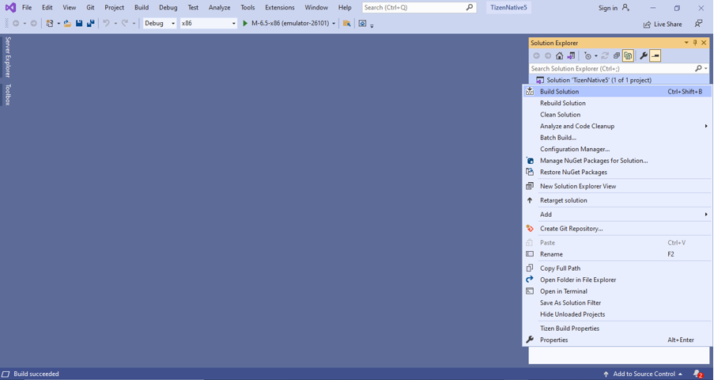

# Hybrid application development

## Develop application

The following sections explain how to use Visual Studio Extension for Tizen to develop hybrid applications. Hybrid application for Tizen supports different types (.NET/Native/Web) of projects in the same solution/workspace.

### Create Tizen .Net project

To create a Tizen .Net project: Refer to [Create Tizen .Net project](dotnet.md)

### Add Tizen Native project

To add a Tizen Native project into the above created .NET project to make the Hybrid solution:

1. In the Visual Studio Solution Explorer, Right Click on Solution **Add &gt; New Project**.

2. For creating Native application, select **C++** and **Tizen** options in the dropdown list. Then, select **Tizen Native project** and click **Next**.

   

3. In the configure window, type the name for your project and click **Create**.

   

4. In the **Tizen Profile Select** window, select the required template for your project, then click **OK**.
   
   

5. The visual studio window with newly created project appears on the **Solution Explorer**.

   

### Set Startup Project

1.  From **Solution Explorer** Right click on the desired Project and select **Set as Startup Project**.

### Add Project Dependency

1.  From Solution explorer Right click on **Startup Project** and select **Add Tizen Project Dependency**.

      

2.  A Window with project list for selection will be displayed.

      

3.  Select the dependency projects and press OK button.

      

### Build your project

1. To build your project, select **Build Solution** in the **Solution Explorer** window.

   

2. To deploy and run your application, select **Debug &gt; Start without Debugging**.

   > [!NOTE]
   > Ensure the emulator is running in your system.

   

   

### Debug your application in emulator

1. Open the .cs file in your visual studio application.

2. Add a break point in your source code.

   

3. Start the debugging session by selecting **Debug &gt; Start Debugging** in the menu bar, or pressing **F5**, or by clicking the **Debug** button in the menu bar.
