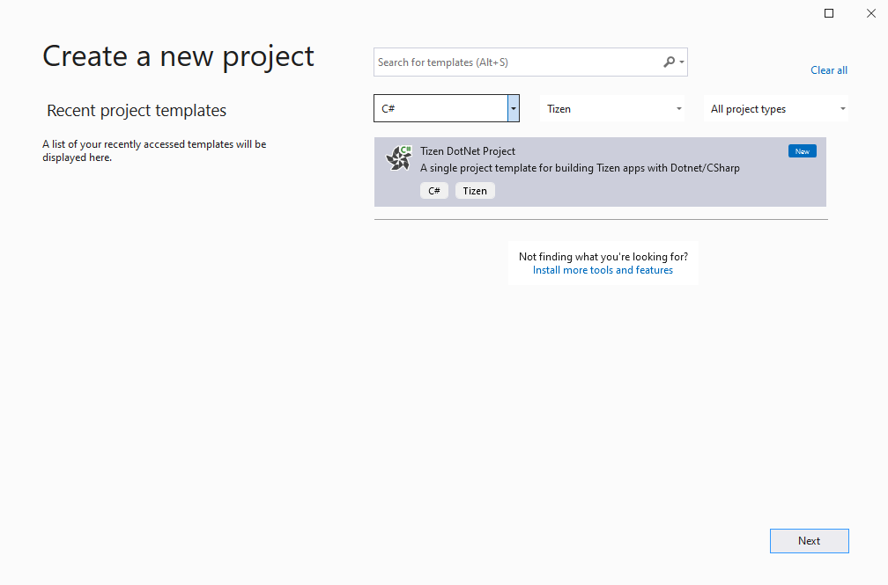
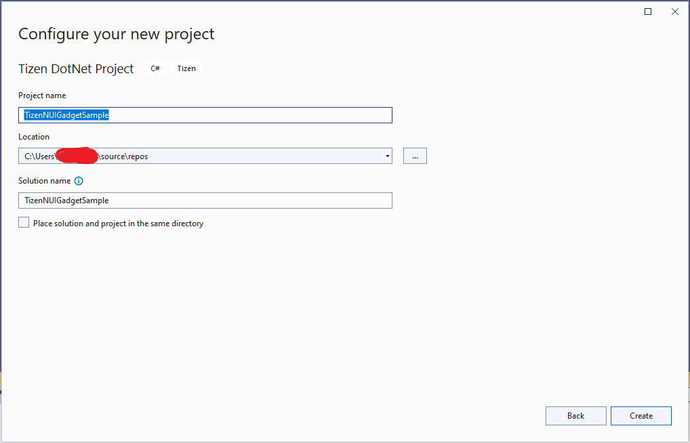
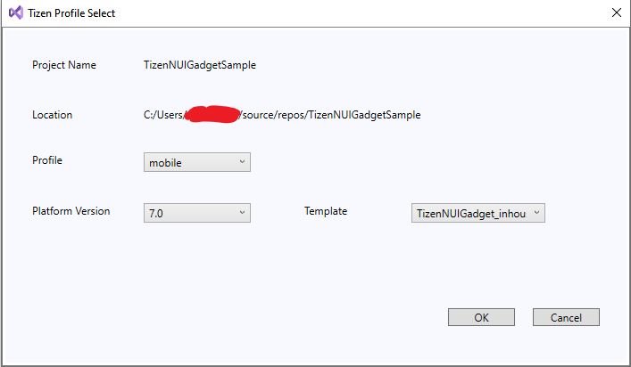
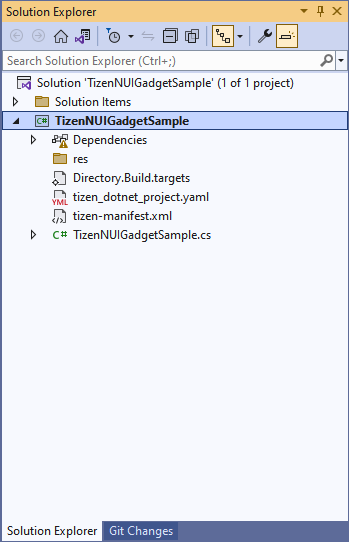
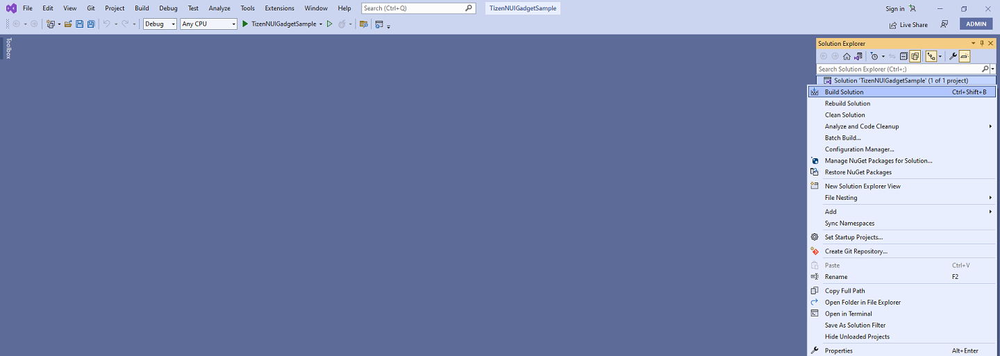
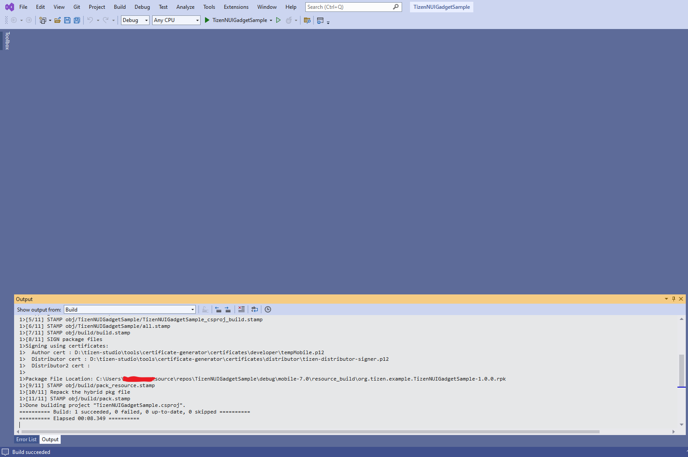

# TizenNUIGadget RPK development

## Develop application

The following sections explain how to use Visual Studio Extension for creating Tizen .NET NUIGadget project and building it as an RPK package.

### Create Tizen .NET NUIGadget project

To create a Tizen .NET NUIGadget project in Visual Studio:

1. Launch the Visual Studio tool.

2. In the Visual Studio menu, select **File &gt; New &gt; Project**.

   

3. In the new project menu, select C# and Tizen from the dropdown list. Then, select **Tizen DotNet Project** and click **Next**.

   

4. In the configure window, type the name for your project and click **Create**.

   

5. In the **Tizen Profile Select** window, select the required profile, 7.0 platform version, and TizenNUIGadget_inhouse template then click **OK**.

   

6. The Visual Studio window with newly created project appears on the Solution Explorer.

   

### Build your project and package it as RPK

1. To build TizenNUIGadget and package it as RPK, select **Build Solution** in the **Solution Explorer** window.

   

2. After the build is successful, the RPK package location will be shown in Output logs.

   